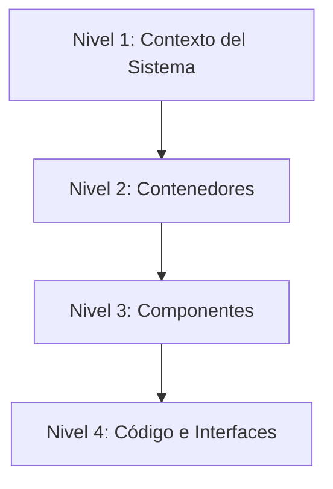
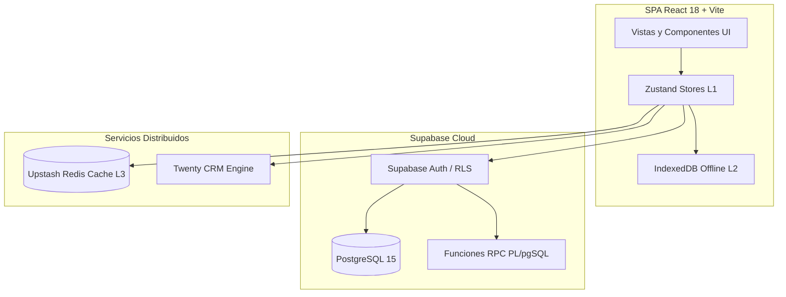
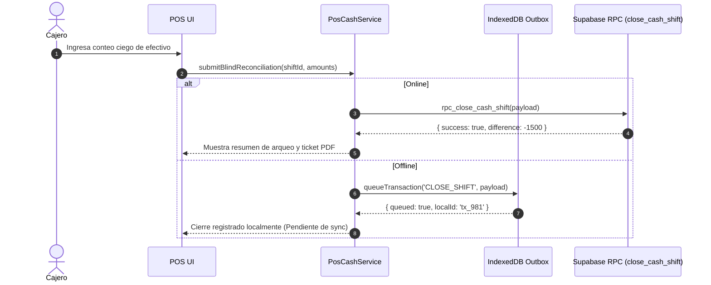

# Archify Architecture Analysis & C4 Modeling Skill

Esta habilidad proporciona una metodología estandarizada para analizar la arquitectura del software, generar diagramas C4 (Contexto, Contenedores, Componentes y Código) y documentar dependencias estructurales con Mermaid.js.

---

## 1. Niveles del Modelo C4 Soportados



1. **C1 - Contexto:** Vista general de usuarios (Cajeros, Administradores, Jefes de Bodega) y sistemas externos (Supabase, Upstash Redis, DIAN, Impresoras Térmicas).
2. **C2 - Contenedores:** Separación de SPA React/Vite, PWA Offline, Base de Datos PostgreSQL/Supabase, Cache L1/L2/L3 y Servicios RPC.
3. **C3 - Componentes:** Servicios modulares (`payrollService`, `inventoryService`, `twentyClient`, `posService`), Stores Zustand y Componentes UI.
4. **C4 - Código:** Diagramas de secuencia y flujos de ejecución específicos (ej: conciliación de caja ciega, cálculo Pareto ABC).

---

## 2. Invocación y Parámetros

El agente debe invocar esta habilidad o el comando `/archify` cuando:
- Se solicite diseñar un nuevo módulo de negocio.
- Se planifique una refactorización de más de 3 archivos interconectados.
- Se requiera mapear dependencias circulares o flujos asíncronos.

### Sintaxis CLI / Workflow:
```bash
/archify [ruta_modulo] [--level c4|container|component|sequence] [--output markdown|mermaid]
```

---

## 3. Plantillas de Diagramas de Arquitectura

### Plantilla C2: Contenedores y Datos en Pezcaderia ERP


### Plantilla C4: Flujo de Transacción Atómica


---

## 4. Reglas de Validación Arquitectónica

1. **Separación Estricta:** Las vistas nunca deben consultar directamente a Supabase o IndexedDB; deben interactuar a través de servicios modulares tipados (`services/`).
2. **Inmutabilidad:** Todo flujo de datos debe retornar copias nuevas de estado.
3. **Resiliencia Offline:** Cualquier flujo transaccional crítico (Venta POS, Movimiento WMS) debe soportar encolamiento Outbox.
