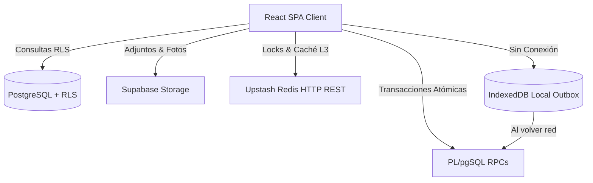

# Supabase BaaS, Client RLS & Offline Outbox Engine — Skill de Especialista

Esta skill especializada conecta directamente con la base de conocimiento oficial del notebook en Google NotebookLM y establece las directrices técnicas, patrones de diseño y estándares de ingeniería para **La Pezcaderia ERP**.

> **Fuente Oficial de Verdad (NotebookLM):**  
> **Notebook:** `Supabase BaaS, Client RLS & Offline Outbox Engine`  
> **Notebook ID:** `6f0eb407-a572-4934-867e-0686daee1270`  
> **URL Oficial:** [https://notebook.google.com/notebook/6f0eb407-a572-4934-867e-0686daee1270](https://notebook.google.com/notebook/6f0eb407-a572-4934-867e-0686daee1270)  
> **Comando de Consulta Rápida:**  
> `nlm query 6f0eb407-a572-4934-867e-0686daee1270 "<tu consulta técnica>"`

---

# Manual Maestro: Supabase BaaS, Client RLS & Motor Offline Outbox

Arquitectura de backend as a service, seguridad a nivel de fila desde el cliente, persistencia serverless y resiliencia offline para operaciones continuas en puntos de venta y almacenes.

---

## 1. Supabase Client SDK (`@supabase/supabase-js` 2.39+)

En esta SPA, no existe un backend intermedio tradicional; el cliente React se comunica directamente con PostgreSQL mediante el SDK oficial de Supabase, gobernado estrictamente por **Row Level Security (RLS)** y **Funciones RPC**.



### A. Inicialización Segura del Cliente
```typescript
import { createClient } from '@supabase/supabase-js';
import type { Database } from '@/types/supabase';

const supabaseUrl = import.meta.env.VITE_SUPABASE_URL;
const supabaseAnonKey = import.meta.env.VITE_SUPABASE_ANON_KEY;

export const supabase = createClient<Database>(supabaseUrl, supabaseAnonKey, {
  auth: {
    persistSession: true,
    autoRefreshToken: true,
    detectSessionInUrl: true,
    storage: window.localStorage,
  },
});
```

### B. Ejecución de RPCs (Remote Procedure Calls) en PL/pgSQL
Para operaciones de negocio que involucran múltiples tablas (ej. arqueo de caja, venta POS, despiece de pescado), NUNCA se ejecutan múltiples `INSERT` o `UPDATE` desde el cliente (peligro de inconsistencia si la red se corta a mitad). Se delega toda la transacción a un **RPC atómico en la base de datos**:

```typescript
// Ejemplo: Venta POS con descuento atómico de stock y creación de factura
export async function processSale(salePayload: SaleData) {
  const { data, error } = await supabase.rpc('process_pos_sale', {
    p_tenant_id: salePayload.tenantId,
    p_customer_id: salePayload.customerId,
    p_payment_method: salePayload.paymentMethod,
    p_items: salePayload.items, // Array JSON de SKUs, cantidades y precios
    p_cash_register_id: salePayload.cashRegisterId,
  });

  if (error) throw new Error(error.message);
  return data; // Devuelve id de factura y número consecutivo
}
```

### C. Supabase Storage con Políticas RLS
- **Buckets Privados**: Los documentos tributarios, comprobantes de pago y remisiones se guardan en buckets no públicos (`invoices-private`, `delivery-notes`).
- **Descargas Seguras**: Uso de URLs firmadas con vencimiento de 60 segundos:
  ```typescript
  const { data } = await supabase.storage
    .from('invoices-private')
    .createSignedUrl(`invoices/${invoiceId}.pdf`, 60);
  ```

---

## 2. Upstash Redis Serverless (HTTP REST Client)

En una SPA en el navegador, las conexiones TCP tradicionales a Redis no son posibles. `@upstash/redis` se comunica mediante HTTP REST sobre `fetch`, permitiendo caching y locks sin abrir sockets continuos ni requerir un servidor Node.js intermedio:

```typescript
import { Redis } from '@upstash/redis';

export const redis = new Redis({
  url: import.meta.env.VITE_UPSTASH_REDIS_REST_URL,
  token: import.meta.env.VITE_UPSTASH_REDIS_REST_TOKEN,
});
```

### Casos de Uso Críticos:
1. **Locks Distribuidos en el POS**:
   - Evitar que dos cajeros o dos procesos cobren la misma orden simultáneamente:
     ```typescript
     // Intenta adquirir lock por 10 segundos
     const acquired = await redis.set(`lock:order:${orderId}`, 'locked', { nx: true, ex: 10 });
     if (!acquired) {
       throw new Error('La orden está siendo procesada en otra terminal.');
     }
     ```
2. **Caché L3 de Catálogos y Tarifas**:
   - Almacenar la lista de precios o catálogo general en Redis con TTL de 5 minutos, reduciendo en un 80% las consultas a Supabase en horas pico.

---

## 3. IndexedDB (`idb`) & Patrón Outbox Offline-First

En cuartos fríos (donde las paredes aíslan la señal Wi-Fi) o ante caídas temporales de internet en el POS, el sistema debe seguir facturando y operando.

### A. Estructura de la Base de Datos Local con `idb`
```typescript
import { openDB, DBSchema } from 'idb';

interface ERPDatabase extends DBSchema {
  outbox: {
    key: string; // UUID local de la transacción
    value: {
      id: string;
      type: 'SALE' | 'MOVEMENT' | 'CASH_ENTRY';
      payload: any;
      createdAt: string;
      status: 'PENDING' | 'SYNCING' | 'FAILED';
      retryCount: number;
    };
    indexes: { 'by-status': string };
  };
  cached_products: {
    key: string;
    value: Product;
  };
}

export async function getLocalDB() {
  return openDB<ERPDatabase>('erp-offline-db', 1, {
    upgrade(db) {
      const outboxStore = db.createObjectStore('outbox', { keyPath: 'id' });
      outboxStore.createIndex('by-status', 'status');
      db.createObjectStore('cached_products', { keyPath: 'id' });
    },
  });
}
```

### B. Motor de Sincronización Automática (Outbox Sync Worker)
1. **Escucha de Conectividad**:
   ```typescript
   window.addEventListener('online', () => triggerOutboxSync());
   ```
2. **Procesamiento Secuencial FIFO**:
   - El worker lee las transacciones en estado `PENDING` ordenadas por fecha de creación.
   - Las envía a Supabase mediante la función RPC correspondiente.
   - Si la RPC tiene éxito, marca el registro como eliminado o `SYNCED`.
   - Si falla por error de red, mantiene el estado `PENDING` para el siguiente ciclo. Si falla por error de negocio (ej. falta de stock no resoluble), marca `FAILED` y levanta una alerta en la interfaz.


---

## Directrices de Implementación para el Agente

1. **Consulta Previa Obligatoria:** Cuando se realicen tareas vinculadas a este dominio, utiliza la CLI `nlm query 6f0eb407-a572-4934-867e-0686daee1270` para verificar mejores prácticas antes de proponer cambios estructurales.
2. **Modularidad Estricta:** El código debe ser modular, desacoplado y con tipos estrictos en TypeScript o Python.
3. **Inmutabilidad:** Toda mutación de estado debe generar nuevas copias de objetos; nunca mutar arreglos o estados en caliente.
4. **Verificación:** Ejecuta las pruebas automatizadas asociadas (`npm run test:run` o tests unitarios) tras cada modificación.
