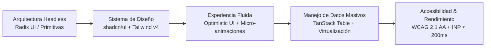

# Diseño Frontend & UI/UX Enterprise: Interfaces Fluidas, Intuitivas y Modernas — Skill de Especialista

Esta skill especializada conecta directamente con la base de conocimiento oficial del notebook en Google NotebookLM y establece las directrices técnicas, patrones de diseño y estándares de ingeniería para **La Pezcaderia ERP**.

> **Fuente Oficial de Verdad (NotebookLM):**  
> **Notebook:** `Diseño Frontend & UI/UX Enterprise: Interfaces Fluidas, Intuitivas y Modernas`  
> **Notebook ID:** `14718d98-431d-455c-bb15-ca44d036421d`  
> **URL Oficial:** [https://notebook.google.com/notebook/14718d98-431d-455c-bb15-ca44d036421d](https://notebook.google.com/notebook/14718d98-431d-455c-bb15-ca44d036421d)  
> **Comando de Consulta Rápida:**  
> `nlm query 14718d98-431d-455c-bb15-ca44d036421d "<tu consulta técnica>"`

---

# Manual Maestro: Diseño Frontend, UI/UX Fluida, Intuitiva y Moderna

Guía de ingeniería y diseño para construir interfaces de usuario de clase mundial en aplicaciones SaaS, ERP, WMS y CRM, garantizando una estética visual de vanguardia, micro-interacciones fluidas y máxima productividad operativa.

---

## 1. Principios Fundamentales de UI/UX Enterprise Moderna



### A. Jerarquía Visual y Control de Densidad
En software empresarial (ERP/WMS/CRM), los usuarios pasan 8 horas al día interactuando con datos. La interfaz debe equilibrar la limpieza visual con la densidad de información:
- **Selector de Densidad (Compact / Regular / Comfortable)**:
  - *Compact*: Filas de 32px, fuente de 12px, padding ajustado (ideal para operadores de almacén o contadores analizando cientos de registros).
  - *Regular*: Filas de 44px, fuente de 14px (modo predeterminado equilibrado).
  - *Comfortable*: Filas de 56px, fuente de 16px (ideal para vistas en tablets o dashboards directivos).
- **Paleta de Colores en Espacio OKLCH / HSL**:
  - Evitar colores saturados puros (#ff0000, #00ff00). Usar espacios de color modernos (`oklch()`) para transiciones de brillo uniformes entre modo claro y oscuro.
  - Modo oscuro con contraste calibrado: fondo `#09090b` (zinc-950) con bordes `#27272a` (zinc-800) y texto primario `#f4f4f5` (zinc-100), eliminando el parpadeo en la carga inicial (*FOUC*).

---

## 2. Sistema de Diseño con shadcn/ui + Tailwind CSS v4

### A. Filosofía Headless & Copia en Repositorio
- El código de los componentes vive directamente dentro de tu carpeta `components/ui/`.
- Cero dependencias monolíticas que bloqueen actualizaciones o rompan compatibilidad.
- Basado en las primitivas sin estilos y totalmente accesibles de **Radix UI**.

### B. Paleta de Comandos Global (`Cmd + K` / `Ctrl + K`)
Toda aplicación SaaS profesional moderna incluye una paleta de comandos interactiva construida con `cmdk`:
- Navegación instantánea a cualquier módulo (`/inventario`, `/facturacion`, `/clientes`).
- Búsqueda global con autocompletado en tiempo real.
- Atajos de teclado para acciones rápidas: `Cmd + K` $\to$ escribir "Nueva Factura" $\to$ abrir modal en 0 milisegundos sin despegar las manos del teclado.

---

## 3. Experiencia Fluida (Fluid UX) y Micro-Animaciones

### A. Animaciones con Propósito (Framer Motion / Motion)
Las animaciones en enterprise no son adornos; comunican causa y efecto:
- **Transiciones de Layout**: Al expandir una fila de la tabla o abrir un panel lateral (*Sheet/Drawer*), usar transiciones físicas con amortiguación suave:
  ```tsx
  <motion.div
    initial={{ opacity: 0, y: 8 }}
    animate={{ opacity: 1, y: 0 }}
    exit={{ opacity: 0, y: -8 }}
    transition={{ duration: 0.15, ease: "easeOut" }}
  >
  ```
- **Feedback Háptico Visual**: Efectos sutiles de hover (`hover:scale-[1.01]`, `active:scale-[0.99]`) con sombras suaves (*soft ambient shadows*).

### B. UI Optimista (Optimistic UI) & Skeleton Loaders
- **Respuesta en 0 ms**: Cuando el usuario marca un ítem como completado o cambia el estado de una orden, la interfaz se actualiza **inmediatamente** en pantalla antes de que el servidor devuelva la respuesta HTTP. Si la petición falla, se revierte suavemente con un toast de error.
- **Skeleton Loaders Estructurados**: Prohibido usar spinners genéricos en pantallas completas. Se utilizan esqueletos animados con shimmer (`animate-pulse`) que replican la forma exacta de las tablas o tarjetas que están cargando.

---

## 4. Grids de Datos Masivos: TanStack Table + Virtualización

El núcleo de un ERP/WMS son sus tablas de datos:
1. **Virtualización del DOM (@tanstack/react-virtual)**:
   - Renderizar únicamente las filas visibles en el viewport (ej. 20 filas en lugar de 10.000 nodos en el DOM).
   - Mantiene la tasa de cuadros en 60 FPS estables sin importar el tamaño de la base de datos.
2. **Funcionalidades de Grids Enterprise**:
   - Column Pinning (congelar columna de SKU/Código a la izquierda y columna de Acciones a la derecha).
   - Filtros avanzados multidimensionales por columna (rango numérico, rango de fechas, multiselect).
   - Edición inline tipo hoja de cálculo con confirmación automática.

---

## 5. Accesibilidad (a11y) y Estándares WCAG 2.1 AA

- **Navegación 100% por Teclado**: Todo botón, enlace, modal o dropdown debe ser operable con `Tab`, `Shift + Tab`, `Enter`, `Space` y `Escape`.
- **Focus Management**: Al abrir un modal o diálogo, atrapar el foco dentro del contenedor (*Focus Trap*) y devolverlo al elemento desencadenante al cerrar.
- **Contraste de Color Calibrado**: Relación de contraste mínima de 4.5:1 para texto normal y 3:1 para elementos de control e iconos interactivos.
- **Regiones Vivas ARIA (`aria-live`)**: Para anunciar en lectores de pantalla cuando se actualiza un contador de stock o se completa una exportación.

---

## 6. Rendimiento y Core Web Vitals

- **INP (Interaction to Next Paint) < 200 ms**: Delegar cómputos pesados a Web Workers o utilizar `useTransition` / `startTransition` de React para evitar bloquear el hilo principal.
- **LCP (Largest Contentful Paint) < 2.5 s**: Pre-carga de tipografías (`next/font`), compresión de imágenes en formato WebP/AVIF y Server Components.
- **CLS (Cumulative Layout Shift) = 0**: Dimensiones explícitas de contenedores para evitar saltos de página durante la carga de assets.


---

## Directrices de Implementación para el Agente

1. **Consulta Previa Obligatoria:** Cuando se realicen tareas vinculadas a este dominio, utiliza la CLI `nlm query 14718d98-431d-455c-bb15-ca44d036421d` para verificar mejores prácticas antes de proponer cambios estructurales.
2. **Modularidad Estricta:** El código debe ser modular, desacoplado y con tipos estrictos en TypeScript o Python.
3. **Inmutabilidad:** Toda mutación de estado debe generar nuevas copias de objetos; nunca mutar arreglos o estados en caliente.
4. **Verificación:** Ejecuta las pruebas automatizadas asociadas (`npm run test:run` o tests unitarios) tras cada modificación.
