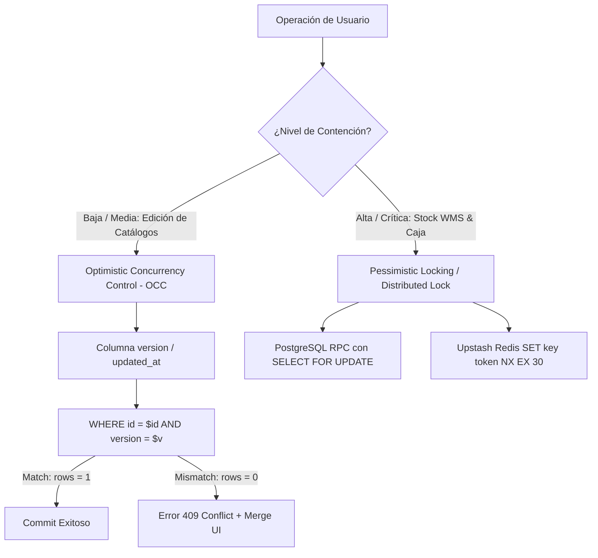

# ERP Concurrency & Asynchronous Engine Skill

Esta skill define los estándares y patrones de ingeniería para gestionar **alta concurrencia de usuarios simultáneos** y **operaciones asíncronas de alto rendimiento** en **MaestroPescaderia ERP**.

---

## 1. Patrones de Control de Concurrencia en Base de Datos



### A. Optimistic Concurrency Control (OCC) con Columna `version`
Para edición de productos, precios y datos maestros:
```sql
-- Función RPC para actualización con OCC
CREATE OR REPLACE FUNCTION update_product_occ(
  p_id UUID,
  p_name TEXT,
  p_price NUMERIC,
  p_expected_version INT
) RETURNS JSONB AS $$
DECLARE
  v_updated_product products%ROWTYPE;
BEGIN
  UPDATE products
  SET name = p_name,
      base_price = p_price,
      version = version + 1,
      updated_at = now()
  WHERE id = p_id AND version = p_expected_version
  RETURNING * INTO v_updated_product;

  IF NOT FOUND THEN
    RAISE EXCEPTION 'CONFLICT_OCC: El registro fue modificado por otro usuario.'
      USING ERRCODE = '40900';
  END IF;

  RETURN to_jsonb(v_updated_product);
END;
$$ LANGUAGE plpgsql;
```

### B. Pessimistic Locking en PostgreSQL (`SELECT ... FOR UPDATE`)
Para operaciones críticas de WMS (reserva de lotes y picking en cuartos fríos):
```sql
CREATE OR REPLACE FUNCTION reserve_inventory_lot(
  p_lot_id UUID,
  p_weight_to_reserve NUMERIC
) RETURNS JSONB AS $$
DECLARE
  v_lot inventory_lots%ROWTYPE;
BEGIN
  -- Bloqueo a nivel de fila durante la transacción
  SELECT * INTO v_lot
  FROM inventory_lots
  WHERE id = p_lot_id
  FOR UPDATE;

  IF v_lot.current_weight_kg < p_weight_to_reserve THEN
    RAISE EXCEPTION 'STOCK_INSUFFICIENT: Solo hay % kg disponibles en el lote.', v_lot.current_weight_kg;
  END IF;

  UPDATE inventory_lots
  SET current_weight_kg = current_weight_kg - p_weight_to_reserve,
      updated_at = now()
  WHERE id = p_lot_id;

  RETURN jsonb_build_object('success', true, 'remaining_kg', v_lot.current_weight_kg - p_weight_to_reserve);
END;
$$ LANGUAGE plpgsql;
```

### C. Distributed Locks con Upstash Redis REST
Para locks rápidos en Edge Functions y frontend:
```typescript
import { Redis } from '@upstash/redis';

export async function withDistributedLock<T>(
  redis: Redis,
  resourceKey: string,
  ttlSeconds: number,
  task: () => Promise<T>
): Promise<T> {
  const lockKey = `lock:${resourceKey}`;
  const lockValue = crypto.randomUUID();

  // Adquisición atómica del lock (SET NX EX)
  const acquired = await redis.set(lockKey, lockValue, { nx: true, ex: ttlSeconds });
  if (!acquired) {
    throw new Error(`RESOURCE_LOCKED: El recurso ${resourceKey} está siendo modificado por otro usuario.`);
  }

  try {
    return await task();
  } finally {
    // Liberación segura del lock solo si el valor coincide (evita borrar locks ajenos)
    const script = `
      if redis.call("get", KEYS[1]) == ARGV[1] then
        return redis.call("del", KEYS[1])
      else
        return 0
      end
    `;
    await redis.eval(script, [lockKey], [lockValue]);
  }
}
```

---

## 2. Mejores Prácticas Asíncronas en Frontend (React 18 + TS)

### A. Cancelación de Peticiones con `AbortController`
Todo servicio que realice llamadas a red debe soportar cancelación:
```typescript
// Hook para peticiones con cancelación automática en unmount o nuevo trigger
import { useEffect, useRef } from 'react';

export function useCancelableAsync() {
  const abortControllerRef = useRef<AbortController | null>(null);

  const execute = async <T>(asyncFn: (signal: AbortSignal) => Promise<T>): Promise<T | null> => {
    // Cancelar la petición anterior si sigue en vuelo
    if (abortControllerRef.current) {
      abortControllerRef.current.abort();
    }

    const controller = new AbortController();
    abortControllerRef.current = controller;

    try {
      return await asyncFn(controller.signal);
    } catch (err: any) {
      if (err.name === 'AbortError' || err.code === 'ERR_CANCELED') {
        return null; // Petición abortada intencionalmente
      }
      throw err;
    }
  };

  useEffect(() => {
    return () => {
      abortControllerRef.current?.abort();
    };
  }, []);

  return { execute };
}
```

### B. Deduplicación de Peticiones en Vuelo (Promise In-Flight Sharing)
Evita disparar múltiples llamadas idénticas a Supabase si varios componentes las solicitan a la vez:
```typescript
const inFlightRequests = new Map<string, Promise<any>>();

export function deduplicateRequest<T>(key: string, requestFn: () => Promise<T>): Promise<T> {
  if (inFlightRequests.has(key)) {
    return inFlightRequests.get(key) as Promise<T>;
  }

  const promise = requestFn().finally(() => {
    inFlightRequests.delete(key);
  });

  inFlightRequests.set(key, promise);
  return promise;
}
```

### C. Transiciones No Bloqueantes con `useTransition`
```tsx
import React, { useState, useTransition } from 'react';

export function ProductSearch({ onFilter }: { onFilter: (query: string) => void }) {
  const [searchTerm, setSearchTerm] = useState('');
  const [isPending, startTransition] = useTransition();

  const handleChange = (e: React.ChangeEvent<HTMLInputElement>) => {
    const value = e.target.value;
    // 1. Actualización urgente inmediata del input (60 FPS)
    setSearchTerm(value);

    // 2. Actualización diferida de cálculo pesado o filtrado de 5.000 filas
    startTransition(() => {
      onFilter(value);
    });
  };

  return (
    <div className="relative">
      <input
        type="text"
        value={searchTerm}
        onChange={handleChange}
        placeholder="Buscar SKU o lote..."
        className="w-full rounded-lg border border-slate-300 p-2.5 dark:border-slate-700"
      />
      {isPending && <span className="absolute right-3 top-3 text-xs text-slate-400">Filtrando...</span>}
    </div>
  );
}
```

---

## 3. Checklist de Concurrencia y Async

- [ ] ¿Las operaciones de inventario y caja usan locks atómicos (`SELECT FOR UPDATE` o Redis `SET NX`)?
- [ ] ¿Los catálogos maestros implementan OCC con columna `version` para evitar sobrescrituras ciegas?
- [ ] ¿Todas las llamadas de búsqueda o autocompletado utilizan `AbortController`?
- [ ] ¿Las consultas frecuentes compartidas implementan deduplicación de promesas en vuelo?
