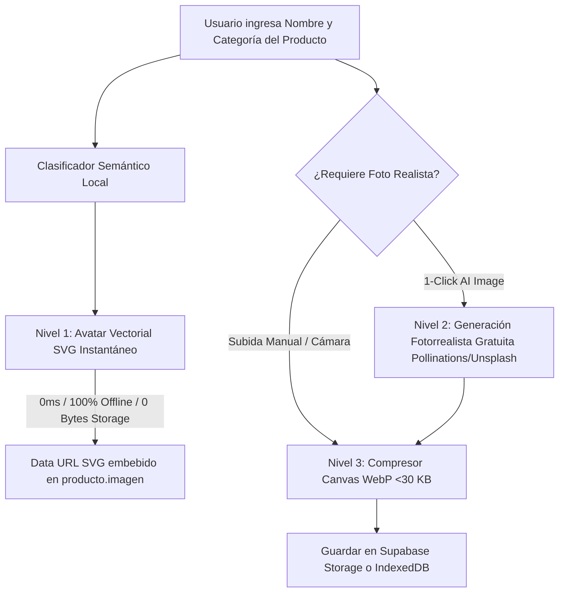

# ERP Product Visual & Image Generation Engine Skill

Esta skill define la arquitectura para la **creación, asignación y optimización visual automática de productos a Costo 0** en **MaestroPescaderia ERP**.

---

## 1. Topología del Flujo Visual Híbrido

### Paleta Semántica por Familia de Producto:
1. **Pescados Enteros y Frescos**: Gradiente Cyan Profundo (`#0E7490`) a Azul Marino (`#1E3A8A`) con icono de pez.
2. **Mariscos y Crustáceos**: Gradiente Coral (`#F97316`) a Rojo Fuego (`#DC2626`) con icono de concha.
3. **Cortes, Filetes y Porciones**: Gradiente Esmeralda (`#059669`) a Teal (`#0D9488`).
4. **Congelados e IQF**: Gradiente Azul Hielo (`#0284C7`) a Indigo (`#2563EB`) con icono de copo de nieve.
5. **Insumos y Empaques**: Gradiente Slate (`#475569`) a Slate Oscuro (`#1E293B`).

---

## 2. Compresión Client-Side WebP (Cero Desperdicio de Storage)

Para evitar superar el límite gratuito de 1 GB de Supabase Storage:
- Toda foto capturada o generada se redimensiona a un máximo de `400x400` píxeles en un `<canvas>` oculto del navegador.
- Se comprime a formato `image/webp` con calidad `0.80`, reduciendo el peso típico de una foto de 4 MB a solo **~18 - 25 KB** (reducción del 99.4%).

---

## 3. Carga Masiva y Brecha Dinámica de Tráfico (Chunks de 5)

Para cargas iniciales masivas (ej. catálogos de 50 o 500 productos):
- **Tamaño de Lote (Chunk Size = 5)**: Procesa en bloques acotados de máximo 5 productos.
- **Detector de Presencia de Usuarios (`userActivityDetector.ts`)**:
  - **Con Usuarios Activos (Horas Pico / Operación en POS / Bodega)**:
    - Aplica una **brecha de enfriamiento de 5 minutos (300.000 ms)** entre cada lote de 5 productos.
    - Garantiza cero contención de CPU, red o memoria con los cajeros y despachadores.
  - **Sin Usuarios Activos (Modo Reposo / Off-Peak / Pestaña Oculta)**:
    - Entra automáticamente en **Modo Turbo**, procesando cada lote de 5 con una micro-pausa de solo **30 ms**.
- **Persistencia Resiliente**:
  - El checkpoint del último lote procesado se almacena en `localStorage` / `IndexedDB`, reanudándose automáticamente si se recarga la aplicación.

---

## 4. Checklist de Creación de Producto

- [ ] ¿El producto asigna automáticamente el avatar SVG temático al escribir el nombre si no tiene imagen previa?
- [ ] ¿El avatar SVG se visualiza de forma nítida en tarjetas de POS, tablas de inventario y PDF de cotizaciones?
- [ ] ¿Las fotos subidas pasan por el helper `compressImageToWebP` antes de persistir?
