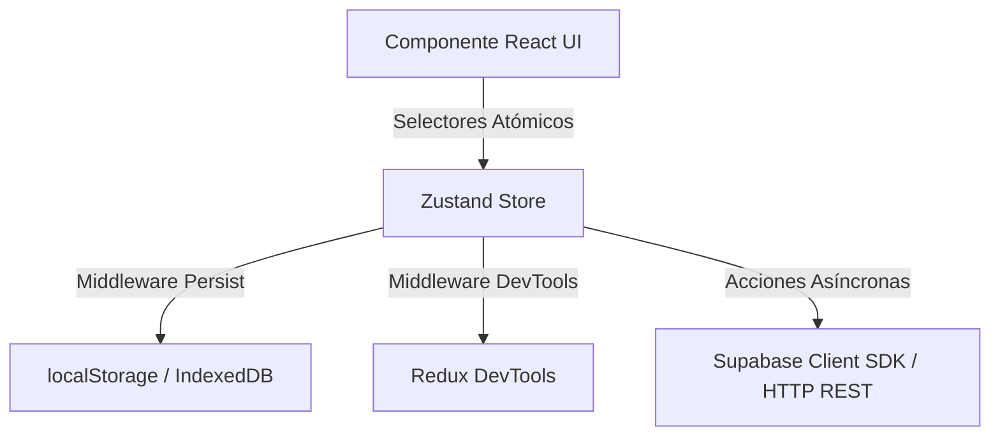

# Frontend SPA: React 18, Vite & Zustand State Architecture — Skill de Especialista

Esta skill especializada conecta directamente con la base de conocimiento oficial del notebook en Google NotebookLM y establece las directrices técnicas, patrones de diseño y estándares de ingeniería para **La Pezcaderia ERP**.

> **Fuente Oficial de Verdad (NotebookLM):**  
> **Notebook:** `Frontend SPA: React 18, Vite & Zustand State Architecture`  
> **Notebook ID:** `c9c297c4-7037-4148-8133-aa43418c1161`  
> **URL Oficial:** [https://notebook.google.com/notebook/c9c297c4-7037-4148-8133-aa43418c1161](https://notebook.google.com/notebook/c9c297c4-7037-4148-8133-aa43418c1161)  
> **Comando de Consulta Rápida:**  
> `nlm query c9c297c4-7037-4148-8133-aa43418c1161 "<tu consulta técnica>"`

---

# Manual Maestro: Frontend SPA - React 18, Vite 5 & Arquitectura de Estado con Zustand 5

Guía de arquitectura y desarrollo para aplicaciones web empresariales tipo SPA (Single Page Application) ejecutadas 100% en el cliente, optimizadas para alto rendimiento, modularidad y coste $0 de infraestructura.

---

## 1. Arquitectura de Estado Global con Zustand 5.0

En una SPA empresarial (ERP, WMS, POS), Zustand actúa como el cerebro operativo de la aplicación. En lugar de un store monolítico gigante, se implementa una arquitectura de **Stores Atómicos Desacoplados por Dominio** (ej. 19 stores en este proyecto):
- `useInventoryStore`: Catálogo de productos, stock disponible, lotes y niveles de rotación.
- `useMovementStore`: Registro de entradas, salidas, mermas de despiece y traslados entre bodegas/cuartos fríos.
- `useCashStore`: Turno actual, arqueo de caja ciega, ingresos, egresos y movimientos de efectivo.
- `useOrderStore` / `useCartStore`: Ítems del carrito POS, descuentos, impuestos y cálculo de totales en COP.
- `useCustomerStore`: Clientes, cartera, historial de compras y cupos de crédito.
- `useAuthStore`: Sesión del usuario, token JWT, roles (SuperAdmin, Cajero, Bodeguero) y `tenant_id`.



### A. Buenas Prácticas Nucleares de Zustand 5
1. **Selectores Atómicos Obligatorios**:
   - NUNCA desestructurar el store completo en el componente:
     ```tsx
     // ❌ INCORRECTO: Re-renderiza el componente con CUALQUIER cambio en el store
     const { items, addItem } = useInventoryStore();

     // ✅ CORRECTO: Re-renderiza ÚNICAMENTE cuando cambia 'items'
     const items = useInventoryStore((state) => state.items);
     const addItem = useInventoryStore((state) => state.addItem);
     ```
   - Para seleccionar múltiples valores primitivos o arrays derivados, usar el comparador de igualdad superficial `shallow`:
     ```tsx
     import { useShallow } from 'zustand/react/shallow';
     const { minStock, maxStock } = useInventoryStore(
       useShallow((state) => ({ minStock: state.minStock, maxStock: state.maxStock }))
     );
     ```

2. **Acciones Asíncronas e Inmutabilidad**:
   - Zustand permite que las acciones vivan dentro del propio store sin necesidad de reducers ni dispatchers complejos:
     ```typescript
     interface InventoryState {
       items: Product[];
       isLoading: boolean;
       error: string | null;
       fetchItems: () => Promise<void>;
       updateStock: (skuId: string, quantity: number) => void;
     }

     export const useInventoryStore = create<InventoryState>()(
       devtools(
         persist(
           (set, get) => ({
             items: [],
             isLoading: false,
             error: null,
             fetchItems: async () => {
               set({ isLoading: true, error: null });
               try {
                 const { data, error } = await supabase.from('inventory').select('*');
                 if (error) throw error;
                 set({ items: data, isLoading: false });
               } catch (err: any) {
                 set({ error: err.message, isLoading: false });
               }
             },
             updateStock: (skuId, quantity) =>
               set((state) => ({
                 items: state.items.map((item) =>
                   item.id === skuId ? { ...item, stock: item.stock + quantity } : item
                 ),
               })),
           }),
           { name: 'app-inventory-storage' }
         )
       )
     );
     ```

3. **Resetting de Estado en Cierre de Sesión**:
   - Cada store debe exponer una función `reset()` para limpiar datos sensibles de memoria cuando el usuario hace logout:
     ```typescript
     const initialState = { items: [], isLoading: false, error: null };
     // En el store:
     reset: () => set(initialState)
     ```

---

## 2. Bundling y Tooling de Producción con Vite 5.2

Vite reemplaza por completo a Webpack/CRA, ofreciendo arranque instantáneo y Hot Module Replacement (HMR) ultrarrápido basado en ES Modules nativos.

### A. Configuración de `vite.config.ts` y Code-Splitting Manual
En una SPA de ERP con librerías pesadas (jsPDF, ExcelJS, Supabase), el *code-splitting* manual por chunks es crucial para mantener el bundle inicial por debajo de 300 KB:

```typescript
import { defineConfig } from 'vite';
import react from '@vitejs/plugin-react';
import path from 'path';

export default defineConfig({
  plugins: [react()],
  resolve: {
    alias: {
      '@': path.resolve(__dirname, './src'),
    },
  },
  build: {
    target: 'es2020',
    sourcemap: false,
    chunkSizeWarningLimit: 600,
    rollupOptions: {
      output: {
        manualChunks: {
          'vendor-react': ['react', 'react-dom', 'zustand'],
          'vendor-supabase': ['@supabase/supabase-js'],
          'vendor-excel': ['exceljs', 'file-saver'],
          'vendor-pdf': ['jspdf', 'jspdf-autotable'],
          'vendor-ui': ['lucide-react', 'sweetalert2'],
        },
      },
    },
  },
});
```

### B. Despliegue SPA a Coste $0 (Vercel / Cloudflare Pages)
Al ser una SPA 100% estática, se aloja de forma gratuita en Vercel o Cloudflare Pages con reescritura de rutas para soportar React Router / navegación client-side:
- **Archivo `vercel.json`**:
  ```json
  {
    "rewrites": [{ "source": "/(.*)", "destination": "/index.html" }]
  }
  ```

---

## 3. Concurrencia y Hooks Avanzados en React 18

1. **`useTransition` para Búsquedas en Tiempo Real**:
   - Al filtrar miles de productos en la tabla del POS, `useTransition` mantiene el campo de texto responsivo a las pulsaciones de teclado mientras la lista filtrada se procesa en segundo plano:
     ```tsx
     const [isPending, startTransition] = useTransition();
     const handleSearch = (e: React.ChangeEvent<HTMLInputElement>) => {
       const query = e.target.value;
       setInputValue(query); // Prioridad alta (input fluido)
       startTransition(() => {
         setFilterQuery(query); // Prioridad diferida (filtrado pesado)
       });
     };
     ```
2. **`useDeferredValue`**:
   - Alternativa para diferir el cálculo de gráficos o reportes pesados basados en el estado del store.
3. **Manejo de Balanzas y Hardware POS**:
   - Custom hook `useSerialScale` que interactúa con la Web Serial API del navegador para leer el peso de la balanza en tiempo real en los cuartos fríos y POS.


---

## Directrices de Implementación para el Agente

1. **Consulta Previa Obligatoria:** Cuando se realicen tareas vinculadas a este dominio, utiliza la CLI `nlm query c9c297c4-7037-4148-8133-aa43418c1161` para verificar mejores prácticas antes de proponer cambios estructurales.
2. **Modularidad Estricta:** El código debe ser modular, desacoplado y con tipos estrictos en TypeScript o Python.
3. **Inmutabilidad:** Toda mutación de estado debe generar nuevas copias de objetos; nunca mutar arreglos o estados en caliente.
4. **Verificación:** Ejecuta las pruebas automatizadas asociadas (`npm run test:run` o tests unitarios) tras cada modificación.
