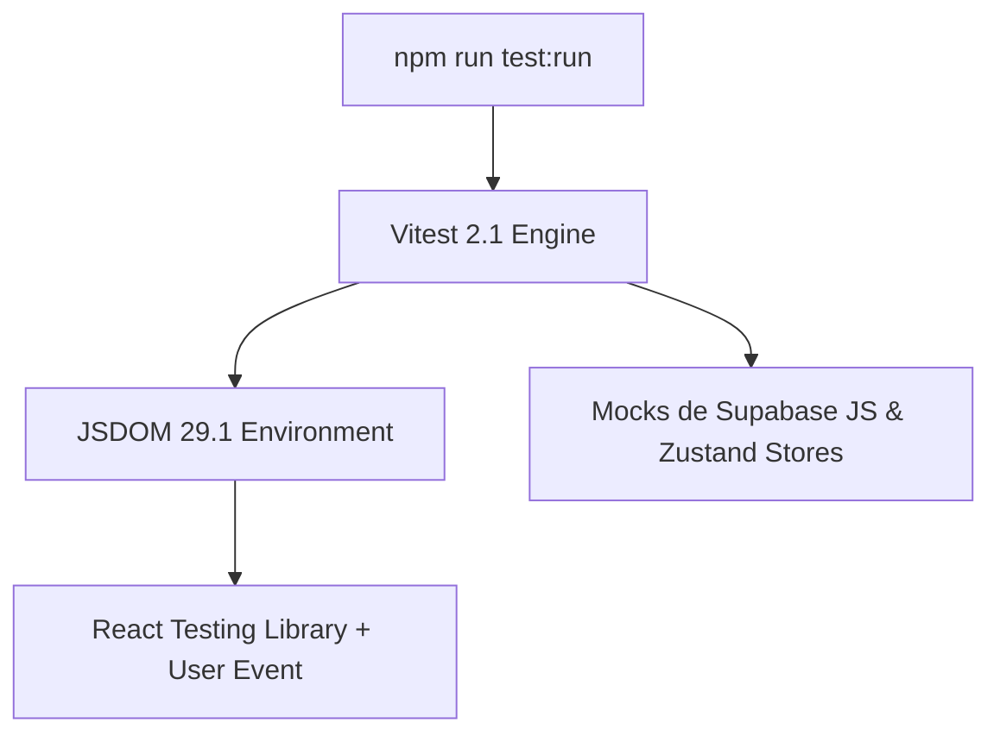

# Frontend Testing & Client Document Engines (Vitest, RTL, jsPDF, ExcelJS) — Skill de Especialista

Esta skill especializada conecta directamente con la base de conocimiento oficial del notebook en Google NotebookLM y establece las directrices técnicas, patrones de diseño y estándares de ingeniería para **La Pezcaderia ERP**.

> **Fuente Oficial de Verdad (NotebookLM):**  
> **Notebook:** `Frontend Testing & Client Document Engines (Vitest, RTL, jsPDF, ExcelJS)`  
> **Notebook ID:** `79820024-087d-4ce4-a79a-c78283869f9a`  
> **URL Oficial:** [https://notebook.google.com/notebook/79820024-087d-4ce4-a79a-c78283869f9a](https://notebook.google.com/notebook/79820024-087d-4ce4-a79a-c78283869f9a)  
> **Comando de Consulta Rápida:**  
> `nlm query 79820024-087d-4ce4-a79a-c78283869f9a "<tu consulta técnica>"`

---

# Manual Maestro: Testing Frontend, Motores Documentales y Reglas de Negocio

Guía técnica integral sobre aseguramiento de calidad con Vitest/RTL, generación de documentos vectoriales en cliente (jsPDF/ExcelJS) y modelado de las reglas de dominio especializadas del proyecto.

---

## 1. Testing Automatizado Frontend: Vitest 2.1 & React Testing Library

A diferencia de proyectos Python (Pytest), esta aplicación corre su suite completa de pruebas en JavaScript/TypeScript utilizando **Vitest** en conjunto con **JSDOM** y **React Testing Library**.



### A. Configuración de `vitest.config.ts`
```typescript
import { defineConfig } from 'vitest/config';
import react from '@vitejs/plugin-react';
import path from 'path';

export default defineConfig({
  plugins: [react()],
  test: {
    globals: true,
    environment: 'jsdom',
    setupFiles: './src/test/setup.ts',
    coverage: {
      provider: 'v8',
      reporter: ['text', 'json', 'html'],
      exclude: ['node_modules/', 'src/test/'],
    },
  },
  resolve: {
    alias: {
      '@': path.resolve(__dirname, './src'),
    },
  },
});
```

### B. Pruebas Unitarias de Lógica Pura y Mocks de Zustand
```typescript
import { describe, it, expect, beforeEach } from 'vitest';
import { calculateParetoABC, calculateWasteCut } from '@/utils/businessMath';

describe('Algoritmos de Dominio', () => {
  it('debe clasificar correctamente productos en clase A, B y C', () => {
    const products = [
      { id: '1', name: 'Salmón Premium', revenue: 8000000 },
      { id: '2', name: 'Atún Rojo', revenue: 1500000 },
      { id: '3', name: 'Merluza', revenue: 500000 },
    ];
    const classified = calculateParetoABC(products);
    expect(classified[0].category).toBe('A');
    expect(classified[1].category).toBe('B');
    expect(classified[2].category).toBe('C');
  });

  it('debe calcular con precisión la merma de despiece y ratio de rendimiento', () => {
    const grossWeightKg = 100.0;
    const netWeightKg = 62.5; // Filete limpio
    const result = calculateWasteCut(grossWeightKg, netWeightKg);

    expect(result.wasteKg).toBe(37.5);
    expect(result.yieldPercentage).toBe(62.5);
  });
});
```

---

## 2. Generación Documental en Cliente a Coste $0

### A. Motor jsPDF 2.5: Tickets POS Térmicos (80mm y 58mm)
Generación de tickets para impresoras térmicas ESC/POS sin requerir ningún servicio de backend:
```typescript
import jsPDF from 'jspdf';

export function generateThermalTicket(sale: SaleReceipt, format: '80mm' | '58mm' = '80mm') {
  const width = format === '80mm' ? 80 : 58;
  // Altura dinámica según cantidad de ítems
  const height = 120 + sale.items.length * 8;

  const doc = new jsPDF({
    unit: 'mm',
    format: [width, height],
  });

  doc.setFont('courier', 'bold');
  doc.setFontSize(10);
  doc.text('DISTRIBUIDORA DEL MAR', width / 2, 8, { align: 'center' });
  doc.setFontSize(8);
  doc.text(`Ticket POS: #${sale.ticketNumber}`, width / 2, 14, { align: 'center' });
  doc.text(`Fecha: ${sale.date}`, 5, 20);

  let y = 28;
  doc.text('--------------------------------', width / 2, y, { align: 'center' });
  y += 5;

  sale.items.forEach((item) => {
    doc.text(`${item.name.substring(0, 16)} x${item.qty}`, 5, y);
    doc.text(`$${item.total.toLocaleString('es-CO')}`, width - 5, y, { align: 'right' });
    y += 5;
  });

  doc.text('--------------------------------', width / 2, y, { align: 'center' });
  y += 6;
  doc.setFontSize(9);
  doc.text(`TOTAL: $${sale.grandTotal.toLocaleString('es-CO')}`, width - 5, y, { align: 'right' });

  doc.autoPrint();
  window.open(doc.output('bloburl'), '_blank');
}
```

### B. Facturación Electrónica DIAN y Tablas con `jspdf-autotable`
- Facturas tamaño Carta/A4 con código QR fiscal, resolución DIAN, rangos de numeración autorizados y desglose de IVA/Retenciones.

### C. ExcelJS 4.4: Exportación de Kardex y Reportes Contables
```typescript
import ExcelJS from 'exceljs';
import { saveAs } from 'file-saver';

export async function exportKardexToExcel(movements: KardexEntry[]) {
  const workbook = new ExcelJS.Workbook();
  const sheet = workbook.addWorksheet('Kardex de Inventario');

  // Cabecera estilizada
  sheet.columns = [
    { header: 'Fecha', key: 'date', width: 15 },
    { header: 'Tipo Movimiento', key: 'type', width: 20 },
    { header: 'Producto / Especie', key: 'product', width: 30 },
    { header: 'Cantidad (Kg)', key: 'qty', width: 15 },
    { header: 'Saldo Stock (Kg)', key: 'balance', width: 18 },
  ];

  sheet.getRow(1).font = { bold: true, color: { argb: 'FFFFFFFF' } };
  sheet.getRow(1).fill = { type: 'pattern', pattern: 'solid', fgColor: { argb: 'FF1E293B' } };

  movements.forEach((m) => sheet.addRow(m));

  const buffer = await workbook.xlsx.writeBuffer();
  saveAs(new Blob([buffer]), `kardex_${new Date().toISOString().slice(0, 10)}.xlsx`);
}
```

---

## 3. Reglas de Dominio y Procesos de Negocio Especializados

### A. Algoritmo Pareto ABC (80/20) para Inventario de Productos del Mar
- Ordenamiento de SKUs por valor total de facturación descendente.
- Cálculo de porcentaje acumulado sobre las ventas del periodo.
- Asignación de reglas de control:
  - **Categoría A (80% valor / 20% ítems)**: Conteo físico diario, alertas de stock mínimo inmediatas.
  - **Categoría B (15% valor / 30% ítems)**: Conteo físico quincenal.
  - **Categoría C (5% valor / 50% ítems)**: Conteo físico mensual.

### B. Gestión de Mermas de Despiece
- Al transformar especies marinas enteras (ej. Salmón entero eviscerado $\to$ Filete porcionado + Recortes + Huesos/Cabeza):
  - Se registra una salida de stock de materia prima bruta.
  - Se registra una entrada de stock del producto procesado y subproductos.
  - La merma no aprovechable se contabiliza como costo operativo de producción.

### C. Arqueo de Caja Ciega en el POS
- Al finalizar el turno, el cajero realiza el conteo físico de dinero en efectivo (billetes de $100.000, $50.000, $20.000, etc.) e ingresa las cantidades **sin conocer el saldo que el sistema calculó**.
- El supervisor abre la conciliación y el sistema ejecuta la función RPC `close_cash_shift`, calculando sobrantes o faltantes de forma auditable.

### D. WMS de Cuartos Fríos y Alquiler 3PL
- Cuadrícula de estanterías y posiciones de estiba estandarizadas a **800 kg**.
- Registro de temperatura de custodia y contratos de alquiler por volumen (m³ o pallets) con facturación recurrente por días o fracciones de mes.

### E. Integración SIIGO API & Facturación Electrónica DIAN
- Conexión con SIIGO Nube mediante autenticación JWT y headers `Partner-Id`.
- Envío de comandos `SendInvoiceByEmailCommand` y emisión de notas de crédito respetando los catálogos fiscales colombianos.


---

## Directrices de Implementación para el Agente

1. **Consulta Previa Obligatoria:** Cuando se realicen tareas vinculadas a este dominio, utiliza la CLI `nlm query 79820024-087d-4ce4-a79a-c78283869f9a` para verificar mejores prácticas antes de proponer cambios estructurales.
2. **Modularidad Estricta:** El código debe ser modular, desacoplado y con tipos estrictos en TypeScript o Python.
3. **Inmutabilidad:** Toda mutación de estado debe generar nuevas copias de objetos; nunca mutar arreglos o estados en caliente.
4. **Verificación:** Ejecuta las pruebas automatizadas asociadas (`npm run test:run` o tests unitarios) tras cada modificación.
