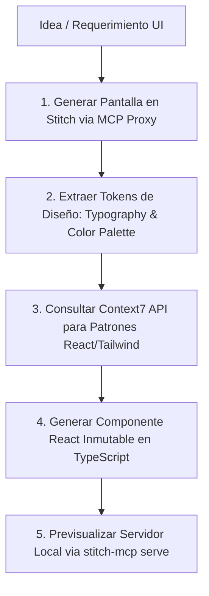

# Google Stitch MCP & Context7 Integration Skill

Esta habilidad proporciona una guía completa y ejecutable para aprovechar al máximo **Google Stitch MCP** (`@_davideast/stitch-mcp`), la plataforma de diseño impulsada por IA de Google, conectada a los agentes autónomos de desarrollo (Antigravity IDE, Claude Code, Gemini CLI).

Además, integra la **API de Context7** para inyectar documentación técnica en tiempo real y mejores prácticas de diseño de componentes al transformar mockups de Stitch en código limpio, modular e inmutable.

---

## 1. Configuración de Conexión y Credenciales

El servidor MCP de Google Stitch está registrado globalmente en la configuración MCP del entorno (`mcp_config.json`).

### Parámetros de Configuración MCP:
```json
{
  "mcpServers": {
    "stitch": {
      "command": "npx",
      "args": [
        "-y",
        "@_davideast/stitch-mcp@latest",
        "proxy"
      ],
      "env": {
        "STITCH_API_KEY": "YOUR_STITCH_API_KEY"
      }
    }
  }
}
```

### Verificación de Salud de Conexión (Stitch Doctor):
Para verificar que la conexión con los servidores de Google Stitch API esté 100% activa:
```bash
cmd /c "set STITCH_API_KEY=YOUR_STITCH_API_KEY&& npx -y @_davideast/stitch-mcp@latest doctor"
```
*Respuesta esperada:* `✔ API Key: Detected | ✔ Stitch API: Healthy (200) | All checks passed!`

---

## 2. Integración con Context7 API

Para garantizar que el código generado a partir de los diseños de Stitch cumpla con las mejores prácticas del ecosistema moderno (React 18, Tailwind CSS, TypeScript), esta skill utiliza **Context7 API**.

### Credenciales de Context7:
- **API Key**: `ctx7sk-f3025892-9756-4e33-80ff-4d1a0c945887`
- **Endpoint**: `https://context7.com/api/v2/context`

### Función de Consulta de Contexto Técnico:
```javascript
async function getTechContext(libraryId, query) {
  const apiKey = 'ctx7sk-f3025892-9756-4e33-80ff-4d1a0c945887';
  const url = `https://context7.com/api/v2/context?libraryId=${encodeURIComponent(libraryId)}&query=${encodeURIComponent(query)}&type=txt`;
  
  const response = await fetch(url, {
    headers: { 'Authorization': `Bearer ${apiKey}` }
  });
  return await response.text();
}
```
*Librerías recomendadas:* `/react/react`, `/tailwindlabs/tailwindcss`, `/vercel/next.js`.

---

## 3. Catálogo de Comandos y Herramientas Stitch MCP

Google Stitch MCP expone los siguientes comandos y herramientas virtuales a través del CLI `stitch-mcp`:

| Comando | Descripción | Ejemplo de Uso |
| :--- | :--- | :--- |
| `doctor` | Diagnóstico de salud de API Key y conexión a Google Stitch. | `npx @_davideast/stitch-mcp doctor` |
| `proxy` | Inicia el servidor proxy MCP para comunicación bidireccional con el agente. | `npx @_davideast/stitch-mcp proxy` |
| `screens` | Explora y lista todas las pantallas/pantallas UI de un proyecto Stitch. | `npx @_davideast/stitch-mcp screens --project <ID>` |
| `serve` | Inicia un servidor web local (Vite) para previsualizar HTML/CSS en tiempo real. | `npx @_davideast/stitch-mcp serve --port 3000` |
| `site` | Compila pantallas de Stitch en una estructura de sitio web (HTML/React). | `npx @_davideast/stitch-mcp site --output ./src` |
| `snapshot` | Genera una captura UI basada en un estado de datos JSON. | `npx @_davideast/stitch-mcp snapshot -d '{"user":"admin"}'` |
| `upload` | Sube un archivo HTML o wireframe existente a Stitch como nueva pantalla. | `npx @_davideast/stitch-mcp upload -f ./mockup.html` |
| `upload-image` | Sube una imagen (PNG/JPG) a Stitch para generación Image-to-UI. | `npx @_davideast/stitch-mcp upload-image -f ./design.png` |
| `view` | Visualiza e inspecciona recursos y tokens de diseño interactivos. | `npx @_davideast/stitch-mcp view` |

---

## 4. Flujos de Trabajo Recomendados (End-to-End Workflows)

### Flujo 1: Text-to-UI → React + Tailwind Component Generation



#### Paso a Paso:
1. **Generación de Pantalla**: Solícita al proxy MCP de Stitch crear una nueva pantalla con especificaciones detalladas (paleta de colores, jerarquía de tipografía, layout responsivo).
2. **Extracción de Tokens**: Utiliza el esquema de salida de Stitch (`DesignSystem`, `Typography`, `Asset`) para mapear colores primarios, secundarios, bordes y espaciados.
3. **Consulta de Context7**: Obtén patrones actualizados de componentes accesibles desde `/react/react` o `/tailwindlabs/tailwindcss`.
4. **Construcción de Código**: Crea componentes modulares en TypeScript estricto manteniendo inmutabilidad de estado.

---

### Flujo 2: Image-to-UI (Wireframe / Boceto → Código)

1. **Subida de Imagen**: Ejecuta `upload-image` para enviar un boceto o captura de pantalla a Google Stitch.
   ```bash
   cmd /c "set STITCH_API_KEY=YOUR_STITCH_API_KEY&& npx -y @_davideast/stitch-mcp@latest upload-image -f ./boceto.png"
   ```
2. **Refinamiento en Stitch**: Stitch analiza la estructura visual y genera el HTML semántico y los componentes visuales en Gemini UI.
3. **Extracción de Código Semántico**: Descarga la estructura generada y convierte las clases visuales en componentes Tailwind CSS integrados en el ERP.

---

## 5. Reglas de Calidad y Estilo Visual (Design Excellence)

Al utilizar Google Stitch MCP para la creación de interfaces en **MaestroPescaderia ERP**:

1. **Riqueza Estética**: Evitar colores planos genéricos. Utilizar paletas vibrantes de modo oscuro/claro con gradientes suaves y sombras pulidas (`shadow-lg`, `backdrop-blur-md`).
2. **Tipografía Moderna**: Garantizar el uso de Google Fonts (como *Inter*, *Outfit* o *Roboto*) mapeadas mediante los tokens de tipografía de Stitch.
3. **Componentes Inmutables**: Ningún componente debe mutar directamente props ni estado global. Retornar siempre copias nuevas.
4. **Sin Placeholders**: Todas las demostraciones UI deben incluir imágenes reales o generadas mediante `generate_image`.

---

## 6. Verificación Continuada

Para verificar en cualquier momento que Stitch MCP esté funcionando correctamente, ejecuta el comando de verificación:
```bash
cmd /c "set STITCH_API_KEY=YOUR_STITCH_API_KEY&& npx -y @_davideast/stitch-mcp@latest doctor"
```
