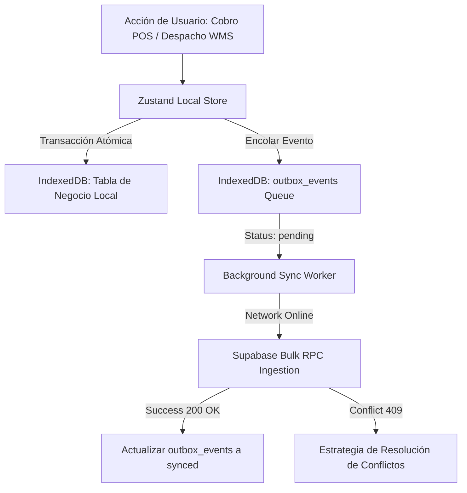

# Offline-First Outbox Synchronization Skill

Esta skill define la arquitectura para permitir que terminales de punto de venta (POS) y operadores de bodega/cuarto frío (WMS) continúen operando a plena capacidad durante **caídas o intermitencias de conexión a internet**, sincronizando de forma segura cuando la red se restablezca.

---

## 1. Topología del Patrón Outbox en el Navegador



### Estructura de la Cola Outbox en IndexedDB:
```typescript
export interface OutboxEvent {
  id: string; // UUID v4 local
  tenantId: string;
  action: 'CREATE_SALE' | 'ADJUST_STOCK' | 'CLOSE_SHIFT' | 'RECEIVE_LOT';
  entity: string; // 'sales', 'inventory_movements', 'cash_shifts'
  payload: Record<string, any>;
  createdAt: string; // ISO Timestamp local
  retryCount: number;
  status: 'pending' | 'syncing' | 'synced' | 'failed';
  errorMessage?: string;
}
```

---

## 2. Reglas de Resolución de Conflictos

1. **Ventas POS (Efectivo / Tarjeta)**:
   - **Regla:** *Append-Only Inmutable*. Las ventas generadas offline siempre se aceptan en el servidor. Si el stock teórico en la nube llega a quedar en negativo debido a una venta offline simultánea, el sistema crea un movimiento de ajuste automático de inventario con motivo `"ajuste_por_concurrencia_offline"`.
2. **Arqueos de Caja**:
   - **Regla:** *Last-Write-Wins con Auditoría*. Los conteos físicos de efectivo se registran con el timestamp exacto del cierre local.
3. **Ingresos de Lote en Bodega**:
   - **Regla:** *Idempotencia vía UUID*. Si el evento se reintenta por falla de red durante la respuesta, la clave única `id` previene duplicados en PostgreSQL (`ON CONFLICT (id) DO NOTHING`).

---

## 3. Checklist para Implementaciones Offline

- [ ] ¿La interfaz muestra un indicador visual claro del estado de red (`Online 🟢` / `Offline 🟡 (${pendingCount} pendientes)`)?
- [ ] ¿Las transacciones locales se guardan en IndexedDB antes de confirmar visualmente al usuario?
- [ ] ¿El worker de sincronización utiliza reintentos exponenciales con jitter para no saturar Supabase al reconectar?
