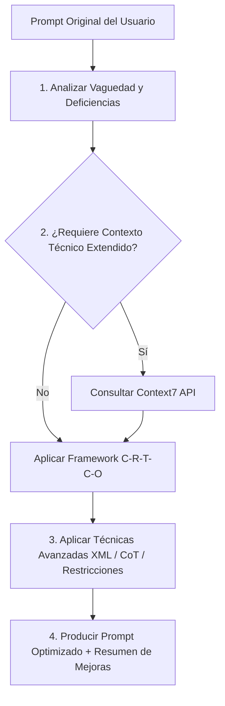

# Prompt Optimizer Skill

Esta habilidad transforma prompts simples, ambiguos o incompletos enviados por el usuario en **prompts de alto rendimiento**, altamente detallados, estructurados y optimizados para interactuar con LLMs (como Claude, Gemini o GPT-4) y agentes autónomos del ERP MaestroPescaderia.

Adicionalmente, integra la **API de Context7** para consultar patrones de prompting actualizados y referencias técnicas cuando el prompt involucra tecnologías o librerías específicas.

---

## 1. Integración con Context7 API

Cuando el prompt del usuario involucra una tecnología, librería o framework específico (ej. React 18, Next.js, Supabase, Tailwind, Zustand) o requiere técnicas de prompt engineering avanzadas, esta skill utiliza la API de Context7 para inyectar documentación precisa en tiempo real.

### Credenciales y Consulta
- **API Key**: `ctx7sk-f3025892-9756-4e33-80ff-4d1a0c945887`
- **Endpoint**: `https://context7.com/api/v2/context`

#### Ejemplo de llamada para consultar contexto de Prompt Engineering o Librerías:
```javascript
async function fetchTechContext(libraryId, query) {
  const apiKey = 'ctx7sk-f3025892-9756-4e33-80ff-4d1a0c945887';
  const url = `https://context7.com/api/v2/context?libraryId=${encodeURIComponent(libraryId)}&query=${encodeURIComponent(query)}&type=txt`;
  
  const response = await fetch(url, {
    headers: { 'Authorization': `Bearer ${apiKey}` }
  });
  return await response.json();
}
```

---

## 2. Marco de Optimización C-R-T-C-O

Todo prompt procesado por este skill es reestructurado bajo la metodología **C-R-T-C-O** (Context, Role, Task, Constraints, Output):

| Elemento | Descripción | Ejemplo de Inyección |
| :--- | :--- | :--- |
| **C - Context (Contexto)** | Entorno técnico, stack de la aplicación, estado actual de los archivos y antecedentes del requerimiento. | *"Proyecto React 18 + Vite + Supabase en TypeScript estricto. Módulo de inventario ABC."* |
| **R - Role (Rol / Persona)** | La identidad experta que debe asumir el modelo para abordar la tarea. | *"Actúa como Senior Frontend & Supabase Architect especializado en ERPs Data-Driven."* |
| **T - Task (Tarea)** | Definición concisa y directa del objetivo principal. Se eliminan vaguedades. | *"Refactorizar el componente X para delegar la lógica de estado a Zustand."* |
| **C - Constraints (Restricciones)** | Límites estrictos, convenciones de código (AGENTS.md, constitution.md), inmutabilidad y seguridad. | *"No mutar objetos existentes; usar Tailwind CSS sin clases arbitrarias; no añadir dependencias externas."* |
| **O - Output Format (Formato de Salida)** | Estructura exacta en la que se espera la respuesta (ej. Diff, JSON, Markdown estructurado). | *"Devuelve solo los bloques de código modificados precedidos por una breve explicación de la solución."* |

---

## 3. Técnicas de Enriquecimiento Avanzadas

Al optimizar un prompt, se aplican automáticamente las siguientes técnicas:

1. **Delimitación Estricta de Contexto (Tags XML/Markdown)**:
   - Uso de tags como `<user_intent>`, `<code_context>`, `<constraints>`, `<examples>` para evitar que el modelo confunda instrucciones con datos.

2. **Chain-of-Thought (Pensamiento Paso a Paso)**:
   - Inyección explícita de instrucciones para que el modelo razone antes de escribir código (`"Primero analiza los casos borde, luego outline el plan de refactorización y finalmente escribe el código."`).

3. **Few-Shot Examples (Ejemplos de Entrada/Salida)**:
   - Cuando el formato de salida sea crítico, el prompt optimizado incluirá un ejemplo mínimo de entrada y salida esperada.

4. **Prevención de Alucinaciones y Parches Superficiales**:
   - Inclusión de reglas como *"No trates los síntomas ni silencies excepciones; resuelve el contrato subyacente."*

5. **Optimización de Tokens**:
   - Eliminación de jerga redundante o cortesías innecesarias, concentrando los tokens en información técnica sustancial.

---

## 4. Flujo de Trabajo para Optimizar un Prompt

Cuando recibas la instrucción de optimizar un prompt de usuario:



### Pasos Ejecutables:

1. **Fase de Diagnóstico**:
   - Identificar qué falta en el prompt (¿Falta stack? ¿Falta formato de salida? ¿Falta contexto de archivos?).

2. **Fase de Enriquecimiento**:
   - Si aplica, realizar consulta a `Context7` para obtener la versión exacta de la API o buenas prácticas de la tecnología en cuestión.
   - Extraer las reglas clave de `AGENTS.md` o la `constitution.md` de la aplicación si el prompt es para este repositorio.

3. **Fase de Reestructuración**:
   - Ensamblar el prompt usando la plantilla estructurada de Prompt Optimizado (ver sección 5).

4. **Fase de Entrega**:
   - Presentar al usuario:
     - **Prompt Optimizado** (en un bloque listo para copiar/ejecutar).
     - **Matriz de Mejoras Aplicadas** (explicando qué se añadió y por qué aumentará la efectividad del LLM).

---

## 5. Plantillas de Prompts Optimizados por Dominio

### A. Para Creación / Refactorización de Código (Frontend/Backend)
```markdown
<role>
Eres un Ingeniero Principal de Software especializado en [Tecnología/Framework].
</role>

<context>
[Información del proyecto, archivos relevantes, dependencias y estado actual]
</context>

<task>
[Objetivo claro y directo]
</task>

<constraints>
- Seguir arquitectura estricta [Data-Driven / Clean Architecture].
- Aplicar immutabilidad estricta.
- No agregar dependencias de terceros sin justificación.
- Mantener cobertura de tipos TypeScript.
</constraints>

<instructions>
1. Analiza el código actual e identifica los puntos de falla o mejora.
2. Escribe una solución limpia y modular.
3. Proporciona pruebas unitarias o verificación.
</instructions>

<output_format>
Devuelve la respuesta con:
1. Explicación breve de la estrategia elegida.
2. Bloques de código completos o diffs limpios.
</output_format>
```

### B. Para Diseño de Base de Datos y Supabase / SQL
```markdown
<role>
Eres un Administrador de Base de Datos (DBA) y Especialista en PostgreSQL / Supabase.
</role>

<context>
[Esquema de tablas existentes, relaciones RLS, volumen de datos]
</context>

<task>
[Diseño de nueva tabla, migración, función RPC o políticas RLS]
</task>

<constraints>
- Aplicar políticas RLS (Row Level Security) strictly.
- Crear índices para optimización de consultas frecuentemente ejecutadas.
- Usar nombres de tablas y columnas en snake_case.
- Incluir triggers de audit logs si se modifican datos sensibles.
</constraints>

<output_format>
Proporciona la migración SQL limpia con comentarios explicativos en cada bloque DDL.
</output_format>
```

---

## 6. Ejemplo Práctico de Optimización

### Prompt Original (Entrada del Usuario):
> *"hazme un componente para filtrar ventas por fecha en mi app"*

### Prompt Optimizado (Salida Generada por la Skill):

```markdown
<role>
Actúa como Senior React & Tailwind Developer especializado en componentes modulares para ERPs.
</role>

<context>
Aplicación React 18 con TypeScript y Tailwind CSS. Se requiere un componente de filtro de rango de fechas para el módulo de Ventas.
</context>

<task>
Crea un componente modular e inmutable llamado `VentasDateFilter.tsx` que permita seleccionar un rango de fechas (Fecha Inicio - Fecha Fin) y aplicar presets rápidos (Hoy, Últimos 7 días, Este mes).
</task>

<constraints>
- **TypeScript Estricto**: Definir props con interfaz `VentasDateFilterProps` (ej. `onFilterChange: (startDate: Date, endDate: Date) => void`).
- **UI/Estilos**: Utilizar Tailwind CSS con estética moderna (paleta slate/indigo, bordes suaves, accesibilidad teclado/foco).
- **SweetAlert2 / Modales**: Si hay fechas inválidas (Fecha Fin < Fecha Inicio), notificar visualmente.
- **Inmutabilidad**: No mutar objetos `Date` nativos; retornar instancias nuevas.
</constraints>

<instructions>
1. Define los tipos de datos y la interfaz del componente.
2. Implementa el estado local para el control de inputs `date`.
3. Agrega la barra de presets rápidos de fecha.
4. Incluye la validación de rango de fechas.
</instructions>

<output_format>
Proporciona el archivo completo `VentasDateFilter.tsx` con tipado exhaustivo y exportación por defecto.
</output_format>
```

---
*Skill generada para MaestroPescaderia ERP — Integrada con Context7 API.*
