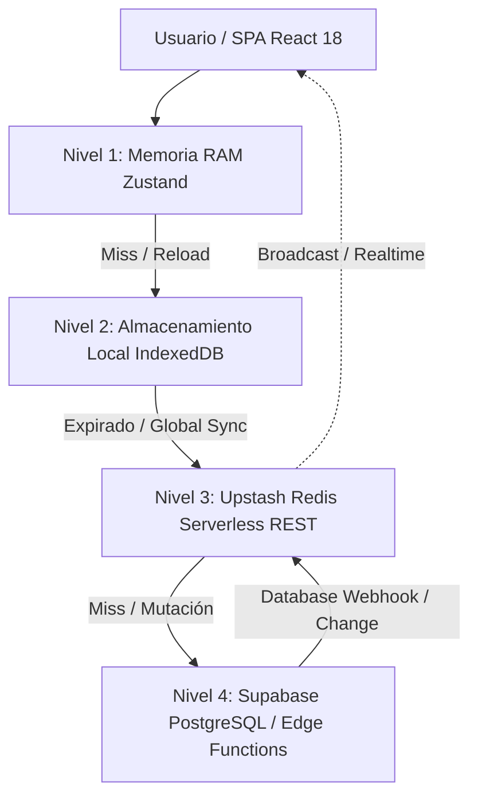

# SaaS Multi-Tier Caching & Concurrency Skill

Esta skill define la estrategia de **Caché Multinivel y Optimización de Throughput** para aplicaciones SPA de alto rendimiento sobre arquitecturas Serverless / Supabase.

---

## 1. Topología del Sistema de Caché

Para maximizar el rendimiento, minimizar la latencia y respetar los límites de la capa gratuita:



### Capas y Responsabilidades:

1. **Nivel 1: Client Memory Cache (Zustand)**:
   - Estado reactivo instantáneo (0ms).
   - Datos de sesión activa, filtros actuales, carrito de ventas POS, estado de modales y vista activa.

2. **Nivel 2: Persistent Client Cache (IndexedDB / LocalStorage)**:
   - Catálogo maestro de productos, listas de precios mayoristas/minoristas, clientes frecuentes y permisos de usuario.
   - Habilita la operación **Offline-First** en caso de micro-cortes de red en punto de venta o planta.

3. **Nivel 3: Distributed Edge Cache (Upstash Redis REST)**:
   - **Locks de Inventario / Reservas Concurrentes**: Bloqueos atómicos con TTL corto (ej. `SET lot:1234:lock true EX 120 NX`) para prevenir colisiones durante el alistamiento.
   - **Métricas Agregadas y Análisis ABC**: Resultados precalculados de Pareto 80/20 y dashboards de KPIs.
   - **Rate Limiting**: Control de peticiones en Edge Functions para proteger cuotas de Supabase.

4. **Nivel 4: Fuente de Verdad (PostgreSQL)**:
   - Persistencia transaccional ACID.
   - Disparo de invalidación de caché vía Webhooks o Supabase Realtime Channels.

---

## 2. Patrón de Consumo Upstash Redis vía HTTP REST

En entornos SPA y Serverless Edge Functions, evita conexiones TCP persistentes que agotan pools. Usa el cliente HTTP ligero de Upstash:

```typescript
// Edge Function o Service Helper
import { Redis } from '@upstash/redis';

const redis = new Redis({
  url: process.env.UPSTASH_REDIS_REST_URL!,
  token: process.env.UPSTASH_REDIS_REST_TOKEN!,
});

// Patrón Cache-Aside para Métricas / ABC
export async function getCachedABCAnalysis(warehouseId: string) {
  const cacheKey = `wms:${warehouseId}:abc_metrics`;
  
  // 1. Intentar lectura de caché
  const cached = await redis.get(cacheKey);
  if (cached) {
    return cached;
  }

  // 2. Si miss, calcular desde PostgreSQL
  const freshData = await calculateABCFromDatabase(warehouseId);

  // 3. Guardar en Redis con TTL (ej. 1 hora)
  await redis.set(cacheKey, JSON.stringify(freshData), { ex: 3600 });

  return freshData;
}
```

---

## 3. Estrategia de Invalidación de Caché (Stale-While-Revalidate)

- **Lecturas Críticas (Stock disponible)**: Invalidación inmediata al registrar movimientos de entrada/salida (`DEL wms:stock:*`).
- **Lecturas Estáticas (Catálogos)**: Cache con TTL extendido (24h) + revalidación en segundo plano.
- **Locks Atómicos**: Expiración automática (`EX`) obligatoria para evitar deadlocks por desconexión de clientes.
