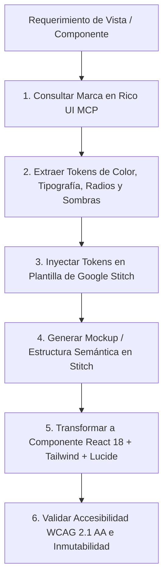

# Stitch & Rico UI Brands Design Integration Skill

Esta habilidad proporciona a los agentes autónomos de IA y desarrolladores frontend un flujo de trabajo unificado para consultar sistemas de diseño de marcas globales desde **Rico UI Brands** (`https://design.ricoui.com/brands`), extraer tokens normalizados a través del servidor MCP **`ricoui-design-mcp`**, y generar componentes e interfaces de producción con **Google Stitch** y **Tailwind CSS**.

---

## 1. Arquitectura del Pipeline de Generación



---

## 2. Herramientas MCP y Comandos CLI Disponibles

El servidor MCP está registrado en `.mcp.json` como `ricoui-design-mcp` y puede ejecutarse tanto por llamadas de herramientas MCP como por CLI directo:

| Herramienta MCP | Comando CLI Equivalente | Descripción |
| :--- | :--- | :--- |
| `ricoui_list_brands` | `node tools/ricoui-mcp/server.cjs brands` | Lista todas las marcas disponibles y sus arquetipos de diseño. |
| `ricoui_get_brand_tokens` | `node tools/ricoui-mcp/server.cjs tokens <marca>` | Retorna los tokens normalizados de una marca (colores HSL/Hex, tipografía, bordes, sombras). |
| `ricoui_get_component_template` | `node tools/ricoui-mcp/server.cjs template <id>` | Retorna la plantilla de código React/Tailwind base (ej: `kpi_card`, `data_table`, `pricing_modal`). |
| `ricoui_format_stitch_prompt` | `node tools/ricoui-mcp/server.cjs prompt "<desc>" <marca>` | Genera automáticamente un prompt enriquecido listo para Google Stitch. |

---

## 3. Catálogo de Marcas y Arquetipos de Estilo

| Marca (ID) | Arquetipo Visual | Colores Clave | Característica Distintiva | Caso de Uso ERP Recomendado |
| :--- | :--- | :--- | :--- | :--- |
| `pezcaderia-glass` | Dark Glassmorphism | `#4f46e5` (Indigo), `#06b6d4` (Cyan) | Paneles translúcidos con blur 16px y bordes sutiles | **Tema por defecto del ERP**, dashboards, cotizaciones |
| `linear` | Modern Dark Minimal | `#5e6ad2` (Indigo), `#08090a` (Deep Slate) | Tipografía ultra limpia, micro-contrastes y bordes refinados | Módulos de auditoría, kanban de pedidos, gestión de tareas |
| `stripe` | Fintech Dynamic Mesh | `#635bff` (Purple), `#00d4aa` (Teal) | Degradados dinámicos y sombras de alta elevación multicapa | Módulos de tesorería, conciliación de pagos y facturación DIAN |
| `raycast` | Pro Launcher Dark | `#ff6363` (Coral), `#0f0f10` (Obsidian) | Altísima densidad de información, atajos de teclado y acento coral | Punto de Venta (POS), selector rápido de productos |
| `supabase` | Developer Cloud Green | `#3ecf8e` (Emerald), `#121212` (Dark) | Contrastes nítidos en verde esmeralda y superficies oscuras | Módulos de inventario WMS, cuartos fríos y trazabilidad FEFO |
| `vercel` | Geist Precision | `#ffffff` (White), `#0070f3` (Electric Blue) | Negro absoluto (`#000000`), alto contraste y bordes milimétricos | Vistas de configuración del sistema, permisos y logs de auditoría |
| `apple` | Frosted Glass Elegance | `#2997ff` (Blue), `#1d1d1f` (Glass) | Bordes curvos continuos (squircles), desenfoque suave y luz de borde | Modales ejecutivos, resúmenes de rendimiento mensual |

---

## 4. Guía de Ejecución Paso a Paso

### Paso 1: Identificar el Requerimiento y Seleccionar la Marca
Define qué pantalla o componente vas a maquetar y cuál es la marca o arquetipo que mejor se adapta al contexto del ERP.
- Si no se especifica marca, usa `pezcaderia-glass` como estándar.

### Paso 2: Extraer Tokens y Generar el Prompt para Stitch
Ejecuta la herramienta o CLI:
```bash
node tools/ricoui-mcp/server.cjs prompt "Dashboard de Ventas y Rendimiento de Despiece" linear
```

### Paso 3: Orquestar con Google Stitch
Envía el prompt al pipeline de Google Stitch (`stitch.json`). Si usas la herramienta Stitch MCP:
```bash
npx -y @_davideast/stitch-mcp@latest snapshot -d '{"brand":"linear", "view":"dashboard"}'
```

### Paso 4: Ensamblar el Componente React 18 / Next.js
Construye el componente en `src/components/` o `src/views/` respetando:
1. **TypeScript Estricto:** Interfaces explícitas para todos los props y estados.
2. **Tailwind CSS Utility-First:** Utilizar las clases de Glassmorphism (`backdrop-blur-xl`, `bg-slate-900/60`, `border-white/10`).
3. **Micro-Animaciones:** Transiciones suaves (`transition-all duration-200 hover:scale-[1.01]`).
4. **Iconos Coherentes:** Utilizar `lucide-react`.

### Paso 5: Control de Calidad y Accesibilidad (WCAG 2.1 AA)
Verifica que:
- Los ratios de contraste de texto sobre fondos de cristal sean al menos **4.5:1**.
- Todos los elementos interactivos tengan estados `hover`, `focus-visible` y `active`.
- No existan datos vacíos ni texto en "Lorem Ipsum".

---

## 5. Ejemplos de Implementación

### Ejemplo: Tarjeta KPI con Acento Linear
```tsx
import React from 'react';
import { TrendingUp, Package } from 'lucide-react';

export const LinearKpiCard = ({ title, value, change }: { title: string; value: string; change: number }) => (
  <div className="relative overflow-hidden rounded-lg border border-white/10 bg-[#121417]/80 p-4 backdrop-blur-xl transition-all hover:border-[#5e6ad2]/40 hover:shadow-[0_0_20px_rgba(94,106,210,0.15)]">
    <div className="flex items-center justify-between text-xs text-[#8a8f98]">
      <span className="uppercase tracking-wider font-mono">{title}</span>
      <Package className="h-4 w-4 text-[#5e6ad2]" />
    </div>
    <div className="mt-3 flex items-baseline justify-between">
      <span className="text-2xl font-bold text-[#f7f8f8] font-sans">{value}</span>
      <span className="flex items-center text-xs font-semibold text-emerald-400">
        <TrendingUp className="mr-1 h-3 w-3" /> +{change}%
      </span>
    </div>
  </div>
);
```

---

## 6. Verificación de Integración

Para validar el funcionamiento del servidor MCP y catálogo de Rico UI en cualquier momento:
```bash
node tools/ricoui-mcp/server.cjs test
```
