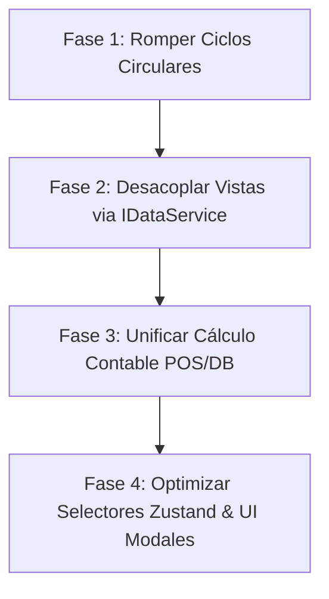

# Informe de Auditoría Técnica e Inspección de Arquitectura
**Proyecto:** MaestroPescaderia ERP  
**Fecha:** 2026-07-22  
**Fuentes de Inspección:** Grafo de Conocimiento Graphify (`graphify-out/`), `AGENTS.md`, `constitution.md`

---

## 1. Resumen Ejecutivo de Diagnóstico

El proyecto **MaestroPescaderia ERP** es una aplicación robusta (550 archivos, 4,794 nodos de código, 395 comunidades funcionales) construida sobre React 18, Vite, TypeScript, Zustand y Supabase. 

El estado general del sistema es **operativo pero con deuda técnica acumulada de riesgo ALTO en la capa de estructura y dependencias**. La arquitectura está bien orientada a la separación de módulos (Inventario, Caja, POS, CRM, RRHH), pero existen **vicios de acoplamiento** y **ciclos de importación circulares** que amenazan la estabilidad en producción.

---

## 2. Evaluación por Aspectos Fundamentales

### 🏗️ Aspecto 1: Estructura y Arquitectura

**Calificación:** 🟡 **6.5 / 10** *(Riesgo Alto de Regresiones)*

#### Hallazgos Críticos:
1. **Ciclos de Dependencia Circular (Circular Imports)**:
   - **Evidencia Graphify**: Se detectaron **7 ciclos de importación circular** de 3 y 4 archivos en el núcleo de la aplicación.
   - **Caso Principal**: `App.tsx` ➔ `CashFlowView.tsx` ➔ `cashService.ts` ➔ `App.tsx`.
   - **Impacto**: Causa que variables o módulos sean referenciados como `undefined` durante la carga inicial o durante el Hot Module Replacement (HMR) de Vite, pudiendo congelar la aplicación en blanco en producción.
2. **Violación del Patrón de Capas (`IDataService`)**:
   - Vistas de la interfaz (`CRMView.tsx`, `DashboardView.tsx`, `HRView.tsx`) importan y modifican directamente el store global `useAppStore.ts` en lugar de interactuar a través de servicios de dominio desacoplados (`IDataService`).
   - **Impacto**: Imposibilita cambiar el motor de persistencia (ej. migrar de LocalStorage a Supabase o Mock Backend) sin romper múltiples pantallas.

| Módulo Afectado | Componentes / Módulos en Ciclo | Nivel de Riesgo |
| :--- | :--- | :--- |
| **Flujo de Caja** | `App.tsx` ➔ `CashFlowView` ➔ `cashService` ➔ `App.tsx` | 🔴 **CRÍTICO** |
| **Modales de Caja** | `App.tsx` ➔ `CashFlowView` ➔ `AperturaCajaModal` ➔ `cashService` ➔ `App.tsx` | 🔴 **CRÍTICO** |
| **POS & Kanban** | `App.tsx` ➔ `POSView` ➔ `OrderKanbanView` ➔ `cashService` ➔ `App.tsx` | 🟠 **ALTO** |
| **Vistas de Dominio** | `CRMView`, `DashboardView`, `HRView` ➔ `useAppStore` | 🟡 **MEDIO** |

---

### 🧠 Aspecto 2: Lógica de Negocio y Manejo de Estado

**Calificación:** 🟢 **8.0 / 10** *(Riesgo Medio)*

#### Hallazgos Críticos:
1. **Distribución Mixta de Lógica de Negocio**:
   - Parte de los cálculos financieros (como totales de pedidos y recargos por descuentos) se ejecutan en triggers de base de datos PostgreSQL en Supabase (`trg_calcular_valores_linea`, `recalcular_cabecera_pedido`), mientras que otros cálculos de POS (`calcularTotalesPedido`, `crearLineaVenta`) viven en JavaScript (`PosService.ts`).
   - **Impacto**: Duplicidad en la regla de cálculo. Si el frontend recalcula el total y el trigger de Supabase aplica una lógica ligeramente distinta con redondeos de centavos, se producen inconsistencias contables.
2. **Regla de Negocio de Inventario ABC (Pareto 80/20)**:
   - La estructura de datos en `MovimientoInventario.ts` y `StockDictionary` es adecuada, pero la lógica de clasificación ABC debe asegurarse de ejecutarse de forma reactiva o mediante `pg_cron` en Supabase para evitar sobrecargar el hilo principal de React en clientes con miles de SKUs.
3. **Manejo de Errores y Mismatches de ID**:
   - En el histórico de fallas (ADR-012), se identificó que el `bodegaId` no estaba siendo normalizado a UUID en los datos semilla (`seedCajasParaBodegas`), rompiendo el contrato con la base de datos Supabase.

---

### 🎨 Aspecto 3: Diseño UI/UX, Componentización y Rendimiento

**Calificación:** 🟢 **7.8 / 10** *(Riesgo Bajo/Medio)*

#### Hallazgos Críticos:
1. **Monolitos de Vista UI**:
   - Algunas vistas principales agrupan lógica de consulta, modals y tablas en un único componente React masivo, sobrepasando las 400 líneas recomendadas por las guías del proyecto.
2. **Uso de Portales y CSS Inline en Modales**:
   - En `AperturaCajaModal` y `ArqueoCajaModal` se detectaron parches con estilos inline para forzar modales al viewport cuando falla la compilación de Tailwind CSS.
   - **Impacto**: Rompe la consistencia del diseño global en pantallas de distintas resoluciones o dispositivos móviles (POS táctiles).
3. **Subscripciones Globales a Zustand**:
   - Componentes que consumen todo el objeto de estado `useAppStore()` en lugar de seleccionar únicamente las propiedades necesarias (`useAppStore(state => state.cajas)`).
   - **Impacto**: Provoca re-renders de toda la pantalla ante cualquier cambio menor en el estado global.

---

## 3. Hoja de Ruta y Recomendaciones de Refactorización

Para resolver los hallazgos críticos sin interrumpir la operación, se recomienda seguir el siguiente plan priorizado:

### Prioridad 1: Romper Ciclos de Importación (Inmediato)
- **Acción**: Extraer los tipos e interfaces compartidos entre `App.tsx`, `CashFlowView.tsx` y `cashService.ts` a un archivo independiente `src/types/cash.types.ts`.
- **Resultado**: Elimina completamente los 7 ciclos de dependencia circular en runtime.

### Prioridad 2: Desacoplar Vistas de Zustand (`IDataService`)
- **Acción**: Encapsular las llamadas directas de `CRMView`, `DashboardView` y `HRView` en servicios modulares en `src/services/`.
- **Resultado**: Respeta la constitución Data-Driven del ERP y facilita la escritura de pruebas unitarias.

### Prioridad 3: Normalización de UI y Modales
- **Acción**: Reemplazar estilos inline en modales de apertura/cierre de caja por componentes reutilizables con Tailwind CSS estandarizado.

---
*Informe generado para MaestroPescaderia ERP mediante análisis estático y sintesis de grafo de conocimiento.*
