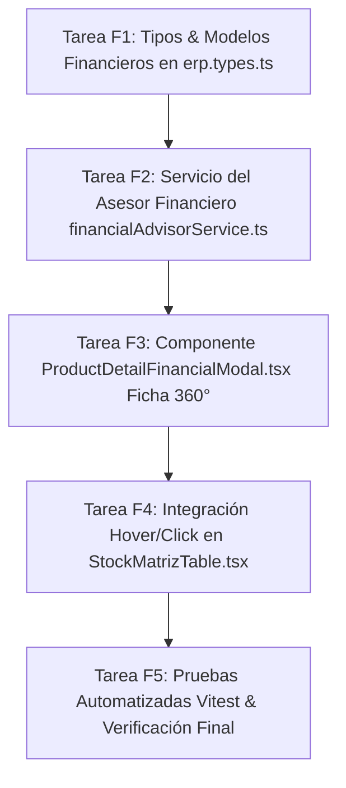

# Especificación de Tareas Atómicas (Spec-Kit Tasks) — Ficha 360° & Asesor Financiero (Auditado QA-2)

Plan de ejecución de tareas atómicas derivado del **Control de Calidad 2 (Alineación Cruzada Spec -> Plan -> Tasks)** para la implementación de la **Ficha 360° Integral del Producto** con **Asesor Financiero Nativo**, gestión de IVA, promociones avanzadas (2x1, 12+1, Canastas) e interactividad en `StockMatrizTable.tsx`.

---

## Matriz de Tareas Atómicas y Dependencias

---

### [X] 📋 Tarea F1: Extensión de Tipos y Modelos de Dominio Financiero
- **Archivo Destino:** [`src/types/erp.types.ts`](file:///c:/Users/usuario/OneDrive/Documentos/Aplicaciones%20Pezca/MaestroPescaderia/src/types/erp.types.ts)
- **Estado:** ✅ Completada.
- **Dependencias:** Ninguna (Capa Base).
- **Acciones Específicas:**
  1. Definir tipo `TipoPromocion = 'PORCENTAJE' | 'PRECIO_FIJO' | '2X1' | '12_MAS_1' | 'VOLUMEN'`.
  2. Definir interfaz `PromocionProducto` (`tipo`, `valor`, `fecha_inicio`, `fecha_fin`, `activa`, `min_kg?`, `descripcion?`).
  3. Definir interfaz `VentaAncladaItem` (`producto_id`, `sku`, `nombre`, `descuento_combo_pct`).
  4. Extender `Product` y `ProductCatalog` con campos opcionales: `cuenta_contable_ingreso?: string`, `promocion_activa?: PromocionProducto`, `ventas_ancladas?: VentaAncladaItem[]`, `porcentaje_merma_esperada?: number`.
  5. Definir interfaces `SimulacionCanal`, `EstadoMargen` (`OPTIMO` | `AJUSTADO` | `PERDIDA`) y `EvaluacionPromocionAvanzada`.
- **Criterio de Aceptación:** `npx tsc --noEmit` compila con Código 0 sin errores de tipos.

---

### [x] 📋 Tarea F2: Servicio del Motor Asesor Financiero (`financialAdvisorService.ts`)
- **Archivo Destino:** [`src/services/financialAdvisorService.ts`](file:///c:/Users/usuario/OneDrive/Documentos/Aplicaciones%20Pezca/MaestroPescaderia/src/services/financialAdvisorService.ts)
- **Estado:** ✅ Completada.
- **Dependencias:** Tarea F1.
- **Acciones Específicas:**
  1. `calcularCostoAprovechable(cpp, porcentajeMerma)`: Cálculo del costo real por kilo aprovechable ($\text{Costo Real} = \text{CPP} / (1 - \text{Merma}/100)$).
  2. `obtenerMargenObjetivo(categoriaABC, canal)`: Implementar política dinámica ABC (POS: 35/42/50%, Restaurante: 25/30/35%, Mayorista: 15/18/22%).
  3. `desglosarIva(precio, tarifaIva, ivaIncluido)`: Desglose bidireccional exacto de Base Gravable y Cuota de IVA.
  4. `calcularPreciosSugeridos(producto, cpp, clasificacionAbc, porcentajeMerma)`: Sugerencia algorítmica de precios por canal sobre costo neto.
  5. `simularRentabilidadCanal(costoBase, precioVenta, tarifaIva, ivaIncluido, clasificacionAbc, canal)`: Cálculo de margen bruto %, utilidad COP, estado semafórico y precio break-even.
  6. `evaluarOfertaAvanzada(tipoPromo, valorPromo, precioNormal, costoBase)`: Guardián de margen efectivo para ofertas `12_MAS_1` ($P_{\text{efectivo}} = 12/13$) y `2X1` ($P_{\text{efectivo}} = 1/2$) con alerta semafórica de venta a pérdida.
  7. `obtenerSugerenciasCanasta(sku)`: Análisis de correlación de compras conjuntas en órdenes previas.
- **Criterio de Aceptación:** Funciones matemáticas puras con cobertura completa de pruebas.

---

### [x] 📋 Tarea F3: Componente `ProductDetailFinancialModal.tsx` (Ficha 360°)
- **Archivo Destino:** [`src/views/inventory/components/ProductDetailFinancialModal.tsx`](file:///c:/Users/usuario/OneDrive/Documentos/Aplicaciones%20Pezca/MaestroPescaderia/src/views/inventory/components/ProductDetailFinancialModal.tsx)
- **Estado:** ✅ Completada.
- **Dependencias:** Tarea F2.
- **Acciones Específicas:**
  1. Encabezado Dark Glassmorphism con avatar WebP, SKU con badge mono, nombre editable y selector de estado activo/inactivo.
  2. 5 Pestañas temáticas:
     - **Tab 1: Resumen 360° & Stock Multibodega:** KPIs de existencias, valoración en libros ($ COP) y barras de nivel por cuarto frío.
     - **Tab 2: Datos Maestros & Catálogo:** Edición de SKU, nombre comercial, categoría jerárquica (Tipo, Línea, Clase), unidad, código de barras y porcentaje de merma.
     - **Tab 3: Asesor Financiero & Precios / Márgenes:** Simulador reactivo con cálculo en vivo de margen bruto %, utilidad y semáforo de rentabilidad por canal (POS, Restaurante, Mayorista).
     - **Tab 4: Impuestos IVA & Cuentas Contables NIIF:** Tarifa de IVA (0%, 5%, 19%), interruptor de IVA incluido y cuentas PUC (14xx, 61xx, 41xx).
     - **Tab 5: Promociones Avanzadas 12+1, Canastas & Kardex:** Configuración de ofertas con guardián semafórico, ventas ancladas y tabla filtrada del Kardex del SKU.
  3. Guardado dual atómico: actualiza `productsCatalog` y `products`, e inserta una nueva vigencia en `productPricings` en `useInventoryStore`.
  4. Control RBAC: `admin` y `administrativo` editan; otros roles acceden en modo solo lectura.
- **Criterio de Aceptación:** Estética Dark Glassmorphism, persistencia en `localDb` y notificación con SweetAlert2.

---

### [x] 📋 Tarea F4: Integración Interactiva en `StockMatrizTable.tsx`
- **Archivo Destino:** [`src/views/inventory/components/StockMatrizTable.tsx`](file:///c:/Users/usuario/OneDrive/Documentos/Aplicaciones%20Pezca/MaestroPescaderia/src/views/inventory/components/StockMatrizTable.tsx)
- **Estado:** ✅ Completada.
- **Dependencias:** Tarea F3.
- **Acciones Específicas:**
  1. Actualizar filas de la tabla con `cursor-pointer transition-all hover:bg-slate-800/40`.
  2. Incorporar badge/botón interactivo en la columna Producto: `[ 👁️ Ficha 360° ]`.
  3. Conectar evento `onClick` de la fila para abrir `ProductDetailFinancialModal` con el producto seleccionado.
  4. Callback `onProductUpdated` que actualiza el catálogo y la matriz sin recargar la página.
- **Criterio de Aceptación:** Apertura instantánea del modal al hacer click en cualquier fila o badge.

---

### [x] 📋 Tarea F5: Suite de Pruebas Automatizadas y Verificación Build
- **Archivo Destino:** [`src/tests/productDetailFinancialModal.test.tsx`](file:///c:/Users/usuario/OneDrive/Documentos/Aplicaciones%20Pezca/MaestroPescaderia/src/tests/productDetailFinancialModal.test.tsx)
- **Estado:** ✅ Completada.
- **Dependencias:** Tareas F1 a F4.
- **Acciones Específicas:**
  1. Pruebas unitarias para `financialAdvisorService`:
     - Cálculo de precios sugeridos por política ABC y ajuste por merma.
     - Desglose de Base Gravable e IVA incluido vs excluido.
     - Detección de precio efectivo y alerta en oferta `12+1` y `2x1`.
  2. Pruebas de integración para `ProductDetailFinancialModal`:
     - Renderizado del modal y cambio entre las 5 pestañas.
     - Simulación de guardado atómico en `useInventoryStore`.
  3. Ejecución de la suite completa: `npm run test:run`.
  4. Verificación de compilación de producción: `npm run build`.
- **Criterio de Aceptación:** 100% de pruebas pasando y cero errores de compilación TypeScript.
