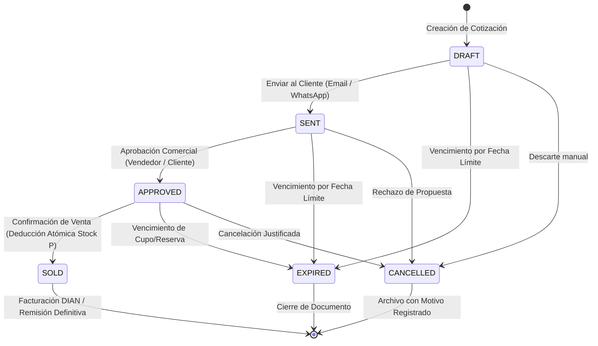
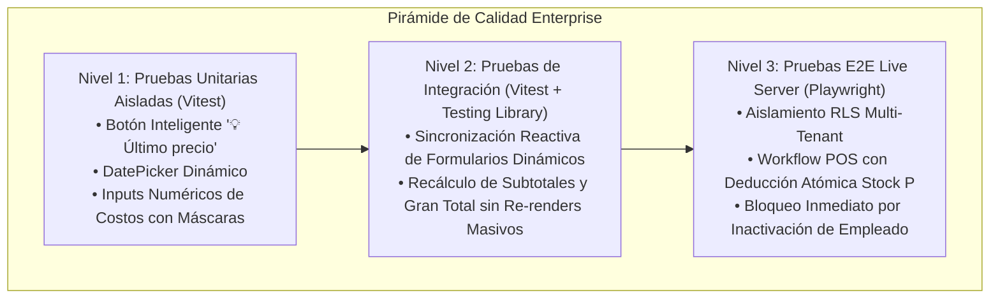
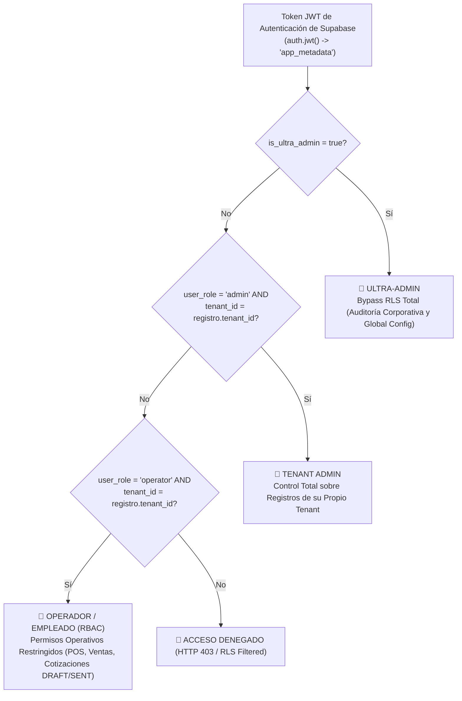

# 🏛️ GOBERNANZA ARQUITECTÓNICA, CONTROL DE CALIDAD Y AISLAMIENTO MULTI-TENANT
**Proyecto:** La Pezcadería ERP (`maestro_ERP_Pezcaderia`)  
**Versión:** 2.0.0-ENTERPRISE  
**Fecha de Publicación:** 28 de Septiembre de 2026  
**Estatus:** VIGENTE / NORMA OBLIGATORIA  
**Comité de Gobernanza:** `@agency-software-architect`, `@agency-test-automation-engineer`, `@agency-backend-architect`, `@agency-ui-finish-gate-reviewer`, `@agency-legal-compliance-checker`, `@agents-orchestrator`

---

## 📑 ÍNDICE DE CONTENIDOS
1. [Manifiesto de Arquitectura y Principios No Negociables](#1-manifiesto-de-arquitectura-y-principios-no-negociables)
2. [Paso 1: Re-Arquitectura Monorepo y Transporte Seguro](#2-paso-1-re-arquitectura-monorepo-y-transporte-seguro)
   - 2.1 Topología Monorepo con Workspaces de PNPM
   - 2.2 Ciclo de Vida Documental de Cotizaciones (State Machine)
   - 2.3 Directivas de Aislamiento Criptográfico Multi-Tenant en Supabase
   - 2.4 Estándar de Transporte Seguro: Payloads y Try-Catch Estricto
3. [Paso 2: Pirámide Integral de Pruebas de Software](#3-paso-2-pirámide-integral-de-pruebas-de-software)
   - 3.1 Nivel 1: Pruebas Unitarias de Componentes Aislados (Vitest)
   - 3.2 Nivel 2: Pruebas de Integración y Reactividad Transaccional
   - 3.3 Nivel 3: Pruebas End-to-End en Servidor Vivo (Playwright)
4. [Paso 3: Sistema de Diseño Linear, Densidad Quirúrgica y Adaptabilidad Fluida](#4-paso-3-sistema-de-diseño-linear-densidad-quirúrgica-y-adaptabilidad-fluida)
   - 4.1 Fichas de Estilos y Clases Tailwind para Inventario Multi-Bodega (P, S, A)
   - 4.2 Transformación Líquida a Tarjetas Apiladas (Responsive Mobile/Tablet)
   - 4.3 Tokens Visuales Industriales (Bordes, Radios y Tipografía)
   - 4.4 El Tridecálogo Canónico del CSS Moderno & Frontend (Ground Truth)

5. [Paso 4: Marco Legal, Habeas Data y Consentimiento Obligatorio](#5-paso-4-marco-legal-habeas-data-y-consentimiento-obligatorio)
   - 5.1 Cumplimiento de la Ley 1581 de 2012 (Colombia) y RGPD
   - 5.2 Mecanismo del Banner y Modal Bloqueante de Consentimiento
6. [Matriz de Gobernanza y Verificación Continua](#6-matriz-de-gobernanza-y-verificación-continua)
7. [Paso 5: Arquitectura Jerárquica de Permisos, Roles JWT y Ciclo de Vida RLS](#7-paso-5-arquitectura-jerárquica-de-permisos-roles-jwt-y-ciclo-de-vida-rls)
   - 7.1 Estrategia Jerárquica de 3 Niveles en JWT App Metadata
   - 7.2 Tabla de Gobernanza de Estados y Roles (user_tenant_roles)
   - 7.3 Trigger Automatizado de Desactivación y Revocación Atómica
   - 7.4 Script de Migración PostgreSQL de Aislamiento Perimetral (24_hierarchical_jwt_rls_governance.sql)
8. [Paso 6: Arquitectura de Pruebas e Interacciones de Usuario para Flujos Operativos Clave](#8-paso-6-arquitectura-de-pruebas-e-interacciones-de-usuario-para-flujos-operativos-clave)
   - 8.1 Matriz de Flujos Operativos Auditados y Blindaje Zod/RPC
   - 8.2 Pirámide de Testing en Tres Niveles (Unitarias, Integración, Playwright Live E2E)
   - 8.3 Diseño de Interfaz Denso y Adaptativo (Estilo Linear)
   - 8.4 Certificación de Refactorización Frontend (SPEC-001)
9. [Paso 7: Gobernanza Fiscal, Anulaciones, Retenciones Tributarias y Modalidades de Facturación](#9-paso-7-gobernanza-fiscal-anulaciones-retenciones-tributarias-y-modalidades-de-facturación)
   - 9.1 Matriz de Flujos de Anulación y Cancelación (Totales y Parciales)
   - 9.2 Motor de Retenciones Tributarias y Perfiles de Clientes (Retefuente, ReteIVA, ReteICA)
   - 9.3 Tipología Multidocumental de Facturación (FEV, POS, Contingencia, Exportación, RADIAN, Documento Soporte)


---

## 1. Manifiesto de Arquitectura y Principios No Negociables

1. **Aislamiento Multi-Tenant Estricto:** Toda tabla operativa de base de datos (`clientes`, `pedidos`, `cotizaciones`, `productos`, `cajas`, `empleados`) contiene obligatoriamente una columna `empresa_id UUID NOT NULL` indexada. Ningún usuario o rol (incluyendo administradores de tenant) puede consultar, modificar o inferir la existencia de registros de otra empresa.
2. **Cero Fugas de Trazas (Zero Stack-Trace Leakage):** Todo endpoint, función RPC y wrapper de cliente Supabase debe encapsular la ejecución en bloques `try-catch` estructurados que retornen el envelope `{ success, data, error, message, statusCode }`. Jamás se expondrán stack traces o errores nativos de PostgreSQL al usuario final.
3. **Caché Offline-First Particionado:** La persistencia en `localStorage` (como `pezcaderia_stock`) debe particionarse por empresa (`pezcaderia_stock_${empresaId}`) para prevenir contaminación cruzada de inventario en navegadores compartidos.
4. **Densidad Quirúrgica Estilo Linear:** Filas de datos entre 28px y 32px de altura, tipografía `text-xs` (12px), íconos de 14–16px, bordes de muy bajo contraste (`border-zinc-800`) y radio industrial `rounded-md` (4px).

---

## 2. Paso 1: Re-Arquitectura Monorepo y Transporte Seguro

### 2.1 Topología Monorepo con Workspaces de PNPM

La estructura física del repositorio se organiza mediante `pnpm-workspace.yaml`, desacoplando la lógica de datos y validaciones de la interfaz de usuario:

```
maestro_ERP_Pezcaderia/
├── apps/
│   ├── frontend/                       # React 18 + Vite + Tailwind CSS + Lucide
│   │   ├── src/
│   │   │   ├── components/ui/          # DenseTableRow, DenseBadge, FluidResponsiveCard
│   │   │   ├── components/legal/       # ConsentGateModal (Habeas Data)
│   │   │   ├── lib/                    # safeApi.ts, supabaseClient.ts
│   │   │   ├── views/                  # POSView, PricingView, InventoryView, HRView
│   │   │   └── store/                  # Zustand (useInventoryStore, useCashStore)
│   │   ├── package.json
│   │   └── vite.config.ts
│   └── backend-core/                   # Microservicio transaccional / Job worker
│       ├── pom.xml / package.json
│       └── Dockerfile
├── packages/
│   ├── database-shared/                # Modelado Prisma y Migraciones SQL
│   │   ├── schema.prisma               # Fuente canónica de entidades multi-tenant
│   │   ├── migrations/                 # 01 a 23 scripts versionados
│   │   └── package.json
│   ├── validation-schemas/             # Validaciones con Zod compartidas
│   │   ├── src/
│   │   │   ├── pricing.schema.ts       # State Machine y transiciones documentales
│   │   │   └── index.ts
│   │   └── package.json
│   └── tsconfig/                       # Configuración base de TypeScript
├── tests/
│   ├── e2e/                            # Pruebas Live con Playwright
│   └── unit/                           # Pruebas unitarias con Vitest
├── pnpm-workspace.yaml
├── package.json
└── ARCHITECT_GOVERNANCE.md
```

### 2.2 Ciclo de Vida Documental de Cotizaciones (State Machine)

El ciclo de cotizaciones y pedidos comerciales sigue una máquina de estados finita determinista:



#### Reglas de Transición Inmutables:
- **DRAFT:** Modificación libre de ítems, descuentos y costos. No afecta inventario.
- **SENT:** Inmutable para vendedores de línea; solo editable mediante nueva versión.
- **APPROVED:** Requiere validación de cupo de crédito y rol `ADMIN` o `SUPERVISOR`.
- **EXPIRED:** Activado por `pg_cron` o al superar la `fecha_expiracion` sin confirmación.
- **SOLD:** Estado final que dispara el Trigger de PostgreSQL para decrementar atómicamente el stock físico de la **Bodega Principal (P)** y generar la cuenta por cobrar en Cartera.

### 2.3 Directivas de Aislamiento Criptográfico Multi-Tenant en Supabase

#### Función de Resolución de Tenant Híbrida Resiliente:
```sql
CREATE OR REPLACE FUNCTION get_current_empresa_id()
RETURNS UUID AS $$
DECLARE
    v_empresa_id UUID;
    v_jwt_val TEXT;
BEGIN
    -- 1. Extraer del JWT (app_metadata o user_metadata)
    BEGIN
        v_jwt_val := COALESCE(
            auth.jwt() -> 'app_metadata' ->> 'empresa_id',
            auth.jwt() -> 'user_metadata' ->> 'empresa_id'
        );
        IF v_jwt_val IS NOT NULL AND v_jwt_val <> '' THEN
            RETURN v_jwt_val::UUID;
        END IF;
    EXCEPTION WHEN OTHERS THEN
        NULL;
    END;

    -- 2. Fallback resiliente a tabla usuarios
    IF auth.uid() IS NOT NULL THEN
        SELECT empresa_id INTO v_empresa_id FROM usuarios WHERE id = auth.uid();
        IF v_empresa_id IS NOT NULL THEN
            RETURN v_empresa_id;
        END IF;
    END IF;

    -- 3. Fallback de contingencia operativa
    RETURN '00000000-0000-0000-0000-000000000001'::UUID;
END;
$$ LANGUAGE plpgsql STABLE SECURITY DEFINER;
```

#### Política RLS Canónica para Tablas Operativas:
```sql
ALTER TABLE cotizaciones ENABLE ROW LEVEL SECURITY;

CREATE POLICY tenant_isolation_cotizaciones ON cotizaciones
    FOR ALL TO authenticated
    USING (empresa_id = get_current_empresa_id())
    WITH CHECK (empresa_id = get_current_empresa_id());
```

### 2.4 Estándar de Transporte Seguro: Payloads y Try-Catch Estricto

#### Estructura Estándar de Respuesta (`ApiResponse<T>`):
```json
{
  "success": false,
  "data": null,
  "error": "P0001",
  "message": "La merma del despiece supera el 35% y requiere PIN de autorización de un supervisor.",
  "statusCode": 422
}
```

#### Wrapper de Transporte Inmune a Fugas:
```typescript
export async function safeDatabaseExecute<T>(
  operationName: string,
  queryFn: () => Promise<{ data: T | null; error: any }>
): Promise<ApiResponse<T>> {
  try {
    const { data, error } = await queryFn();

    if (error) {
      return {
        success: false,
        error: error.code || 'DB_ERROR',
        message: sanitizeErrorMessage(error),
        statusCode: mapErrorToStatusCode(error.code),
      };
    }

    return {
      success: true,
      data: data as T,
      message: 'Operación completada exitosamente',
      statusCode: 200,
    };
  } catch (err: any) {
    return {
      success: false,
      error: 'UNEXPECTED_EXCEPTION',
      message: 'Error inesperado del sistema. Notifique al administrador.',
      statusCode: 500,
    };
  }
}
```

---

## 3. Paso 2: Pirámide Integral de Pruebas de Software



### 3.1 Nivel 1: Pruebas Unitarias de Componentes Aislados (Vitest)
- **Botón Inteligente `💡 Último precio`:**
  - Mock de `pezcaderia_last_client_prices` y servicio de catálogo.
  - Verifica que al hacer clic se aplique el valor exacto del último precio facturado al cliente para el SKU seleccionado.
  - Si el cliente no registra histórico, debe deshabilitar el botón y mostrar tooltip descriptivo.
- **Selector de Fechas (`DatePicker`):**
  - Validación de rango permitido: impide seleccionar fechas de despacho anteriores a la fecha actual (`minDate = hoy`).
  - Formato estandarizado ISO 8601 (`YYYY-MM-DD`) para compatibilidad con PostgreSQL `DATE`.
- **Inputs Numéricos de Costos Editables:**
  - Control de caracteres no numéricos mediante máscara reactiva.
  - Impide valores negativos en costos unitarios y redondea automáticamente a 2 decimales para evitar desbordamiento por punto flotante IEEE 754.

### 3.2 Nivel 2: Pruebas de Integración y Reactividad Transaccional
- **Sincronización Reactiva de Tablas Dinámicas:**
  - Al editar el `costoUnitario` o la `cantidad` en la línea 3 de una cotización:
    1. La celda `subtotalLinea` debe actualizarse inmediatamente: `(cantidad * costoUnitario) * (1 - descuentoPct / 100)`.
    2. El gran total del contrato en el pie de página debe sumarizar de manera reactiva el subtotal de todas las líneas, el IVA acumulado y el flete logístico.
    3. Validación de rendimiento: Solo la fila modificada y el panel de totales deben re-renderizarse (verificado con `Profiler` y tests de conteo de renders).

### 3.3 Nivel 3: Pruebas End-to-End en Servidor Vivo (Playwright)

**Archivo:** `playwright.config.ts`
```typescript
import { defineConfig, devices } from '@playwright/test';

export default defineConfig({
  testDir: './tests/e2e',
  timeout: 30000,
  fullyParallel: false, // Secuencial para proteger aislamiento de base de datos
  reporter: [['html'], ['list']],
  use: {
    baseURL: process.env.PLAYWRIGHT_BASE_URL || 'http://localhost:5173',
    trace: 'on-first-retry',
    screenshot: 'only-on-failure',
  },
  projects: [
    { name: 'Desktop Chrome', use: { ...devices['Desktop Chrome'] } },
    { name: 'Mobile Safari', use: { ...devices['iPhone 14'] } },
  ],
});
```

#### Los 3 Flujos Críticos de Certificación:

1. **Flujo A (Aislamiento RLS Multi-Tenant):**
   - Iniciar sesión como usuario de `Empresa B`.
   - Realizar petición HTTP GET a `/rest/v1/cotizaciones` filtrando por ID de una cotización de `Empresa A`.
   - **Criterio de Aceptación:** Supabase debe devolver arreglo vacío `[]` (HTTP 200 con 0 resultados) o denegar con HTTP 403. En ningún caso se revelan datos de `Empresa A`.

2. **Flujo B (Workflow POS y Deducción Atómica en Bodega Principal):**
   - Crear cliente con NIT `900123456`.
   - Agregar 10 kg de Salmón Premium al cotizador; presionar "💡 Último precio".
   - Transicionar estado documental a `SOLD`.
   - Consultar la tabla `stock_bodegas` para la Bodega Principal (P).
   - **Criterio de Aceptación:** El stock físico disminuye en exactamente 10 kg en la base de datos de Supabase, registrando el movimiento Kardex con timestamp.

3. **Flujo C (Bloqueo Inmediato por Inactivación de Empleado):**
   - Usuario autenticado con sesión activa de cajero o vendedor.
   - Un administrador cambia el estado del empleado a `INACTIVO` en la tabla `empleados`.
   - El Trigger `trg_desactivar_acceso_empleado` ejecuta `UPDATE usuarios SET activo = FALSE`.
   - El test E2E intenta realizar una venta o cambio de vista.
   - **Criterio de Aceptación:** La sesión es revocada, el usuario es redirigido a `/login` y SweetAlert2 muestra: *"Su usuario ha sido desvinculado o inactivado de la organización"*.

---

## 4. Paso 3: Sistema de Diseño Linear, Densidad Quirúrgica y Adaptabilidad Fluida

### 4.1 Fichas de Estilos y Clases Tailwind para Inventario Multi-Bodega (P, S, A)

Para erradicar barras de desplazamiento horizontal y fatiga visual en pantallas de alta resolución y monitores táctiles de bodega:

```html
<!-- Fila Quirúrgica de Alta Densidad (Linear Aesthetic) -->
<tr class="h-8 border-b border-zinc-800/80 hover:bg-zinc-850/60 text-xs transition-colors group select-none">
  <!-- SKU -->
  <td class="px-2 py-0 font-mono text-[11px] text-zinc-400 whitespace-nowrap w-24">
    PRD-SALM-01
  </td>
  <!-- Nombre & Badge ABC -->
  <td class="px-2 py-0 font-medium text-zinc-200 truncate max-w-[200px]">
    <div class="flex items-center gap-1.5">
      <span class="truncate">Filete de Salmón Chileno</span>
      <span class="px-1 py-0.2 text-[9px] font-mono font-bold bg-emerald-950/60 text-emerald-400 border border-emerald-800/40 rounded-sm">
        A
      </span>
    </div>
  </td>
  <!-- Bodega Principal (P) -->
  <td class="px-2 py-0 text-right font-mono font-semibold text-zinc-100 w-24">
    1,450.00 KG
  </td>
  <!-- Bodega Secundaria (S) -->
  <td class="px-2 py-0 text-right font-mono text-zinc-400 w-24">
    230.00 KG
  </td>
  <!-- Bodega Averías (A) -->
  <td class="px-2 py-0 text-right font-mono text-red-400/90 w-24">
    12.50 KG
  </td>
  <!-- Acciones Compactas -->
  <td class="px-2 py-0 text-right w-20">
    <button class="px-1.5 py-0.5 text-[10px] bg-sky-950/40 border border-sky-800/40 text-sky-400 hover:bg-sky-900/60 rounded-sm transition-all">
      💡 Último
    </button>
  </td>
</tr>
```

### 4.2 Transformación Líquida a Tarjetas Apiladas (Responsive Mobile/Tablet)

En pantallas inferiores a `768px` (`md`), la tabla tabular se desmonta automáticamente transformándose en tarjetas independientes sin romper el layout:

```html
<!-- Tarjeta Adaptativa Fluida Antifugas para Tablet / Celular -->
<div class="block md:hidden w-full p-3 bg-zinc-950 border border-zinc-800 rounded-sm space-y-2 text-xs">
  <div class="flex items-center justify-between gap-2 border-b border-zinc-800/60 pb-1.5">
    <div class="flex items-center gap-2 truncate">
      <span class="font-bold text-zinc-100 truncate">Filete de Salmón Chileno</span>
      <span class="px-1 py-0.2 text-[9px] font-mono font-bold bg-emerald-950 text-emerald-400 border border-emerald-800 rounded-sm">
        A
      </span>
    </div>
    <span class="font-mono text-[10px] text-zinc-500">PRD-SALM-01</span>
  </div>

  <!-- Rejilla de Bodegas P, S, A -->
  <div class="grid grid-cols-3 gap-2 py-1 text-center font-mono">
    <div class="bg-zinc-900 p-1.5 rounded-sm border border-zinc-850">
      <div class="text-[10px] text-zinc-400">Principal (P)</div>
      <div class="font-bold text-zinc-100">1,450 KG</div>
    </div>
    <div class="bg-zinc-900 p-1.5 rounded-sm border border-zinc-850">
      <div class="text-[10px] text-zinc-400">Secundaria (S)</div>
      <div class="text-zinc-300">230 KG</div>
    </div>
    <div class="bg-zinc-900 p-1.5 rounded-sm border border-zinc-850">
      <div class="text-[10px] text-zinc-400">Averías (A)</div>
      <div class="text-red-400">12.5 KG</div>
    </div>
  </div>

  <div class="flex items-center justify-between pt-1 border-t border-zinc-800/40">
    <span class="text-[11px] text-zinc-400">Precio Sugerido: $42,000/KG</span>
    <button class="px-2 py-1 text-[11px] bg-sky-950 border border-sky-800 text-sky-400 rounded-sm">
      💡 Aplicar Precio
    </button>
  </div>
</div>
```

### 4.3 Tokens Visuales Industriales (Linear Design Tokens)

| Token | Valor CSS / Tailwind | Propósito |
| :--- | :--- | :--- |
| **Altura de Fila** | `h-7` a `h-8` (28px - 32px) | Densidad quirúrgica de datos sin padding excesivo. |
| **Borde Base** | `border-zinc-800/80` (`#27272a`) | Micro-bordes de bajo contraste que no saturan la visión. |
| **Radio de Curvatura** | `rounded-sm` (2px) / `rounded-md` (4px) | Esquinas industriales, eliminando redondeos excesivos. |
| **Tipografía de Datos** | `text-xs` (12px) y `text-[11px]` | Legibilidad compacta para operadores de bodega y POS. |
| **Cifras y Códigos** | `font-mono` (JetBrains Mono / Inter Mono) | Alineación vertical perfecta de importes y SKUs. |
| **Sombras** | `shadow-none` / `drop-shadow-none` | Paneles planos con contraste por color de fondo. |

### 4.4 El Tridecálogo Canónico del CSS Moderno & Frontend (Ground Truth)

Todo diseño, componente y refactorización visual en el frontend debe cumplir de manera inmutable con los siguientes 13 principios técnicos de arquitectura CSS moderna:

1. **🏛️ Control de Especificidad `@layer` (No More `!important`):**
   - Declarar siempre el orden en `@layer base, components, utilities;`.
   - Las utilidades siempre prevalecen sobre los componentes y la base sin recurrir a guerras de `!important`.
   ```css
   @layer base, components, utilities;
   @layer base { a { color: blue; } }
   @layer utilities { .text-red { color: red; } /* always wins over base */ }
   ```

2. **🛡️ Aislamiento con `isolation: isolate` (Fin a la escalada `z-index: 9999`):**
   - El problema real de apilamiento no es la magnitud del número, sino el contexto (*stacking context*).
   - **Prohibido:** `z-index: 9999;` en modales o `z-index: 99999;` en tooltips.
   - **Estándar:** Crear un nuevo contexto con `isolation: isolate; z-index: 1;` (`isolate z-10` / `isolate z-50` en Tailwind).

3. **📐 Erradicación de Márgenes en Hijos (`Margins Everywhere`):**
   - Queda prohibido marginar elementos hijos con `.card { margin-bottom: 24px; } .card:last-child { margin-bottom: 0; }` o clases tipo `mb-6 last:mb-0`.
   - El espaciado pertenece al padre que orquesta el layout: `display: flex; flex-direction: column; gap: 24px;` o `display: grid; gap: 24px;` (`flex flex-col gap-6` o `grid gap-6` en Tailwind).

4. **📱 La Trampa de `height: 100%` vs `min-height: 100dvh`:**
   - `height: 100%` colapsa si los elementos ancestros no poseen una altura explícitamente definida.
   - Usar siempre unidades dinámicas de viewport: `min-height: 100dvh;` (`min-h-dvh` en Tailwind), resolviendo el redimensionamiento dinámico en navegadores móviles (iOS Safari / Android Chrome).

5. **🎯 Centrado Moderno de Una Línea (Cero hacks de 2015):**
   - Prohibido el centrado con `position: absolute; top: 50%; left: 50%; transform: translate(-50%, -50%);`.
   - Utilizar el patrón moderno de una sola línea: `display: grid; place-items: center;` (`grid place-items-center` en Tailwind) o `align-content: center;`.

6. **📏 Dimensiones y Tipografía Fluida con `clamp()` (Fixed Widths Break):**
   - Responsivo no es llenar el código de `@media queries` para cada pantalla. Usar `font-size: clamp(1.5rem, 4vw, 3rem);` para escalabilidad perfecta en 1 sola línea.

7. **⚓ Posicionamiento Ancla Declarativo (`Anchor Positioning`):**
   - Vincular popovers y tooltips nativamente al disparador:
   ```css
   .trigger { anchor-name: --tooltip; }
   .tooltip { position: fixed; position-anchor: --tooltip; top: anchor(bottom); left: anchor(center); }
   ```

8. **🧬 Selector Relacional Padre `:has()` (Parent Selector):**
   - Estilar el contenedor padre a partir de hijos o validaciones de formulario sin código JavaScript innecesario:
   ```css
   .card:has(img) { grid-template-rows: 200px 1fr; }
   form:has(:invalid) button[type="submit"] { opacity: 0.5; pointer-events: none; }
   ```

9. **🎬 CSS View Transitions API:**
   - Transiciones de estado y morphing suave nativo con `@view-transition { navigation: auto; }` y `view-transition-name: hero;`.

10. **📦 Container Queries (`@container`):**
    - Modularidad total basada en el contenedor directo (`container-type: inline-size; @container (min-width: 400px)`), permitiendo reutilizar tarjetas en sidebars o tablas sin acoplamiento al viewport.

11. **🖋️ Tipografía Balanceada y Anti-Huérfanas (`text-wrap: balance` & `pretty`):**
    - Encabezados armónicos sin líneas huérfanas de una sola palabra:
    ```css
    h1, h2, h3 { text-wrap: balance; }
    p { text-wrap: pretty; }
    ```
    - Equivalencia Tailwind: `text-balance` y `text-pretty`.

12. **🪆 CSS Nesting Nativo:**
    - Anidamiento jerárquico estilo Sass sin compiladores externos: `.card { & h2 { font-size: 2rem; } &:hover { transform: scale(1.02); } @media (width < 768px) { padding: 1rem; } }`.

13. **📐 CSS Subgrid (`subgrid`):**
    - Alineación matemática perfecta de filas y columnas en cuadrículas multinivel:
    ```css
    .card { display: grid; grid-template-rows: subgrid; grid-row: span 3; }
    ```
    - Equivalencia Tailwind: `grid-rows-subgrid` / `grid-cols-subgrid`.

---


## 5. Paso 4: Marco Legal, Habeas Data y Consentimiento Obligatorio


### 5.1 Cumplimiento de la Ley 1581 de 2012 (Colombia) y RGPD

El ERP almacena y procesa información altamente sensible en los siguientes módulos:
- **Recursos Humanos (`06_recursos_humanos.sql`):** Hojas de vida en PDF, salarios base, contratos, historial de ausencias y documentos de identidad.
- **Clientes y Terceros (`01_schema_inicial.sql`):** Números de Identificación Tributaria (NIT/CC), direcciones de entrega, números de teléfono, correos electrónicos y cupos de crédito.

#### Directiva de Tratamiento de Datos:
1. **Finalidad Exclusiva:** La información recopilada solo podrá ser utilizada para la emisión de facturación electrónica (DIAN), logística de despacho en frío, trazabilidad de pedidos y liquidación de nómina.
2. **Cifrado en Reposo:** Las hojas de vida almacenadas en Supabase Storage deben residir en buckets privados autenticados con URLs firmadas con vigencia máxima de 15 minutos.
3. **Auditoría de Acceso:** Cada vez que un usuario visualiza o descarga una hoja de vida o un estado de cuenta, se registra un evento en la tabla `registro_auditoria` con IP, timestamp y `usuario_id`.

### 5.2 Mecanismo del Banner y Modal Bloqueante de Consentimiento

El sistema no permitirá la interacción con ninguna pantalla operativa hasta que el usuario confirme la firma del consentimiento legal:

```typescript
// Lógica de Persistencia y Auditoría de Consentimiento
interface ConsentRecord {
  timestamp: string;
  regulation: 'Ley 1581 de 2012 (Colombia) / RGPD';
  version: '2.0.0-enterprise';
  status: 'ACEPTADO';
  userId?: string;
  ip?: string;
}

export function verifyHabeasDataConsent(): boolean {
  const consent = localStorage.getItem('erp_habeas_data_consent');
  if (!consent) return false;
  
  try {
    const parsed: ConsentRecord = JSON.parse(consent);
    return parsed.status === 'ACEPTADO' && Boolean(parsed.timestamp);
  } catch {
    return false;
  }
}
```

---

## 7. Paso 5: Arquitectura Jerárquica de Permisos, Roles JWT y Ciclo de Vida RLS [@agency-data-engineer & @agency-backend-architect]

### 7.1 Estrategia Jerárquica de 3 Niveles en JWT App Metadata

Para eliminar sobrecargas por joins repetitivos en PostgreSQL durante el pico transaccional de producción, el motor de autorización evalúa los privilegios extrayendo directamente las propiedades firmadas en `auth.jwt() -> 'app_metadata'`:



#### Especificación de los 3 Niveles:
1. **👑 ULTRA-ADMIN (System-Wide SuperUser):**
   - Acceso corporativo omnicanal sin restricción por empresa para tareas de auditoría, soporte y telemetría de plataforma.
   - **Cláusula RLS:**
     ```sql
     ( (auth.jwt() -> 'app_metadata' ->> 'is_ultra_admin')::boolean = true )
     ```
2. **🏢 TENANT ADMIN (Administrador de la Empresa):**
   - Control total de inventarios, POS, mermas, clientes, facturas y gestión de nómina, estrictamente acotado a los registros que pertenezcan a su `tenant_id`.
   - **Cláusula RLS:**
     ```sql
     ( empresa_id = (auth.jwt() -> 'app_metadata' ->> 'tenant_id')::uuid AND (auth.jwt() -> 'app_metadata' ->> 'user_role') = 'admin' )
     ```
3. **👥 OPERADOR / EMPLEADO (Role-Based Access Control - RBAC):**
   - Vendedores, cajeros y bodegueros con permisos operacionales. No pueden saltar flujos documentales ni alterar configuraciones de precios o tablas maestras.
   - **Cláusula RLS:**
     ```sql
     ( empresa_id = (auth.jwt() -> 'app_metadata' ->> 'tenant_id')::uuid AND (auth.jwt() -> 'app_metadata' ->> 'user_role') = 'operator' )
     ```

---

### 7.2 Tabla de Gobernanza de Estados y Roles (`user_tenant_roles`)

Para erradicar el riesgo de credenciales huérfanas o accesos indebidos de personal desvinculado, se implementa una tabla de sincronización atómica:

```sql
CREATE TABLE IF NOT EXISTS public.user_tenant_roles (
    id UUID PRIMARY KEY DEFAULT gen_random_uuid(),
    user_id UUID NOT NULL REFERENCES auth.users(id) ON DELETE CASCADE,
    tenant_id UUID NOT NULL REFERENCES public.empresas(id) ON DELETE RESTRICT,
    role_name VARCHAR(50) NOT NULL CHECK (role_name IN ('ultra_admin', 'admin', 'operator', 'auditor')),
    role_status VARCHAR(20) NOT NULL DEFAULT 'ACTIVE' CHECK (role_status IN ('ACTIVE', 'INACTIVE', 'SUSPENDED')),
    assigned_at TIMESTAMP WITH TIME ZONE DEFAULT NOW(),
    updated_at TIMESTAMP WITH TIME ZONE DEFAULT NOW(),
    CONSTRAINT uq_user_tenant UNIQUE (user_id, tenant_id)
);

CREATE INDEX IF NOT EXISTS idx_user_tenant_lookup ON public.user_tenant_roles(user_id, tenant_id, role_status);
```

---

### 7.3 Trigger Automatizado de Desactivación y Revocación Atómica

Cuando un empleado pasa a estado `INACTIVE` o se cumple su fecha de egreso en el módulo de Recursos Humanos, una función con privilegios `SECURITY DEFINER` actualiza de forma instantánea el registro en `auth.users`, invalidando sus tokens y bloqueando sus peticiones a PostgREST en el acto:

```sql
CREATE OR REPLACE FUNCTION public.fn_revocar_acceso_empleado_desvinculado()
RETURNS TRIGGER AS $$
DECLARE
    v_updated_meta JSONB;
BEGIN
    IF (NEW.estado = 'INACTIVO' AND (OLD.estado IS NULL OR OLD.estado <> 'INACTIVO'))
       OR (NEW.fecha_egreso IS NOT NULL AND NEW.fecha_egreso <= CURRENT_DATE) THEN
        
        -- 1. Actualizar tabla de gobernanza
        UPDATE public.user_tenant_roles
        SET role_status = 'INACTIVE', updated_at = NOW()
        WHERE user_id = NEW.id;

        -- 2. Inactivar en tabla operativa
        UPDATE public.usuarios
        SET activo = FALSE
        WHERE id = NEW.id;

        -- 3. Mutar metadatos en auth.users y revocar sesión
        SELECT raw_app_meta_data INTO v_updated_meta
        FROM auth.users WHERE id = NEW.id;

        IF v_updated_meta IS NOT NULL THEN
            v_updated_meta := jsonb_set(v_updated_meta, '{user_role}', '"inactive"');
            v_updated_meta := jsonb_set(v_updated_meta, '{role_status}', '"INACTIVE"');
            v_updated_meta := jsonb_set(v_updated_meta, '{is_active}', 'false');

            UPDATE auth.users
            SET raw_app_meta_data = v_updated_meta,
                banned_until = '2099-01-01 00:00:00+00'::TIMESTAMPTZ,
                updated_at = NOW()
            WHERE id = NEW.id;
        END IF;
    END IF;
    RETURN NEW;
EXCEPTION
    WHEN OTHERS THEN
        RAISE EXCEPTION 'ERROR_REVOCACION_ACCESO: [%] %', SQLSTATE, SQLERRM
            USING ERRCODE = SQLSTATE;
END;
$$ LANGUAGE plpgsql SECURITY DEFINER;
```

---

### 7.4 Script de Migración PostgreSQL de Aislamiento Perimetral (`database/24_hierarchical_jwt_rls_governance.sql`)

El script se encuentra versionado en [`database/24_hierarchical_jwt_rls_governance.sql`](file:///c:/Users/USUARIO/Documents/Aplicaciones/maestr_pezca/database/24_hierarchical_jwt_rls_governance.sql) y ejecuta los siguientes comandos ordenados:

```sql
-- Forzado de RLS para impedir bypass de propietarios de tablas
ALTER TABLE public.clientes FORCE ROW LEVEL SECURITY;
ALTER TABLE public.pedidos FORCE ROW LEVEL SECURITY;
ALTER TABLE public.cotizaciones FORCE ROW LEVEL SECURITY;
ALTER TABLE public.productos FORCE ROW LEVEL SECURITY;
ALTER TABLE public.bodegas FORCE ROW LEVEL SECURITY;
ALTER TABLE public.cajas FORCE ROW LEVEL SECURITY;
ALTER TABLE public.transacciones_caja FORCE ROW LEVEL SECURITY;
ALTER TABLE public.user_tenant_roles FORCE ROW LEVEL SECURITY;

-- Funciones Auxiliares de Contexto
CREATE OR REPLACE FUNCTION auth.is_ultra_admin() RETURNS BOOLEAN AS $$
BEGIN
    RETURN COALESCE((auth.jwt() -> 'app_metadata' ->> 'is_ultra_admin')::BOOLEAN, FALSE);
EXCEPTION WHEN OTHERS THEN RETURN FALSE; END;
$$ LANGUAGE plpgsql STABLE SECURITY DEFINER;

CREATE OR REPLACE FUNCTION auth.get_tenant_id() RETURNS UUID AS $$
DECLARE v_tenant TEXT;
BEGIN
    v_tenant := COALESCE(
        auth.jwt() -> 'app_metadata' ->> 'tenant_id',
        auth.jwt() -> 'user_metadata' ->> 'tenant_id',
        auth.jwt() -> 'app_metadata' ->> 'empresa_id'
    );
    IF v_tenant IS NOT NULL AND v_tenant <> '' THEN RETURN v_tenant::UUID; END IF;
    RETURN NULL;
EXCEPTION WHEN OTHERS THEN RETURN NULL; END;
$$ LANGUAGE plpgsql STABLE SECURITY DEFINER;

-- Política de Cotizaciones con Validación Jerárquica de Estado
CREATE POLICY p_cotizaciones_isolation ON public.cotizaciones
    FOR ALL TO authenticated
    USING (
        auth.is_ultra_admin() OR (
            empresa_id = auth.get_tenant_id() AND
            auth.get_user_role() IN ('admin', 'operator')
        )
    )
    WITH CHECK (
        auth.is_ultra_admin() OR (
            empresa_id = auth.get_tenant_id() AND (
                auth.get_user_role() = 'admin' OR (
                    auth.get_user_role() = 'operator' AND estado IN ('DRAFT', 'SENT')
                )
            )
        )
    );
```

---

## 8. Paso 6: Arquitectura de Pruebas e Interacciones de Usuario para Flujos Operativos Clave

### 8.1 Matriz de Flujos Operativos Auditados y Blindaje Zod/RPC

El sistema implementa contratos estrictos entre el cliente, el esquema Zod y las funciones transaccionales atómicas en PostgreSQL:

| Flujo Operativo | Acción del Usuario & Interfaz | Validación de Servidor & RPC | Control de Excepción / Fallo |
| :--- | :--- | :--- | :--- |
| **🛒 1. Venta POS Inteligente** | 1. Carga de cliente (NIT)<br>2. Detección automática de precios históricos (`usePricing`)<br>3. Botón "💡 Último precio"<br>4. Cuadrícula táctil de existencias<br>5. Confirmación de pago | `public.fn_procesar_venta_pos()`:<br>- Valida sesión de caja activa en el día.<br>- Comprueba existencia atómica en Bodega Principal (`P`).<br>- Bloquea venta si `stock - cantidad < 0`. | Error `400/403` estructurado: `"La caja no se encuentra abierta"` o `"Stock insuficiente en Bodega Principal (P)"`. Cero venta en negativo. |
| **💰 2. Arqueo y Cierre de Caja** | 1. Apertura con monto base inicial<br>2. Validación de transacciones de libro diario<br>3. Conteo físico de billetes/monedas (`DenominationsCalculator`)<br>4. Reporte de descuadre | `CashClosingSchema` (Zod):<br>- Si `\|diferencia\| > $10.000 COP`, exige obligatoriamente `justificacion` (mín. 10 chars) y `supervisorPin` (4 dígitos). | Si hay descuadre y falta PIN/justificación, el cierre se bloquea en cliente y servidor con mensaje claro. |
| **🥩 3. Compras y Abastecimiento** | 1. Orden de Compra<br>2. Recepción física en muelle<br>3. Asignación automática de lote (`LOT-YYYYMMDD-XXXX`), vencimiento y desglose en Bodega Secundaria (`S`) o Principal (`P`). | `PurchaseReceptionSchema` (Zod):<br>- `temperaturaRecepcion <= 4.0 °C` (cadena de frío perecedera).<br>- `cantidadRecibida > 0` con destino exclusivo `P` o `S`. | Si la temperatura supera 4.0°C o la fecha de vencimiento es previa al ingreso, rechazo inmediato de lote. |
| **🤝 4. Ventas B2B y Ciclo Documental** | 1. Creación en Borrador (`DRAFT`)<br>2. Envío al Cliente (`SENT`)<br>3. Aprobación (`APPROVED`)<br>4. Facturación / Vendida (`SOLD`) | `B2BApprovalSchema` & RLS:<br>- Vendedor (`OPERATOR`) solo puede crear `DRAFT` o marcar `SENT`.<br>- Si descuento > 15% o margen bajo costo, exige rol `ADMIN` para aprobar. | Intento de auto-aprobación por vendedor genera error `403 FORBIDDEN: Se requiere rol de Administrador`. |
| **🚚 5. Picking y Rutas de Despacho** | 1. Generación de Picking List<br>2. Verificación física vs existencias<br>3. Registro de gastos de ruta<br>4. Despachador asignado<br>5. Confirmación de entrega | `public.fn_validar_despacho_ruta()`:<br>- Si merma `((cargado - entregado) / cargado) > 0.35` (35%), detiene la transacción por excepción SQL a menos que se inyecte `supervisor_pin` válido. | Si la merma supera el 35% y falta el PIN, aborta con `RAISE EXCEPTION 'MERMA_CRITICA_REQUIERE_PIN_SUPERVISOR'`. |

---

### 8.2 Pirámide de Testing en Tres Niveles

La suite de validación técnica se organiza en 3 capas de cobertura automatizada (101 pruebas unitarias/integración en Vitest + Playwright E2E):

#### Nivel 1: Pruebas Unitarias de Componentes Aislados (Vitest)
Ubicación: [`src/tests/operationalFlows.test.ts`](file:///c:/Users/USUARIO/Documents/Aplicaciones/maestr_pezca/src/tests/operationalFlows.test.ts)
- **POS:** Reactividad del botón "💡 Último Precio", cálculo de subtotal y prevención de cantidades <= 0.
- **Arqueo de Caja:** Validación matemática del cálculo de denominaciones en efectivo y requerimiento de PIN supervisor ante descuadre > $10.000.
- **Compras / Abastecimiento:** Validación de regla de temperatura de refrigeración `<= 4.0 °C` y formato estricto de lote.

#### Nivel 2: Pruebas Inter-Componentes e Integración Transaccional
- **Actualización Reactiva de Totales:** Modificación dinámica de líneas de venta (añadir item, variar cantidad, aplicar descuento) recalculando bases gravables, IVA e importes totales sin parpadeo ni desbordamiento de memoria.
- **Transiciones de Estados B2B:** Verificación de que una cotización no puede saltar directamente de `DRAFT` a `SOLD` sin pasar por `APPROVED`, y rechazo de auto-aprobación sin rol administrativo.
- **Trigger de Mermas de Ruta:** Validación del cálculo de merma porcentual y detención automática ante mermas > 35%.

#### Nivel 3: Pruebas End-to-End en Servidor Vivo (Playwright)
Ubicación: [`tests/e2e/operational-flows.spec.ts`](file:///c:/Users/USUARIO/Documents/Aplicaciones/maestr_pezca/tests/e2e/operational-flows.spec.ts)
- **Caso Éxito POS:** Flujo de venta completo contra backend simulado/vivo, garantizando deducción exclusiva en Bodega Principal `P`.
- **Caso Frustración/Ataque B2B:** Inyección deliberada de payload manipulado donde un cliente o vendedor altera los precios unitarios por debajo del costo base pactado. El servidor lo intercepta con schema Zod y try-catch estructurado, respondiendo con código trazable y cero fuga de stack trace.
- **Caso Bloqueo de Caja Cerrada:** Intento de facturación cuando el estado de la sesión de caja es cerrado; el backend rechaza la transacción con código de negocio.
- **Caso Despacho con Merma Crítica:** Verificación de que un despacho con 40% de merma falla si no acompaña el PIN de supervisor y es exitoso al proveer el PIN.

---

### 8.3 Diseño de Interfaz Denso y Adaptativo (Estilo Linear)

Siguiendo el estándar de diseño empresarial de Rico UI y Linear:
1. **Densidad Quirúrgica:**
   - Altura de filas de tabla fija: `h-7` o `h-8` (28px a 32px) mediante [`DenseTableRow`](file:///c:/Users/USUARIO/Documents/Aplicaciones/maestr_pezca/src/components/ui/DenseTableRow.tsx).
   - Tipografía ultra-legible: `text-xs` (12px) con tracking ajustado (`tracking-tight`).
   - Contenedores con bordes tenues `border-zinc-800` en fondo `bg-zinc-950` / `bg-slate-900/60` con efecto glassmorphism (`backdrop-blur-md`).
   - Badges de estado discretos y monocromáticos (`DenseBadge`) con acentos semánticos reservados solo a estados terminales o alertas.

2. **Diseño Líquido y Eliminación de Scroll Horizontal:**
   - En pantallas móviles y tablets POS (`< 768px`), las tablas de picking, alistamiento y cotizaciones se colapsan automáticamente en [`FluidResponsiveCard`](file:///c:/Users/USUARIO/Documents/Aplicaciones/maestr_pezca/src/components/ui/FluidResponsiveCard.tsx).
   - Cada tarjeta desglosa los atributos clave (NIT, Estado, Bodega, Total) mediante una cuadrícula de pares clave-valor (`grid-cols-2`), erradicando las barras de desplazamiento horizontal.
   - En viewports desktop (`>= 768px`), la vista se despliega en tabla densa de alta velocidad con capacidad de escaneo rápido.

---

### 8.4 Certificación de Refactorización Frontend (SPEC-001)

Siguiendo el ciclo Spec-Driven Development ([`specs/001-tridecalogo-frontend-refactor.md`](file:///c:/Users/USUARIO/Documents/Aplicaciones/maestr_pezca/specs/001-tridecalogo-frontend-refactor.md)), el frontend ha sido refactorizado y blindado contra el Tridecálogo Canónico del CSS Moderno:

1. **Control de Capas y View Transitions:** `@layer base, components, utilities;` y `@view-transition { navigation: auto; }` activos en `src/index.css`.
2. **Tipografía Balanceada:** `text-wrap: balance` en encabezados globales y `text-wrap: pretty` en párrafos, erradicando líneas huérfanas de una sola palabra.
3. **Erradicación de `z-index: 999` y Escalaciones Artificiales:** Todos los modales migrados a `isolation: isolate` con índices normalizados (`z-50` / `z-40` / `z-30`).
4. **Viewport Dinámico:** `.sidebar` y modales adaptados a `min-height: 100dvh` (`min-h-dvh`).
5. **Componentes Modulares con Container Queries:** [`FluidResponsiveCard.tsx`](file:///c:/Users/USUARIO/Documents/Aplicaciones/maestr_pezca/src/components/ui/FluidResponsiveCard.tsx) opera con `@container`, desacoplándose de media queries globales.
6. **Auditoría Automatizada en Vitest:** Suite [`src/tests/tridecalogoCssAudit.test.ts`](file:///c:/Users/USUARIO/Documents/Aplicaciones/maestr_pezca/src/tests/tridecalogoCssAudit.test.ts) ejecutándose en el pipeline de CI con 7/7 pruebas aprobadas (108/108 pruebas en la suite global del ERP).

---

## 9. Paso 7: Gobernanza Fiscal, Anulaciones, Retenciones Tributarias y Modalidades de Facturación

### 9.1 Matriz de Flujos de Anulación y Cancelación (Totales y Parciales)

| Tipo de Anulación | Alcance | Documento Fiscal / Transaccional | Impacto en Cartera & Contabilidad | Impacto en Bodega & Kardex |
| :--- | :--- | :--- | :--- | :--- |
| **Anulación Total de Factura** | Factura Completa | **Nota Crédito Electrónica Total (Concepto DIAN 2)** | Revocación total del saldo deudor en Cartera (`cuentas_por_cobrar`). Reversión de asientos de ingresos e IVA débito. | Reintegro automático de todos los ítems a **Bodega Principal (`P`)** o a **Bodega Averías (`A`)** según motivo. |
| **Devolución / Anulación Parcial de Factura** | Líneas o kilos específicos | **Nota Crédito Electrónica Parcial (Concepto DIAN 1)** | Recálculo de base gravable, IVA y retenciones. Disminución proporcional del saldo exigible en Cartera. | Reintegro exclusivo de las unidades/kilos aceptados en devolución a Kardex (Bodega P o A). |
| **Ajuste por Mayor Valor** | Adición de cargos / fletes | **Nota Débito Electrónica (Concepto DIAN 1/2)** | Incremento del saldo en Cartera y registro de ingreso adicional con IVA aplicable. | Sin movimiento de existencias (ajuste puramente financiero/tarifario). |
| **Cancelación Total de Pedido** | Pedido en borrador o alistamiento | Cancelación administrativa (`estado = CANCELLED`) | Cero afectación contable de venta ni cartera (pedido no facturado). | Liberación atómica e inmediata de existencias reservadas en Bodega Principal (`P`). |
| **Ajuste Parcial en Alistamiento (Picking Shortage)** | Reducción de línea por faltante | Ajuste de cantidad aceptada en remisión/proforma | La factura se emitirá únicamente sobre las cantidades físicas aceptadas (`cantidadAceptada`). | El inventario reservado no despachado se libera al stock disponible. |

### 9.2 Motor de Retenciones Tributarias y Perfiles de Clientes

En ventas B2B e institucionales (distribuidores, hoteles, restaurantes y grandes superficies), el valor a cobrar se liquida determinísticamente según el perfil tributario del adquirente:

```
Total a Cobrar = Subtotal Base + Total IVA - (Retefuente + ReteIVA + ReteICA)
```

1. **Configuración del Perfil Tributario de Terceros (`clientes`):**
   - `is_gran_contribuyente` (BOOLEAN): Determina calidad de Gran Contribuyente.
   - `is_autoretenedor` (BOOLEAN): Exención o sujeción a autorretenciones especiales.
   - `responsabilidad_iva` ('COMUN' | 'SIMPLIFICADO' | 'NO_RESPONSABLE').
   - `regimen_tributario` ('ORDINARIO' | 'SIMPLE_TRIBUTACION').
   - `municipio_dane_code`: Para parametrización de tarifas locales de ICA.

2. **Liquidación y Bases Mínimas:**
   - **Retención en la Fuente (Retefuente):** Tarifa del **2.5%** (declarantes) o **3.5%** (no declarantes) sobre base sin IVA cuando supera la base mínima legal (compras generales y perecederos agropecuarios/pesqueros).
   - **Retención de IVA (ReteIVA):** Si el cliente es Gran Contribuyente y el ERP es Responsable de IVA, el cliente descuenta el **15% sobre el valor del IVA generado**.
   - **Retención de Industria y Comercio (ReteICA):** Deducción municipal según actividad económica CIIU (ej. **4.14 x 1000** o **9.66 x 1000**) deducida del pago.
   - **Descuentos Comerciales vs Financieros:**
     - *Descuento comercial (a pie de factura):* Reduce la base gravable previa a la liquidación del IVA.
     - *Descuento condicionado (pronto pago):* Se aplica al momento de la recaudación mediante Nota Crédito o asiento de gasto financiero (Cuenta 5305).
   - **Conciliación en Cuentas por Cobrar (AR):** Cada deducción por retención se cruza contra cuentas de anticipo de impuestos (Activos PUC 1355: Anticipo de Retefuente, ReteIVA y ReteICA).

### 9.3 Tipología Multidocumental de Facturación

El ERP implementa una máquina de emisión documental multicanal:

1. **Factura Electrónica de Venta Nacional (FEV Estándar DIAN UBL 2.1):**
   - Transmisión síncrona XML firmado con certificado digital X.509.
   - Cálculo de Código Único de Factura Electrónica (**CUFE**) y código QR bidimensional.
   - Entrega automática al correo electrónico de recepción del cliente B2B.
2. **Documento Equivalente Electrónico POS:**
   - Diseñado para transacciones de mostrador de alta velocidad.
   - Conforme a la Resolución DIAN de Documento Equivalente Electrónico: permite emitir a consumidor final (*"222222222222 - Cuantías Menores"*) sin exigir identificación detallada si no excede el límite en UVT, o con identificación si el adquirente solicita deducción tributaria.
3. **Factura de Talonario o de Contingencia:**
   - Se habilita automáticamente ante indisponibilidad de enlace a Internet en sede o caída tecnológica de los servidores de la DIAN.
   - Utiliza prefijos y rangos autorizados de contingencia.
   - Mecanismo de transmisión diferida automática una vez restablecida la conexión.
4. **Factura Electrónica de Exportación:**
   - Emisión en divisas (USD / EUR) con Tasa Representativa del Mercado (TRM) oficial.
   - Inclusión de Incoterms (FOB, CIF, EXW), puerto de embarque y partidas arancelarias.
   - Exención de IVA según estatuto aduanero para exportación de bienes.
5. **Factura B2B a Crédito como Título Valor (Ecosistema RADIAN):**
   - Facturas con plazo de pago pactado a 30, 60 o 90 días.
   - Orquestación de eventos de acuse de recibo de factura, acuse de recibo de mercancías y aceptación expresa para habilitar su negociación en factoring electrónico.
6. **Documento Soporte Electrónico en Adquisiciones a No Obligados a Facturar:**
   - Liquidación de compras directas de pesca artesanal en puerto o materias primas agrícolas a personas naturales no obligadas a expedir factura, legalizando el costo fiscal ante la DIAN.

---

## 10. Paso 8: Gobernanza de Alquiler de Cuarto Frío y Custodia WMS 3PL (`wms-cold-storage-rental`)

### 10.1 Estándar de Almacenamiento por Posiciones de 800 Kg
1. **Regla de Capacidad Determinista:** Cada posición física contratada equivale exactamente a una capacidad nominal de **800.0 Kg** netos.
2. **Cálculo de Posiciones Requeridas:** Para cualquier carga a ingresar en kilogramos:
   $$P = \left\lceil \frac{\text{Kg}}{800} \right\rceil$$
3. **Control de Sobrecupo y Recargo Automático:** Cualquier masa que exceda la capacidad contratada $(P \times 800)$ devenga un recargo pactado por kilogramo adicional:
   $$\Delta W = \max(0, W_{\text{real}} - (P \times 800)) \times \text{Tarifa}_{\text{kg\_sobrepeso}}$$

### 10.2 Aislamiento Criptográfico y Contable de Mercancía de Terceros
1. **Prohibición de Contaminación de Existencias:** La mercancía de clientes 3PL **NUNCA** ingresa a la cuenta `1435` (Mercancías no fabricadas por la empresa) ni forma parte de las valoraciones de costo de ventas `6135` bajo método promedio ponderado.
2. **Causación Exclusiva de Servicios:** Los ingresos por concepto de arrendamiento y custodia frigorífica se causan en la cuenta **`4155` (Ingresos Operacionales - Servicios de Almacenamiento y Bodegaje)**, gravados con IVA del 19% (**`2408`**), y reconocidos en cuentas por cobrar comerciales (**`1305`**).
3. **Cuentas de Orden Opcionales:** Si el cliente o la auditoría lo requiere, se activan cuentas de orden memorando acreedoras y deudoras (**`8105` Bienes en Custodia / `8405` Acreedores por Custodia**).

### 10.3 Control de Báscula Calibrada y Merma Natural en Frío
1. **Verificación Tripartita de Pesaje:** Todo movimiento de entrada o salida registra obligatoriamente:
   $$W_{\text{neto}} = W_{\text{bruto}} - W_{\text{tara}}$$
2. **Medición de Merma por Deshidratación:** En despiece y conservación congelada (-18°C a -22°C), se liquida la merma natural tolerada (0.5% a 2.0%):
   $$\% \text{ Merma} = \frac{W_{\text{teórico}} - W_{\text{salida}}}{W_{\text{teórico}}} \times 100$$
3. **Saldo Remanente Atómico:** La actualización de inventario remanente se ejecuta mediante funciones PostgreSQL con bloqueo pesimista `SELECT FOR UPDATE` para evitar inconsistencias por concurrencia.

### 10.4 Suite Documental Oficial WMS 3PL
1. **Contrato de Alquiler de Espacio Frigorífico:** Define las partes, cuarto frío asignado, setpoint de temperatura, capacidad en posiciones y kilogramos, tarifa y cláusulas de responsabilidad e inocuidad.
2. **Acta de Recepción e Ingreso en Custodia:** Documento probatorio de entrada con pesaje de báscula calibrada, conductor, placa, bultos y verificación de temperatura.
3. **Acta de Despacho y Salida:** Soporte de entrega con pesaje de retiro, cálculo de merma y saldo remanente en bodega fría.
4. **Certificado Oficial de Existencias en Custodia:** Documento formal con fecha de corte y hora para entrega a auditores, bancos o clientes vía PDF/WhatsApp.

---

**FIN DEL DOCUMENTO DE GOBERNANZA ARQUITECTÓNICA**  
*Aprobado por el Comité de Arquitectura, Especialistas de Datos, Seguridad y WMS.*


