# Catálogo Oficial de Notebooks en Google NotebookLM — La Pezcadería ERP

Este documento contiene la **documentación oficial y el inventario maestro de fuentes de verdad** sincronizadas en **Google NotebookLM** el **30 de septiembre de 2026**.

Estos notebooks constituyen el repositorio de conocimiento estructurado que alimenta a los Agentes de IA, especialistas temáticos y desarrolladores que operan sobre la arquitectura de **La Pezcadería ERP / WMS / POS**.

---

## 1. Resumen Ejecutivo del Conocimiento Centralizado

- **Fecha de sincronización:** 30 de septiembre de 2026
- **Cuenta propietaria:** `yurgenmg00@gmail.com`
- **Total de Notebooks actualizados hoy:** 19 notebooks
- **Total de Fuentes oficiales indexadas hoy:** ~1,788 fuentes (documentación oficial, RFCs, manuales de arquitectura y código fuente)
- **Herramienta de conexión:** CLI / MCP `nlm` (`notebooklm-tools`)

---

## 2. Mapa Maestro de Notebooks (30 de Septiembre de 2026)

```mermaid
graph TD
    A[NotebookLM: Ecosistema Oficial Pezcadería ERP] --> B[Bloque 1: Stack Real SPA & Hardware POS]
    A --> C[Bloque 2: UI/UX & Sistemas de Diseño]
    A --> D[Bloque 3: Colección de Roles SaaS & Backend]
    A --> E[Bloque 4: IA Agéntica & Datos]

    B --> B1[React 18 + Vite 5 + Zustand 5]
    B --> B2[Supabase BaaS + Client RLS + Outbox]
    B --> B3[Vitest + RTL + jsPDF + ExcelJS]
    B --> B4[POS Hardware: Balanzas + ESC/POS + DualScreen]

    C --> C1[UI/UX Enterprise Fluida]
    C --> C2[React Security & Architecture]
    C --> C3[Desarrollo Web Core]

    D --> D1[Ingeniero de Software]
    D --> D2[SaaS Architect & Multi-Tenant]
    D --> D3[Database Architect PostgreSQL]
    D --> D4[Backend FastAPI & Python]
    D --> D5[Cloud DevOps Cost-Zero]
    D --> D6[SecOps OWASP Guard]
    D --> D7[Async Tasks & Event-Driven]
    D --> D8[QA & TDD Automation]

    E --> E1[AI Context & Repomix / MCP]
    E --> E2[Google Antigravity SDK]
    E --> E3[Ingeniería de Datos]
```



---

### Bloque 1: Stack Real de Producción SPA & Hardware POS (Cierre de Brecha)

Notebooks creados específicamente para reflejar al 100% el stack activo de **La Pezcadería ERP** (React 18 + Vite + Zustand + Supabase + jsPDF + Periféricos):

| Notebook | ID de Notebook | Fuentes | Skill de Agente Asociada | Tecnologías Clave Cubiertas |
| :--- | :--- | :---: | :--- | :--- |
| **Frontend SPA: React 18, Vite & Zustand State Architecture** | `c9c297c4-7037-4148-8133-aa43418c1161` | 41 | [`frontend-spa-vite-zustand`](file:///c:/Users/USUARIO/Documents/Aplicaciones/maestr_pezca/.agents/skills/frontend-spa-vite-zustand/SKILL.md) | React 18 concurrente, Vite 5 SPA, Zustand 5 (19 stores atómicos, persistencia en localStorage, selectores shallow). |
| **Supabase BaaS, Client RLS & Offline Outbox Engine** | `6f0eb407-a572-4934-867e-0686daee1270` | 67 | [`supabase-baas-offline-outbox`](file:///c:/Users/USUARIO/Documents/Aplicaciones/maestr_pezca/.agents/skills/supabase-baas-offline-outbox/SKILL.md) | `@supabase/supabase-js`, auth JWT, Client RLS (`tenant_id`), RPCs PL/pgSQL, IndexedDB (`idb`) Outbox y Upstash Redis REST. |
| **Frontend Testing & Client Document Engines** | `79820024-087d-4ce4-a79a-c78283869f9a` | 53 | [`frontend-testing-document-engines`](file:///c:/Users/USUARIO/Documents/Aplicaciones/maestr_pezca/.agents/skills/frontend-testing-document-engines/SKILL.md) | Vitest 2, JSDOM 29, `@testing-library/react`, jsPDF 2.5 vectorial (tickets térmicos/facturas DIAN), ExcelJS 4 y SweetAlert2. |
| **Punto de Venta (POS): Arquitectura, Hardware & UX Enterprise** | `8a874285-2ff6-4c55-8744-3a1042e3cdaa` | 108 | [`pos-hardware-ux-enterprise`](file:///c:/Users/USUARIO/Documents/Aplicaciones/maestr_pezca/.agents/skills/pos-hardware-ux-enterprise/SKILL.md) | Balanzas Web Serial API (trama Toledo/Torrey), Impresoras térmicas ESC/POS (corte `GS V 0` y cajón `ESC p`), escáneres GS1-128 y dual display. |

---

### Bloque 2: UI/UX & Sistemas de Diseño Enterprise

| Notebook | ID de Notebook | Fuentes | Skill de Agente Asociada | Tecnologías Clave Cubiertas |
| :--- | :--- | :---: | :--- | :--- |
| **Diseño Frontend & UI/UX Enterprise: Interfaces Fluidas, Intuitivas y Modernas** | `14718d98-431d-455c-bb15-ca44d036421d` | 112 | [`enterprise-frontend-uiux-design`](file:///c:/Users/USUARIO/Documents/Aplicaciones/maestr_pezca/.agents/skills/enterprise-frontend-uiux-design/SKILL.md) | shadcn/ui, Radix UI, Tailwind v4, TanStack Table (densidad Compact/Regular), Framer Motion, `Cmd + K`, OKLCH dark mode. |
| **Bridging React Architecture and Security Standards** | `c8544a01-a46e-4f49-8580-62a259af34ae` | 299 | [`react-best-practices`](file:///c:/Users/USUARIO/Documents/Aplicaciones/maestr_pezca/.agents/skills/react-best-practices/SKILL.md) | Arquitectura avanzada de componentes React, sanitización de inputs, XSS prevention, seguridad en ciclo de vida del cliente. |
| **Desarrollo Web** | `7d24e6f7-b0c9-48dd-84f8-4edafa81061c` | 197 | [`ui-ux-ecosystem`](file:///c:/Users/USUARIO/Documents/Aplicaciones/maestr_pezca/.agents/skills/ui-ux-ecosystem/SKILL.md) | Fundamentos de diseño web, estándares W3C, protocolos HTTP/2 y HTTP/3, buenas prácticas fullstack. |

---

### Bloque 3: Colección de Especialistas SaaS & Backend

| Notebook | ID de Notebook | Fuentes | Skill de Agente Asociada | Tecnologías Clave Cubiertas |
| :--- | :--- | :---: | :--- | :--- |
| **Ingeniero de Software** | `77754a0d-dff3-464f-84bc-e8c66316a406` | 67 | [`software-systems-engineer`](file:///c:/Users/USUARIO/Documents/Aplicaciones/maestr_pezca/.agents/skills/software-systems-engineer/SKILL.md) | Arquitectura general de sistemas SaaS, ERP, WMS, CRM, patrones de diseño de alto nivel y consistencia de datos. |
| **SaaS Solution & Multi-Tenant Systems Architect** | `a87a5fa3-ac63-4686-99a6-b8f68359b50f` | 61 | [`saas-solution-multitenant-architect`](file:///c:/Users/USUARIO/Documents/Aplicaciones/maestr_pezca/.agents/skills/saas-solution-multitenant-architect/SKILL.md) | Aislamiento multi-inquilino (`tenant_id`), RLS dinámico, contratos OpenAPI/Swagger, micro-frontends y escalabilidad. |
| **Database Architect & Transactional Guard** | `b7c294f1-9e15-4130-adc4-501cb9d394fe` | 75 | [`database-architect-transactional-guard`](file:///c:/Users/USUARIO/Documents/Aplicaciones/maestr_pezca/.agents/skills/database-architect-transactional-guard/SKILL.md) | PostgreSQL (MVCC, pessimistic locking `SELECT FOR UPDATE`, índices trigram/GIN, Alembic, diseño relacional ACID). |
| **Backend & Modular API Engineer** | `50e1ee96-59cd-468b-823d-edd4fe1f15cb` | 70 | [`backend-modular-fastapi-engineer`](file:///c:/Users/USUARIO/Documents/Aplicaciones/maestr_pezca/.agents/skills/backend-modular-fastapi-engineer/SKILL.md) | FastAPI (Python 3.12+), Pydantic v2, SQLAlchemy 2.0 Async, routers modulares por dominio de negocio. |
| **Frontend Architecture & Enterprise UX/UI Engineer** | `9bae25a4-27a0-48fe-8e81-e9e2128802d5` | 50 | [`frontend-architecture-enterprise-engineer`](file:///c:/Users/USUARIO/Documents/Aplicaciones/maestr_pezca/.agents/skills/frontend-architecture-enterprise-engineer/SKILL.md) | Next.js 15 App Router, Server Actions, TanStack Table, shadcn/ui. |
| **Cloud DevOps & Cost-Zero Infrastructure Engineer** | `96436550-80a8-4ad4-bd03-abfd982b159a` | 82 | [`cloud-devops-cost-zero-infrastructure`](file:///c:/Users/USUARIO/Documents/Aplicaciones/maestr_pezca/.agents/skills/cloud-devops-cost-zero-infrastructure/SKILL.md) | Coolify, Oracle Cloud Infrastructure (OCI Always Free ARM), Cloudflare R2, Docker Compose, despliegues a coste $0. |
| **SecOps & Multi-Tenant Security Guard** | `288c9ebf-8048-4067-bf58-d0bf8800ea1d` | 37 | [`secops-multitenant-owasp-guard`](file:///c:/Users/USUARIO/Documents/Aplicaciones/maestr_pezca/.agents/skills/secops-multitenant-owasp-guard/SKILL.md) | OWASP Top 10, Authorization Cheat Sheets, control de sesiones, protección CSRF/XSS, prevención de BOLA/IDOR. |
| **Asynchronous Tasks & Event-Driven Engineer** | `54b50fd9-63f6-475d-a0cc-fdf144133962` | 66 | [`async-tasks-event-driven-engineer`](file:///c:/Users/USUARIO/Documents/Aplicaciones/maestr_pezca/.agents/skills/async-tasks-event-driven-engineer/SKILL.md) | Celery, Redis Streams, Transactional Outbox pattern, mensajería asíncrona, Resend. |
| **QA & TDD Automation Engineer** | `a9a59323-9c1b-4388-bb79-3311720b414c` | 67 | [`qa-tdd-automation-engineer`](file:///c:/Users/USUARIO/Documents/Aplicaciones/maestr_pezca/.agents/skills/qa-tdd-automation-engineer/SKILL.md) | Pytest, Playwright, CI/CD en GitHub Actions, metodología TDD Red-Green-Refactor. |

---

### Bloque 4: Inteligencia Artificial Agéntica & Datos

| Notebook | ID de Notebook | Fuentes | Skill de Agente Asociada | Tecnologías Clave Cubiertas |
| :--- | :--- | :---: | :--- | :--- |
| **AI Context Engineer & Agentic Workflow Architect** | `12bf83a3-7ae5-467f-a6ce-e860ec344462` | 40 | [`ai-context-agentic-workflow-architect`](file:///c:/Users/USUARIO/Documents/Aplicaciones/maestr_pezca/.agents/skills/ai-context-agentic-workflow-architect/SKILL.md) | RAG con pgvector, Model Context Protocol (MCP), empaquetado con **Repomix**, optimización de tokens para LLMs. |
| **Antigrativy Google** | `fbdeca4a-a62b-469f-8a60-37d6b65fb4c5` | 127 | [`google-antigravity-sdk`](file:///C:/Users/USUARIO/.gemini/config/plugins/google-antigravity-sdk/skills/google-antigravity-sdk/SKILL.md) | Google Antigravity SDK, orquestación de agentes autónomos, flujos multi-agente y herramientas integradas. |
| **Ingeniería De datos** | `a6f33c4a-cc5a-414f-bb56-f109e4ccbdd2` | 189 | [`scientific-agent-analytics`](file:///c:/Users/USUARIO/Documents/Aplicaciones/maestr_pezca/.agents/skills/scientific-agent-analytics/SKILL.md) | Apache Spark, Databricks Lakehouse, Delta Lake, pipelines ETL/ELT y orquestación de flujos de analítica. |


---

## 3. Guía Rápida de Consulta desde CLI (`nlm`)

Para consultar directamente estos notebooks desde la terminal en cualquier momento:

### 1. Consultar el Stack Real de la SPA (Zustand + Vite + React 18):
```bash
nlm query c9c297c4-7037-4148-8133-aa43418c1161 "¿Cómo optimizar selectores atómicos en Zustand 5 para evitar re-renders innecesarios en la tabla de inventario?"
```

### 2. Consultar Supabase BaaS & Patrón Outbox Offline:
```bash
nlm query 6f0eb407-a572-4934-867e-0686daee1270 "¿Cómo estructurar la cola de transacciones en IndexedDB con patrón Outbox para el POS sin conexión?"
```

### 3. Consultar Pruebas con Vitest o Generación jsPDF:
```bash
nlm query 79820024-087d-4ce4-a79a-c78283869f9a "¿Cuáles son las mejores prácticas para generar un ticket térmico de 80mm con jsPDF sin romper márgenes?"
```

### 4. Consultar Diseño UI/UX Enterprise:
```bash
nlm query 14718d98-431d-455c-bb15-ca44d036421d "¿Qué pautas de densidad y diseño de filas aplican para tablas de alta densidad en ERP/WMS?"
```

---

## 4. Política de Mantenimiento y Actualizaciones

1. **Inmutabilidad de Fuentes:** Los manuales maestros y URLs cargadas en cada notebook son fuentes de verdad auditadas.
2. **Adición de Fuentes Nuevas:** Para enriquecer cualquier notebook:
   ```bash
   nlm source add <notebook-id> --url <url-oficial>
   nlm source add <notebook-id> --file <ruta-archivo.md>
   ```
3. **Sincronización:** Cada vez que se incorpore un nuevo módulo o dependencia core al ERP, se debe actualizar este catálogo y subir la documentación oficial correspondiente a NotebookLM.
