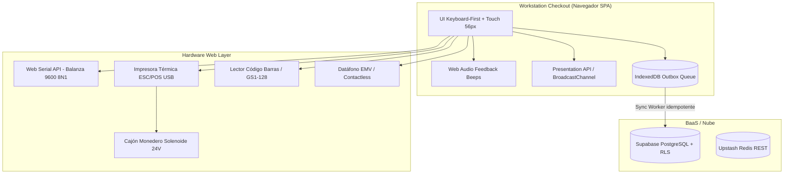

# Documentación Oficial: Punto de Venta (POS) — Arquitectura, Hardware & UX Enterprise

> **Notebook Oficial en NotebookLM:** `Punto de Venta (POS): Arquitectura, Hardware & UX Enterprise`  
> **Notebook ID:** `8a874285-2ff6-4c55-8744-3a1042e3cdaa`  
> **URL:** [https://notebook.google.com/notebook/8a874285-2ff6-4c55-8744-3a1042e3cdaa](https://notebook.google.com/notebook/8a874285-2ff6-4c55-8744-3a1042e3cdaa)  
> **Fuentes Indexadas:** 108 fuentes oficiales (W3C Web Serial, WebUSB, ESC/POS, Stripe Terminal, Presentation API, IndexedDB, etc.)  
> **Fecha de Creación:** 30 de Septiembre de 2026

---

## 1. Misión y Alcance del Módulo POS

En el punto de venta de **La Pezcaderia ERP**, la latencia y la fricción cuestan dinero. La venta de productos perecederos (pescado fresco, mariscos, congelados) requiere una interacción fluida donde el cajero debe:
1. Pesar producto en tiempo real sobre balanzas industriales.
2. Cobrar con múltiples medios de pago (efectivo, datáfono, transferencias Nequi/Daviplata).
3. Emitir tickets térmicos instantáneos sin intervención de diálogos lentos del navegador.
4. Operar sin conexión a internet en caso de caída de fibra o red local.
5. Garantizar auditoría de caja ciega y prevención antifraude.



---

## 2. Especificaciones de Hardware & Periféricos

### 2.1 Balanzas y Básculas Continuas (Web Serial API)
- **Protocolo:** Comunicación serie asíncrona sobre USB (`navigator.serial`).
- **Parámetros típicos:** `baudRate: 9600`, `dataBits: 8`, `stopBits: 1`, `parity: "none"`.
- **Formato de Trama Estándar (Toledo / Torrey / Dibal):**
  ```text
  ST,GS,+001.450kg\r\n
  ```
- **Lógica de Captura:**
  - `ST`: Lectura estable (Stable). Solo se permite facturar si la balanza está estable.
  - `US`: Lectura inestable (Unstable). Muestra indicador ámbar en pantalla.
  - El peso se lee automáticamente al presionar `F6` o al escanear un código de barras de producto por peso.

### 2.2 Impresoras Térmicas y Cajón Monedero (ESC/POS Binario)
- **Anchos soportados:** Rollos térmicos estándar de **80mm** (48 columnas) y **58mm** (32 columnas).
- **Comandos ESC/POS nativos:**
  - Inicializar impresora: `ESC @` (`0x1B, 0x40`)
  - Apertura de cajón monedero: `ESC p 0 25 250` (`0x1B, 0x70, 0x00, 0x19, 0xFA`) — envía un pulso de 24V al solenoide del cajón a través del puerto RJ11 de la impresora.
  - Corte de papel parcial/total: `GS V 0` (`0x1D, 0x56, 0x00`)
- **Modo de Impresión:** Enrutamiento directo mediante WebUSB / Web Serial o impresión vectorial con `jsPDF` en dimensiones de 80mm sin cabeceras del sistema operativo.

### 2.3 Escáner de Código de Barras (Modo Keyboard Wedge)
- Los escáneres USB operan como teclados virtuales ultrarrápidos (digitan entre 20 y 50 caracteres por segundo seguidos de `Enter`).
- **Mecanismo de captura:** Hook global `useBarcodeScanner` que detecta ráfagas de teclas con latencia menor a 30 ms entre pulsaciones, evitando que el cajero tenga que hacer clic en el buscador para escanear.
- **Soporte de Códigos GS1-128 / EAN-13 con Peso Embebido:**
  - Prefijo `20` o `21`: Código de barras impreso por balanzas de etiquetado que contiene PLU (4 dígitos) + Peso en gramos (5 dígitos).
  - Parser automático para desglosar producto y peso sin re-pesar en caja.

### 2.4 Pantalla Secundaria para el Cliente (Customer Display)
- Uso de la **Presentation API** o **BroadcastChannel API** (`channel = new BroadcastChannel('pos_customer_display')`).
- Proyecta en un segundo monitor o tablet orientada al cliente:
  - Lista de compras en vivo con precios y descuentos.
  - Peso actual de la balanza en tiempo real.
  - Total a pagar y código QR de pago (Nequi / Bancolombia / Bre-B).

---

## 3. Ergonomía de Interfaz y Atajos Keyboard-First

Para maximizar la velocidad de atención y evitar lesiones por movimientos repetitivos de mouse:

| Atajo | Acción en POS | Comportamiento |
| :---: | :--- | :--- |
| `F1` | Búsqueda PLU / Texto | Foco inmediato en buscador de productos. |
| `F2` | Modificar Cantidad / Peso | Salto al campo de cantidad del ítem seleccionado. |
| `F3` | Aplicar Descuento | Modal con autorización supervisor si supera porcentaje base. |
| `F4` | Aparcar Venta (Hold) | Guarda el carrito temporalmente para atender al cliente siguiente. |
| `F5` | Recuperar Venta | Abre lista de tickets aparcados para reanudar. |
| `F6` | Capturar Balanza | Solicita lectura inmediata estable al puerto serie. |
| `F8` | Eliminar Línea | Anula el producto activo con log de auditoría. |
| `F9` | Abrir Cajón sin Venta | Dispara pulso de apertura requiriendo motivo obligatorio. |
| `F12` o `+ (Numpad)` | Cobrar / Pagar | Abre pantalla de medios de pago y desglose de cambio. |
| `Escape` | Cancelar / Volver | Cierra modales o limpia selección activa. |

---

## 4. Arquitectura Offline-First & Resiliencia

1. **Persistencia en IndexedDB (`idb`):**
   - Catálogo de productos, clientes y tarifas sincronizados localmente en almacenamiento del navegador.
   - Cola de ventas pendientes (**Patrón Outbox**): Cada venta finalizada se almacena con estado `pending_sync` y folio de contingencia local.
2. **Sincronización Idempotente con Supabase RPC:**
   - Al detectar reconexión a internet (`navigator.onLine`), un worker en background procesa los tickets encolados en orden FIFO.
   - Las transacciones se envían mediante RPC con UUID determinista generado en el cliente, garantizando que ninguna venta se duplique ante cortes intermitentes.
3. **Arqueo de Caja Ciega (Blind Shift Reconciliation):**
   - El cajero cierra turno ingresando el conteo físico de billetes y vouchers sin conocer el monto teórico del sistema.
   - El supervisor audita en tiempo real las discrepancias (sobrantes/faltantes).

---

## 5. Consultas al Notebook desde la CLI (`nlm`)

Este notebook contiene la documentación técnica completa, especificaciones de hardware y ejemplos de integración. Puedes consultarlo directamente desde la terminal:

```bash
# Consultar integración de balanzas por Web Serial
nlm query 8a874285-2ff6-4c55-8744-3a1042e3cdaa "¿Cómo parsear tramas continuas de peso Toledo/Torrey en Web Serial evitando bloqueos de buffer?"

# Consultar comandos ESC/POS y apertura de cajón
nlm query 8a874285-2ff6-4c55-8744-3a1042e3cdaa "¿Cuál es la secuencia binaria exacta de ESC/POS para abrir el cajón monedero por puerto RJ11 de la impresora?"

# Consultar arquitectura de pantalla dual de cliente
nlm query 8a874285-2ff6-4c55-8744-3a1042e3cdaa "¿Cómo sincronizar el carrito con la pantalla del cliente usando BroadcastChannel sin recargar?"
```
