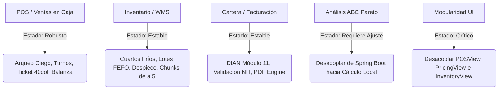

# Auditoría Integral de Código, Flujos de Negocio y Arquitectura — MaestroPescaderia ERP (2026)

Este documento presenta el informe exhaustivo y detallado tras la evaluación línea por línea del repositorio, identificando fallos latentes, bloqueos en flujos de trabajo, riesgos de seguridad, desactualizaciones y desviaciones respecto a la Constitución del ERP.

---

## 📊 1. Resumen Ejecutivo del Estado del Sistema

| Dimensión Evaluada | Estado | Diagnóstico Principal |
| :--- | :---: | :--- |
| **Integridad de Tipos (TypeScript)** | 🟢 APROBADO | `tsc --noEmit` compila con 0 errores. |
| **Pruebas Automatizadas (Vitest)** | 🟢 APROBADO | 13 suites y **55 tests pasando (100%)**. |
| **Arquitectura de Stores Zustand** | 🟢 APROBADO | 19 stores modulares con separación por dominio. |
| **Linter / Análisis Estático** | 🔴 CRÍTICO | `npm run lint` falla por archivo de configuración ESLint faltante. |
| **Modularidad de Vistas** | 🔴 CRÍTICO | 4 vistas monolíticas exceden por mucho el límite de 800 líneas (`POSView`, `PricingView`, `InventoryView`, `App`). |
| **Acoplamiento de Tipos** | 🟠 ALTO | Vistas importando tipos y utilidades desde `App.tsx` (dependencia circular). |
| **Lógica de Inventario ABC** | 🟠 ALTO | `AnalisisAbcWidget` cae a mock data estático cuando no hay Spring Boot. |
| **Seguridad / Hardcoded Secrets** | 🟡 MEDIO | `twentyClient.ts` contiene JWT API key en string literal. |

---

## 🚨 2. Matriz de Hallazgos Clasificados por Severidad

### 🔴 SEVERIDAD CRÍTICA (Nivel 1)

#### 1. Vistas Monolíticas "God-Components"
* **Archivos Afectados**:
  * [`src/views/POSView.tsx`](file:///c:/Users/usuario/OneDrive/Documentos/Aplicaciones%20Pezca/MaestroPescaderia/src/views/POSView.tsx) (~2.604 líneas / 121 KB)
  * [`src/views/PricingView.tsx`](file:///c:/Users/usuario/OneDrive/Documentos/Aplicaciones%20Pezca/MaestroPescaderia/src/views/PricingView.tsx) (~2.073 líneas / 115 KB)
  * [`src/views/InventoryView.tsx`](file:///c:/Users/usuario/OneDrive/Documentos/Aplicaciones%20Pezca/MaestroPescaderia/src/views/InventoryView.tsx) (~1.777 líneas / 77 KB)
  * [`src/App.tsx`](file:///c:/Users/usuario/OneDrive/Documentos/Aplicaciones%20Pezca/MaestroPescaderia/src/App.tsx) (~1.588 líneas / 59 KB)
* **Impacto**: Viola la Constitución del ERP (*"No debe existir lógica pesada en las vistas"*) y las directrices de ECC (*"200-400 líneas típico, 800 max"*). Provoca re-renders innecesarios en cascada, dificulta la trazabilidad y aumenta el costo de mantenimiento.
* **Solución**: Modularizar en sub-componentes atómicos por pestaña (ej. `PricingView` $\rightarrow$ `CatalogPricingTab`, `CustomPricesTab`, `B2BQuoteWizard`, `DeliveryLogisticsTab`).

#### 2. Configuración ESLint Inexistente en Raíz
* **Archivo Afectado**: Raíz del proyecto (`.eslintrc.cjs` ausente).
* **Impacto**: El script `npm run lint` falla inmediatamente con error `ESLint couldn't find a configuration file`.
* **Solución**: Crear `.eslintrc.cjs` configurado para React 18, TypeScript y Vite.

---

### 🟠 SEVERIDAD ALTA (Nivel 2)

#### 3. Dependencia Circular y Exportación de Tipos desde `App.tsx`
* **Archivos Afectados**:
  * `src/views/POSView.tsx` (Línea 4: `import { Product, Cliente, ... } from '../App.tsx'`)
  * `src/views/ARView.tsx` (Línea 3: `import { InvoiceAR } from './ARView.tsx'`)
* **Impacto**: `App.tsx` es la vista raíz del sistema; que las vistas secundarias dependan de la raíz para obtener definiciones de tipos rompe la jerarquía unidireccional y crea riesgo de ciclos de importación.
* **Solución**: Migrar todas las importaciones de tipos a [`src/types/erp.types.ts`](file:///c:/Users/usuario/OneDrive/Documentos/Aplicaciones%20Pezca/MaestroPescaderia/src/types/erp.types.ts).

#### 4. Falso Fallback Estático en Cálculo ABC Pareto 80/20
* **Archivo Afectado**: [`src/views/inventory/components/AnalisisAbcWidget.tsx`](file:///c:/Users/usuario/OneDrive/Documentos/Aplicaciones%20Pezca/MaestroPescaderia/src/views/inventory/components/AnalisisAbcWidget.tsx) (Líneas 35-65).
* **Impacto**: Cuando el servicio externo Spring Boot no responde (lo cual es el caso estándar en el despliegue serverless de Capa Gratuita), el widget muestra 4 productos de ejemplo fijos en lugar de calcular el Pareto real basado en el stock y ventas de `useMovementStore`.
* **Solución**: Implementar el cálculo local determinista de Pareto 80/20 en TypeScript consumiendo el estado real de `useInventoryStore` y `useMovementStore`.

---

### 🟡 SEVERIDAD MEDIA (Nivel 3)

#### 5. Hardcoded Token en `twentyClient.ts`
* **Archivo Afectado**: [`src/services/twentyClient.ts`](file:///c:/Users/usuario/OneDrive/Documentos/Aplicaciones%20Pezca/MaestroPescaderia/src/services/twentyClient.ts) (Línea 9).
* **Impacto**: Contiene un string JWT estático que puede ser detectado por escáners de seguridad y rompe el principio de configuración mediante variables de entorno.
* **Solución**: Reemplazar por `import.meta.env.VITE_TWENTY_API_KEY || ''`.

#### 6. Falta de `AbortController` en Búsquedas Rápidas
* **Archivos Afectados**: `ProductSearchPanel.tsx`, `ClientsView.tsx`.
* **Impacto**: Al escribir rápidamente en campos de búsqueda con filtrado asíncrono o autocompletado, las respuestas desordenadas pueden sobreescribir el estado más reciente (Race Condition).
* **Solución**: Integrar `AbortController` o debounce de 150ms.

---

## 🗺️ 3. Mapa de Estado de Flujos Transaccionales

---

## 🛠️ 4. Plan de Acción Recomendado (Fases SDD)

1. **Fase 1 (Inmediata - Gobernanza & Linters)**:
   - Crear `.eslintrc.cjs` para restaurar `npm run lint`.
   - Sanitizar `twentyClient.ts`.
   - Corregir importaciones de tipos en `POSView.tsx` hacia `src/types/erp.types.ts`.
2. **Fase 2 (Negocio - Motor ABC Pareto Local Serverless)**:
   - Reemplazar el fallback estático de `AnalisisAbcWidget.tsx` por el cálculo algorítmico real Pareto 80/20.
   - Agregar suite de pruebas unitarias para el algoritmo Pareto local.
3. **Fase 3 (Refactor Arquitectónico - Desacople de Vistas Monolíticas)**:
   - Extraer sub-componentes y hooks de `POSView.tsx` y `PricingView.tsx` reduciendo su tamaño a `< 500` líneas por archivo.
