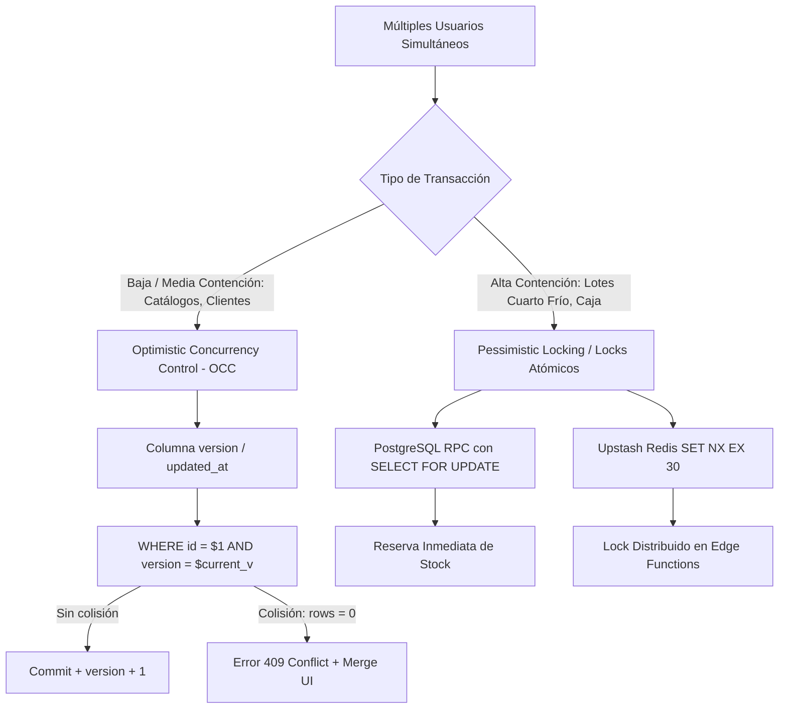

# Guía Definitiva de Concurrencia Simultánea y Patrones Asíncronos (Async)

Este documento condensa los resultados de la investigación técnica y las mejores prácticas oficiales de la industria (System Design Primer, PostgreSQL Docs 18, Supabase RLS y React 18 Concurrency) para **MaestroPescaderia ERP**.

---

## 1. Topología del Control de Concurrencia de Datos

### A. Estrategia 1: Optimistic Concurrency Control (OCC)
* **Dónde se usa:** Edición de productos, listas de precios, perfiles de clientes y maestros de contabilidad.
* **Mecanismo:** Cada fila contiene `version INTEGER DEFAULT 1`. Al enviar una actualización, el `UPDATE` condiciona el versionamiento actual. Si otro usuario modificó el registro milisegundos antes, la consulta afecta 0 filas, disparando un conflicto `409` para recargar los cambios recientes y evitar sobrescrituras ciegas.

### B. Estrategia 2: Pessimistic Locking (`SELECT FOR UPDATE`)
* **Dónde se usa:** Reserva de lotes de pescado en cuartos fríos (`inventory_lots`), asignación de consecutivos fiscales y arqueos de caja ciega.
* **Mecanismo:** La transacción PostgreSQL bloquea la fila a nivel de base de datos durante la ejecución de la función RPC, impidiendo que dos cajeros o bodegueros reserven el mismo kilo de marisco a la vez.

### C. Estrategia 3: Distributed Locks con Upstash Redis REST (`SET NX EX`)
* **Dónde se usa:** Procesos multi-paso en Edge Functions (ej. generación de nómina masiva o cálculo de Pareto ABC).
* **Mecanismo:** Bloqueo atómico con TTL de expiración automática para prevenir deadlocks en caso de caída de conexión.

---

## 2. Mejores Prácticas Asíncronas (Async / Await) en Frontend

### A. Cancelación Inmediata con `AbortController`
Al teclear en barras de búsqueda, cambiar de pestaña o cerrar modales, las peticiones HTTP anteriores se abortan inmediatamente para no desperdiciar ancho de banda ni actualizar componentes desmontados.

### B. Deduplicación de Peticiones en Vuelo (In-Flight Promise Sharing)
Si tres componentes de la misma vista solicitan el catálogo de categorías a la vez, el sistema comparte la misma promesa en memoria, reduciendo las llamadas a Supabase a 1 sola.

### C. Concurrencia de React 18 (`useTransition` & `useDeferredValue`)
Separación estricta entre **Actualizaciones Urgentes** (renderizado del input de texto a 60 FPS) y **Actualizaciones No Urgentes** (filtrado y ordenamiento de 5.000 lotes o cálculo de mermas).

---

## 3. Matriz de Comandos de Barra Disponibles

| Comando | Alias | Skill Vinculada |
| :--- | :--- | :--- |
| **`/concurrency`** | **`/async`** | [`erp-concurrency-async-engine`](file:///c:/Users/usuario/OneDrive/Documentos/Aplicaciones%20Pezca/MaestroPescaderia/.agents/skills/erp-concurrency-async-engine/SKILL.md) |
| **`/ui-ux`** | **`/design-system`** | [`erp-uiux-design-system`](file:///c:/Users/usuario/OneDrive/Documentos/Aplicaciones%20Pezca/MaestroPescaderia/.agents/skills/erp-uiux-design-system/SKILL.md) |
