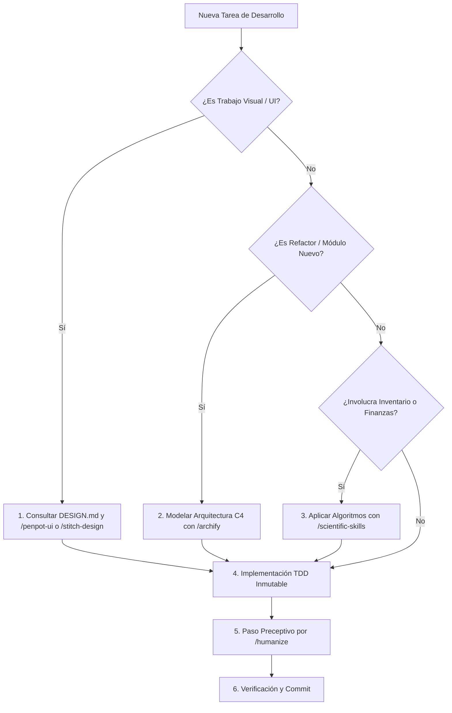

# Manual del Ecosistema de Herramientas de Agentes, Comandos Slash (/) y Estándares UI/UX

Este documento establece la guía maestra de referencia para la utilización de las herramientas de agente y los estándares de diseño UI/UX incorporados en **MaestroPescaderia ERP / FerreOn**.

---

## 1. Matriz de Comandos de Barra ('/') y Habilidades

| Comando Slash | Habilidad Asociada (`SKILL.md`) | Propósito Principal | Criterio de Activación / Uso Obligatorio |
| :--- | :--- | :--- | :--- |
| `/archify` | [`archify-architecture`](file:///c:/Users/usuario/OneDrive/Documentos/Aplicaciones%20Pezca/MaestroPescaderia/.agents/skills/archify-architecture/SKILL.md) | Diagramas de arquitectura C4 y análisis estructural con Mermaid. | **Obligatorio** antes de refactorizaciones multi-archivo o creación de nuevos módulos. |
| `/humanize` | [`humanizer-refinement`](file:///c:/Users/usuario/OneDrive/Documentos/Aplicaciones%20Pezca/MaestroPescaderia/.agents/skills/humanizer-refinement/SKILL.md) | Refinamiento de texto, erradicación de clichés de IA y copy natural. | **Obligatorio** en descripciones de Pull Request, mensajes de error y manuales. |
| `/penpot-ui` | [`penpot-design-system`](file:///c:/Users/usuario/OneDrive/Documentos/Aplicaciones%20Pezca/MaestroPescaderia/.agents/skills/penpot-design-system/SKILL.md) | Maquetación con estándares Flexbox/Grid basados en Penpot. | **Obligatorio** al crear o rediseñar vistas y componentes responsivos. |
| `/open-design` | [`open-design-assets`](file:///c:/Users/usuario/OneDrive/Documentos/Aplicaciones%20Pezca/MaestroPescaderia/.agents/skills/open-design-assets/SKILL.md) | Catálogo de avatares SVG, paletas y micro-componentes abiertos a costo 0. | Creación de avatares de producto y micro-animaciones sin costo de API. |
| `/scientific-skills` | [`scientific-agent-analytics`](file:///c:/Users/usuario/OneDrive/Documentos/Aplicaciones%20Pezca/MaestroPescaderia/.agents/skills/scientific-agent-analytics/SKILL.md) | Algoritmos de Pareto ABC (80/20), mermas y conversión de unidades. | **Obligatorio** en cálculos de inventario, categorización y báscula. |
| `/ponytail` | [`ponytail-harness`](file:///c:/Users/usuario/OneDrive/Documentos/Aplicaciones%20Pezca/MaestroPescaderia/.agents/skills/ponytail-harness/SKILL.md) | Harness de pipelines de tareas encadenadas por etapas con checkpoints. | Automatizaciones complejas, migraciones y suites de tests por lotes. |
| `/ui-tools` | [`ui-ux-ecosystem`](file:///c:/Users/usuario/OneDrive/Documentos/Aplicaciones%20Pezca/MaestroPescaderia/.agents/skills/ui-ux-ecosystem/SKILL.md) | Hub de utilidades de diseño, generadores de paletas y styleguides. | Búsqueda de recursos y patrones de componentes. |
| `/stitch-design` / `/ricoui` | [`stitch-ricoui-design`](file:///c:/Users/usuario/OneDrive/Documentos/Aplicaciones%20Pezca/MaestroPescaderia/.agents/skills/stitch-ricoui-design/SKILL.md) | Extracción de tokens de marcas globales (Linear, Stripe) y Google Stitch. | Generación de pantallas con estética Dark Glassmorphism. |

---

## 2. Protocolo de Ejecución de Tareas de Desarrollo

---

## 3. Síntesis de las Colecciones de UI/UX Integradas

1. **Penpot:** Ecosistema abierto de maquetación vectorial y Flexbox.
2. **Awesome-Design-MD:** Convención de tokens y especificaciones vivas en Markdown (`DESIGN.md`).
3. **Awesome-Design-Tools:** Herramientas de validación de contraste WCAG 2.1 AA y tipografías.
4. **Awesome-AI-Tools-for-UI:** Modelos y prompts para generación autónoma de interfaces.
5. **Awesome-Styleguides:** Reglas de consistencia de marcas líderes.
6. **UI-Tools:** Snippets rápidos y componentes atómicos.
