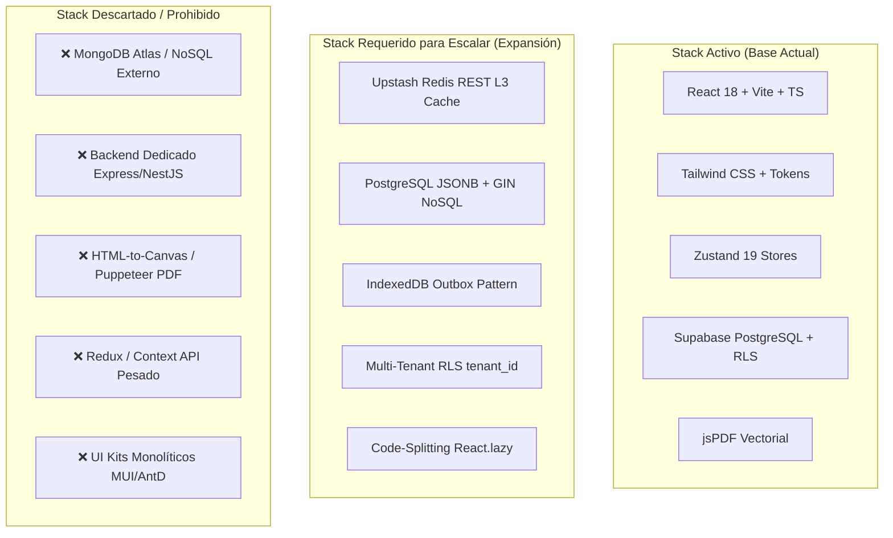
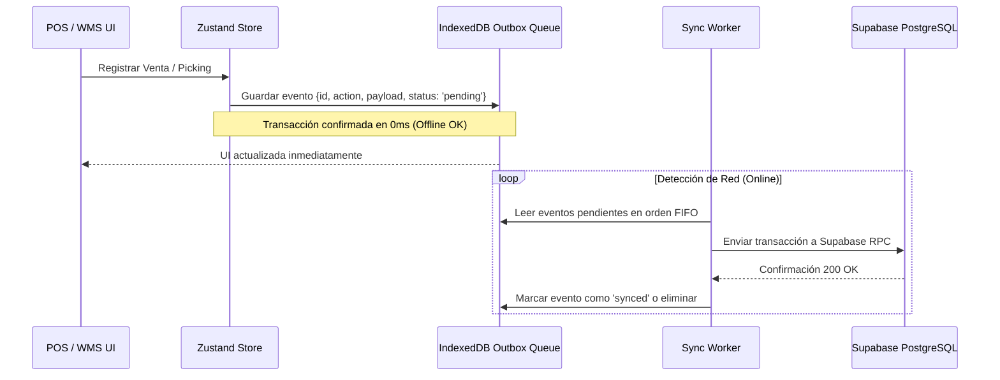

# Evaluación Analítica del Stack Tecnológico, Expansión y Crecimiento SaaS

Este documento contiene la **auditoría técnica exhaustiva**, la **matriz de gobernanza tecnológica** y el **plan de expansión arquitectónica** para MaestroPescaderia ERP / WMS / POS operando en formato SPA sobre capas gratuitas de nube.

---

## 1. Matriz de Gobernanza del Stack Tecnológico



### Tabla Comparativa de Tecnologías:

| Dominio | Stack Actual | Stack Requerido (Expansión) | Stack Descartado / Prohibido | Razón Técnica |
| :--- | :--- | :--- | :--- | :--- |
| **Frontend Framework** | React 18.2 + Vite 5.2 | React 18 + Vite (Code-Splitting por ruta) | Next.js SSR / Nuxt | La arquitectura es 100% SPA para hosting estático de costo cero en Vercel Edge CDN. |
| **Lenguaje** | TypeScript 5.2 (Estricto) | TypeScript 5.2+ (Zod Schemas para DTOs) | JavaScript sin tipos | Garantiza contratos inmutables e integridad de datos de nómina, caja e inventario. |
| **Estado Global** | Zustand 5.0 (19 stores) | Zustand + Selectores Atómicos | Redux Toolkit / MobX | Zustand ofrece la mínima huella de memoria y máxima velocidad de render en React 18. |
| **Base de Datos** | Supabase (PostgreSQL 15) | PostgreSQL + `metadata JSONB` + Índices GIN | MongoDB / DynamoDB externo | Se evita latencia cross-cloud y se mantienen transacciones ACID al 100% en la capa gratuita. |
| **Caché & Concurrencia** | Memoria Local / State | Upstash Redis Serverless (HTTP REST) | Redis TCP en Servidor Dedicado | Las conexiones TCP persistentes saturan pools en Serverless; el cliente REST HTTP es stateless y gratuito (10k req/día). |
| **Resiliencia & Offline** | LocalStorage simple | IndexedDB (`idb`) con Patrón Outbox | Fallo al desconectar red | Permite facturar en POS y despachar en cuartos fríos sin internet, encolando eventos de sincronización. |
| **Generación de PDFs** | jsPDF básico | jsPDF Vectorial + AutoTable en cliente | Puppeteer / HTML2Canvas / Server PDF | La generación client-side consume 0 recursos de servidor, pesa <100 KB y es ultra-nítida. |
| **Aislamiento Multi-Tenant**| Mono-empresa | Multi-Tenant lógico (`tenant_id` + RLS) | Instancias aisladas de pago | Permite escalar a múltiples empresas o franquicias en la misma cuota gratuita de 500 MB. |

---

## 2. Arquitectura de Expansión Multi-Tenant Lógico

Para escalar a franquicias, múltiples sedes o clientes SaaS sin costos adicionales:

```sql
-- Función auxiliar para extraer el tenant_id del JWT
CREATE OR REPLACE FUNCTION current_tenant_id() 
RETURNS UUID AS $$
  SELECT NULLIF(current_setting('request.jwt.claims', true)::jsonb->'app_metadata'->>'tenant_id', '')::UUID;
$$ LANGUAGE sql STABLE;

-- Políticas RLS universales por tenant
ALTER TABLE products ENABLE ROW LEVEL SECURITY;
CREATE POLICY tenant_isolation_products ON products
  FOR ALL
  USING (tenant_id = current_tenant_id())
  WITH CHECK (tenant_id = current_tenant_id());
```

---

## 3. Arquitectura Offline-First con Patrón Outbox (IndexedDB)


