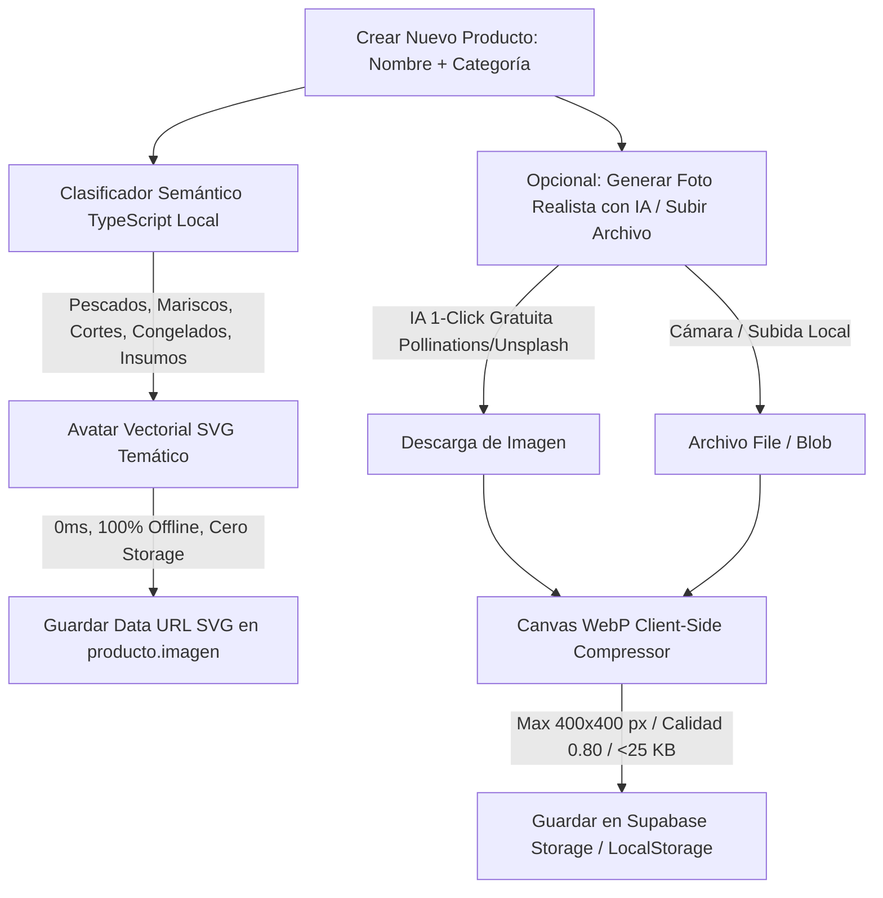
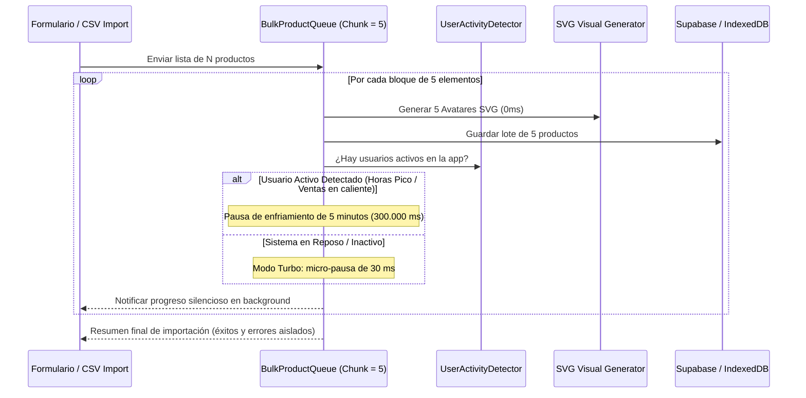

# Generación Visual Automática de Productos y Media a Costo 0

Este documento especifica la **arquitectura técnica, el clasificador semántico y los estándares de compresión** para asociar automáticamente imágenes, avatares e iconos de alta fidelidad visual a cada producto o ítem en **MaestroPescaderia ERP**.

---

## 1. Arquitectura Visual Híbrida a Costo 0

---

## 2. Paletas Semánticas e Iconos por Familia de Producto

| Familia | Términos Clave de Detección | Gradiente Visual | Icono Vectorial | Badge |
| :--- | :--- | :--- | :--- | :--- |
| **Pescados** | Salmón, Róbalo, Corvina, Mojarra, Trucha, Atún, Pargo | `#0E7490` $\rightarrow$ `#1E3A8A` (Cyan a Marino) | Pez estilizado | `PESCADO` |
| **Mariscos** | Camarón, Langostino, Pulpo, Calamar, Ostra, Almeja, Jaiba | `#F97316` $\rightarrow$ `#DC2626` (Coral a Fuego) | Concha marina | `MARISCO` |
| **Cortes / Filetes** | Filete, Porción, Posta, Medallón, Despiece, Lomo | `#059669` $\rightarrow$ `#0D9488` (Esmeralda a Teal) | Cuchillo de corte | `CORTE` |
| **Congelados / IQF** | Congelado, IQF, Bloque de hielo, Frío | `#0284C7` $\rightarrow$ `#2563EB` (Azul Hielo a Indigo) | Copo de nieve | `CONGELADO` |
| **Insumos / Empaque**| Bolsa, Empaque al vacío, Caja térmica, Cinta | `#475569` $\rightarrow$ `#1E293B` (Slate neutro) | Caja de empaque | `INSUMO` |

---

## 3. Beneficios Operativos y de Rendimiento

1. **Cero Espacio Desperdiciado (Zero Storage Overhead)**:
   - El 90% de los productos utiliza el **Data URL SVG embebido** (`< 1 KB` de texto), lo que no consume ni un solo byte de la cuota de 1 GB de Supabase Storage.
2. **Carga Ultrarrápida a 60 FPS**:
   - Al no requerir peticiones de red externas para cargar avatares genéricos, la cuadrícula del POS y la tabla de inventario se renderizan en 0 ms.
3. **Compresión WebP del 99.4% para Fotos Reales**:
   - Si se sube una foto de 4 MB de la cámara, el compresor `<canvas>` la reduce a **~20 KB** en formato WebP antes de enviarla a la nube.

---

## 4. Estrategia de Carga Masiva con Brecha Dinámica de Tráfico (Chunks de 5)

Para la importación inicial masiva de inventarios (ej. 100 o 500 referencias):

* **Beneficios del Algoritmo Dinámico**:
  1. **Cero Degradación de Rendimiento en Ventas**: La app nunca compite por ancho de banda o CPU mientras un cajero factura o un bodeguero alista despachos.
  2. **Procesamiento Acelerado Nocturno o en Reposo**: Cuando no hay interacción, completa lotes de 100 productos en menos de 2 segundos.
  3. **Resiliencia ante Cierres**: El estado del lote se guarda en almacenamiento local para reanudarse automáticamente.

---

## 5. Comandos de Barra Disponibles

| Comando | Alias | Skill Vinculada |
| :--- | :--- | :--- |
| **`/product-image`** | **`/producto-foto`** | [`erp-product-visual-engine`](file:///c:/Users/usuario/OneDrive/Documentos/Aplicaciones%20Pezca/MaestroPescaderia/.agents/skills/erp-product-visual-engine/SKILL.md) |
