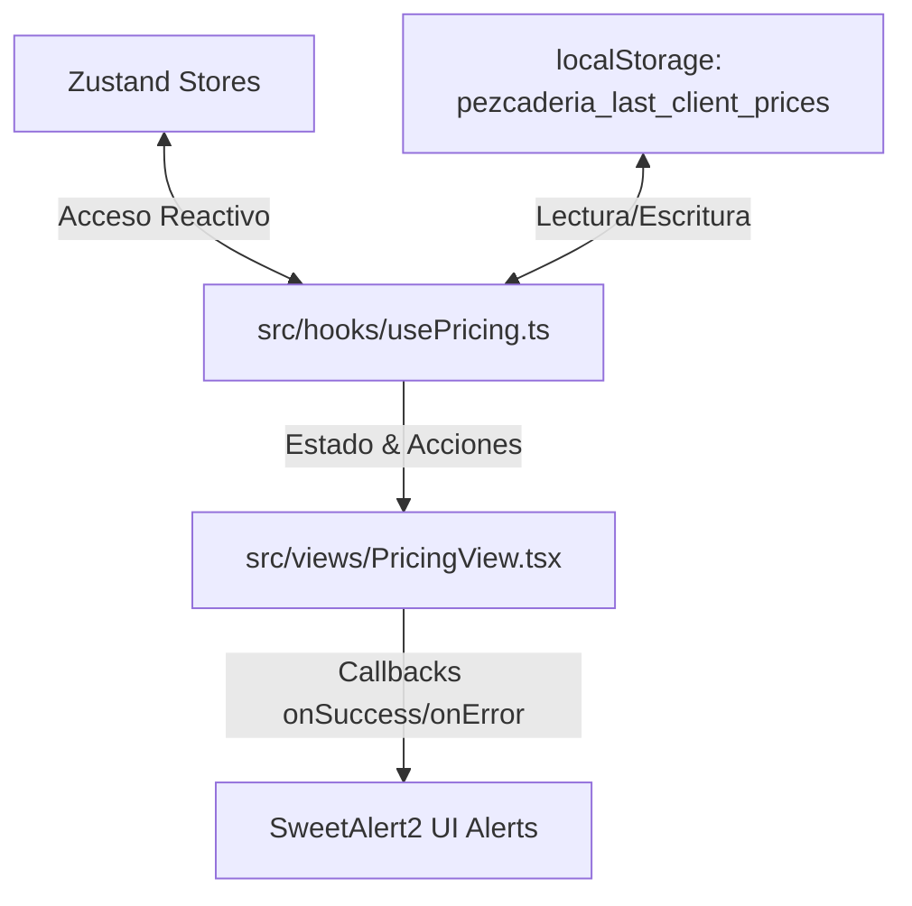

# Speckit Plan: Refactorización de PricingView y Centralización de Tipos (El Cómo)

Este plan de implementación detalla la reestructuración del cotizador (`PricingView.tsx`) y del sistema de tipos globales del ERP para lograr un código desacoplado, mantenible y de alto rendimiento.

## 1. Esquema de Datos y Modelos (TypeScript)
Centralizaremos los tipos en `src/types/erp.types.ts` para evitar dependencias circulares entre vistas y hooks:

```typescript
// src/types/erp.types.ts

export interface Cliente {
  id: string;
  nombre: string;
  identificacion: string;
  tipoIdentificacion: 'NIT' | 'CC' | 'CE';
  tipoPersona: 'NATURAL' | 'JURIDICA';
  direccion: string;
  telefono: string;
  email: string;
  ciudad: string;
  tipoPrecio: 'POS' | 'RESTAURANTE' | 'MAYORISTA';
  encargadoCompras?: string;
  cupoCredito: number;
  activo: boolean;
}

export interface Conductor {
  id: string;
  nombre: string;
  identificacion: string;
  licencia: string;
  celular: string;
  activo: boolean;
}

export interface DevolucionPedido {
  id: string;
  pedidoId: string;
  pedidoNo: string;
  clienteId: string;
  clienteNombre: string;
  conductorId: string;
  conductorNombre: string;
  estado: 'PROGRAMADA' | 'RECIBIDA_BODEGA' | 'VALIDADA_FINANZAS' | 'ANULADA';
  fechaProgramacion: string;
  fechaRecibido?: string;
  recibidoPor?: string;
  fechaValidacion?: string;
  items: Array<{
    sku: string;
    nombre: string;
    cantidadSolicitada: number;
    cantidadRecibida?: number;
    precioUnitarioVenta: number;
    estadoCalidad?: 'APROBADO_REINGRESO' | 'DESCARTE_MERMA';
    estadoFisico?: 'APTO_INVENTARIO' | 'AVERIA_DESCARTE' | 'RECHAZADO';
    loteInventario?: string;
  }>;
}

export interface ProductCatalog {
  id: string;
  sku: string;
  nombre: string;
  categoria: string;
  unidadMedida?: 'kg' | 'und' | 'lb' | 'gr';
  imagen?: string;
  codigo_barras?: string;
  iva?: number;
  ivaIncluido?: boolean;
  control_inventario?: boolean;
  produccion?: boolean;
  activo: boolean;
  categoriaABC?: 'A' | 'B' | 'C';
  metadata?: Record<string, string>;
}

export interface ProductPricing {
  id: string;
  productoId: string;
  vigenciaDesde: string;
  precio_compra: number;
  buffer_seguridad: number;
  precio_venta_pos: number;
  precio_venta_restaurante: number;
  precio_venta_mayorista: number;
  actualizadoPor: string;
}

export interface Product extends ProductCatalog {
  precio_compra: number;
  buffer_seguridad: number;
  precio_venta_pos: number;
  precio_venta_restaurante: number;
  precio_venta_mayorista: number;
}
```

---

## 2. Flujo de Información y Componentes

El flujo de control separa limpiamente el almacenamiento de datos, la lógica del negocio (hook) y el renderizado UI:



### A. El Hook Orquestador (`src/hooks/usePricing.ts`)
Encapsulará:
1. **Selección de Cliente**:
   * Filtrado y vinculación del cliente.
   * Consulta del histórico de precios (`pezcaderia_last_client_prices`).
   * Aplicación/Restauración automática de tarifas de fidelidad.
2. **Cálculos y Cotización**:
   * Gestión de las líneas agregadas.
   * Cálculo de subtotales, IVA y total final (memoizados con `useMemo`).
3. **Persistencia y Estado Global**:
   * Consolidación de cotizaciones aprobadas interactuando con el store de pedidos de Zustand.
   * Decremento de inventario al marcar el estado como `Sold`.

### B. La Vista de UI (`src/views/PricingView.tsx`)
1. Consume `usePricing()` para pintar:
   * Lista de cotizaciones.
   * Panel de edición y agregador de ítems.
   * Botón dinámico de alerta: `💡 Último: $X.XXX (Aplicar)`.
2. Escucha callbacks para renderizar:
   * Confirmación o errores mediante modales emergentes de `SweetAlert2`.

---

## 3. Plan de Ejecución (Paso a Paso)

* **Paso 1: Tipado y Compatibilidad**:
  Crear `src/types/erp.types.ts` y mover los tipos de `App.tsx`. Re-exportarlos desde `App.tsx`. Verificar compilación estática ejecutando:
  `npx.cmd tsc --noEmit`.
* **Paso 2: Implementación de usePricing**:
  Crear `src/hooks/usePricing.ts` agregando la lógica de cálculo y los hooks de Zustand.
* **Paso 3: Refactorización de PricingView**:
  Simplificar `src/views/PricingView.tsx` consumiendo el hook, reduciendo el código fuente a <1000 líneas.
* **Paso 4: Validación**:
  Verificar pruebas unitarias (`npx.cmd vitest run src/tests`) y control de compilación general.
