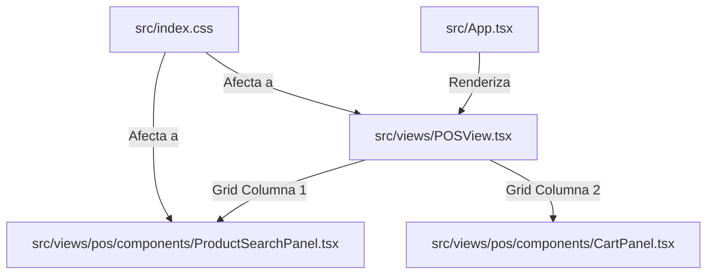

# Especificación Base: Corrección de Colapso de Grid en POS (v2.0)

## 1. Qué se va a construir

Se implementará una corrección estructural en el diseño CSS y Tailwind de la interfaz de Punto de Venta (POS) en [POSView.tsx](file:///c:/Users/PERSONAL/Documents/Aplicaciones/maestro_ERP_Pezcaderia/src/views/POSView.tsx) y [ProductSearchPanel.tsx](file:///c:/Users/PERSONAL/Documents/Aplicaciones/maestro_ERP_Pezcaderia/src/views/pos/components/ProductSearchPanel.tsx). La solución consiste en:

1. **Resolución de Especificidad CSS en Layout Principal**:
   * Ajustar o eliminar las reglas en conflicto del selector `.pos-layout` en [index.css](file:///c:/Users/PERSONAL/Documents/Aplicaciones/maestro_ERP_Pezcaderia/src/index.css) para que no sobreescriban las clases utilitarias de visualización condicional de Tailwind (`flex` en móvil y `lg:grid` en pantallas grandes).
   * Asegurar que el contenedor principal mantenga su proporción `7fr` (para catálogo) y `3fr` (para el panel del carrito) en pantallas de escritorio.

2. **Resolución de Especificidad CSS en Grid de Productos**:
   * Alinear la clase `.pos-products-grid` de [index.css](file:///c:/Users/PERSONAL/Documents/Aplicaciones/maestro_ERP_Pezcaderia/src/index.css) con las utilidades de rejilla de Tailwind (`grid-cols-2`, `sm:grid-cols-3`, `lg:grid-cols-4`). Esto evita que el navegador ignore las propiedades responsivas debido a la especificidad del selector de clase.

3. **Contención e Inmutabilidad de Altura (Shell Pattern)**:
   * Aplicar contención estricta al grid mediante propiedades `min-h-0` e inyección de `overflow-hidden` a nivel de contenedores padres.
   * Evitar que la página completa realice scroll vertical al desbordarse el inventario, obligando a que cada panel gestione su propio scroll independiente (`overflow-y-auto`).

---

## 2. Por qué se va a construir (Justificación)

En el despliegue del servidor de desarrollo local, se detectó una fractura visual crítica en la pantalla del POS:

* **Colapso Vertical del Layout**: En pantallas de escritorio, el catálogo y el carrito no se mantienen uno al lado del otro. El carrito se desplaza hacia abajo en la columna izquierda, dejando el 30% derecho de la pantalla vacío.
* **Causa Raíz - Conflicto de Especificidad**: El selector `.pos-layout` definido en [index.css](file:///c:/Users/PERSONAL/Documents/Aplicaciones/maestro_ERP_Pezcaderia/src/index.css) aplica de forma incondicional `display: flex`. Como los selectores de clase CSS tradicionales tienen mayor especificidad que las utilidades individuales de Tailwind, el navegador prioriza `display: flex` por encima de `lg:grid`, rompiendo la estructura de columnas.
* **Desalineación del Catálogo**: La rejilla de productos no responde correctamente a los cambios de tamaño de pantalla porque el CSS de `.pos-products-grid` fuerza columnas fijas (`repeat(auto-fill, minmax(180px, 1fr))`) ignorando la responsividad móvil/escritorio de Tailwind.

---

## 3. Mapeo de Dependencias y Componentes Afectados

Consultando el grafo de dependencias, los componentes que interactúan en esta vista y que deben sincronizarse son:

---

## 4. Criterios de Aceptación

1. **Rejilla Responsiva de Dos Columnas**:
   * En pantallas grandes (ancho >= 1024px), el catálogo y el carrito deben mostrarse siempre alineados de forma horizontal en proporción `70% / 30%`.
2. **Scroll Independiente**:
   * El desbordamiento de productos en el catálogo o líneas en el carrito no debe estirar la pantalla hacia abajo. Cada panel debe desplazarse verticalmente dentro de sus límites.
3. **Rejilla de Tarjetas Estable**:
   * En móviles se deben mostrar 2 columnas, en pantallas medianas 3, y en pantallas grandes 4 columnas para las tarjetas de productos, respetando las dimensiones del grid.
