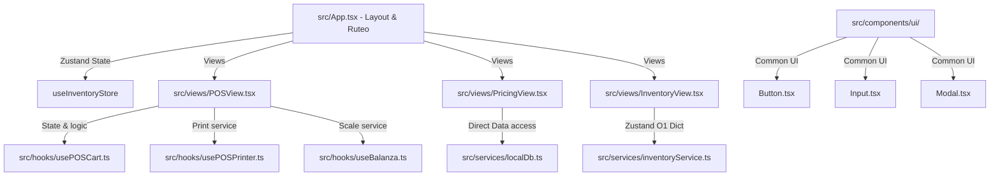

# Especificación Base: Análisis de Frontend y Plan de Integración de Buenas Prácticas (v1.0)

## 1. Qué se va a construir
Una evaluación de arquitectura y un plan de acción formal para la refactorización y alineación del frontend del ERP **Maestro Pezcadería** con estándares de nivel de producción. Esto incluye:
1. **Inventario y Auditoría del Stack**: Mapeo completo de las dependencias clave, herramientas y configuraciones activas (React 18, Vite 5, Tailwind CSS 3, Zustand 5, TypeScript 5, Vitest 2).
2. **Diagnóstico de Deuda Técnica y "Code Smells"**: Identificación de archivos sobredimensionados (ej. `App.tsx` con >1300 líneas, `PricingView.tsx` con >2100 líneas), acoplamiento de lógica de negocio en vistas y problemas de tipado.
3. **Estrategia de Integración de Buenas Prácticas**: Diseño de patrones para separar la lógica de presentación de la lógica de negocio (hooks personalizados, controladores y Zustand), unificación estética bajo tokens Tailwind y directrices de tipado estricto.

---

## 2. Por qué se va a construir (Justificación)
A medida que el ERP de la Pezcadería ha crecido para soportar bodegas múltiples, despachos B2B y bitácoras inmutables, la UI ha acumulado complejidad:
* **Monolitos en Vistas**: Vistas críticas contienen miles de líneas combinando estados locales de React, llamadas asíncronas de servicios, cálculos de mermas e inventario, y renderizado JSX masivo. Esto dificulta la lectura, la mantenibilidad y eleva el riesgo de regresiones.
* **Acoplamiento Directo**: Varias vistas dependen directamente del estado de base de datos simulada en `localStorage` o manipulan el stock de forma manual (lo cual ya causó discrepancias en tests unitarios anteriormente).
* **Mantenibilidad y Escalado**: Para agregar nuevas características complejas sin degradar el rendimiento ni violar las reglas de la Constitución del ERP (arquitectura modular estricta Data-Driven), es imperativo migrar a un patrón desacoplado y con tipado estricto.

---

## 3. Análisis de Dependencias y Estructura (Vía Grafo)
Consultando el grafo estructural del proyecto (`graphify-out/graph.json`), se identifican las siguientes dependencias críticas en el frontend:

---

## 4. Prácticas Clave Propuestas para Integración
1. **Patrón de Desacoplamiento (Hooks/Vistas)**:
   * Extraer la lógica de negocio, filtros de búsqueda e interacción con el store de Zustand de `PricingView.tsx` e `InventoryView.tsx` hacia hooks dedicados (`usePricing.ts`, `useInventoryOperations.ts`).
2. **Centralización y Tipado Estricto**:
   * Asegurar que todo elemento del catálogo, transacción y estado de caja esté debidamente tipado en archivos de tipos globales (`src/types/`).
   * Eliminar casts generalizados a `any` introducidos durante arreglos de compilación rápidos, reemplazándolos por interfaces extensibles.
3. **Consistencia Estética e Interfaz Premium**:
   * Migrar los elementos visuales repetitivos a componentes reutilizables en `src/components/ui/`.
   * Implementar estados de carga (skeletons), micro-animaciones (hover, transiciones suaves) y paletas HSL consistentes siguiendo las directrices de diseño del ERP.
4. **Robustez en Testing (TDD)**:
   * Implementar pruebas unitarias previas a cualquier refactorización de lógica. Asegurar cobertura mínima del 80% en los nuevos controladores de estado y hooks.
