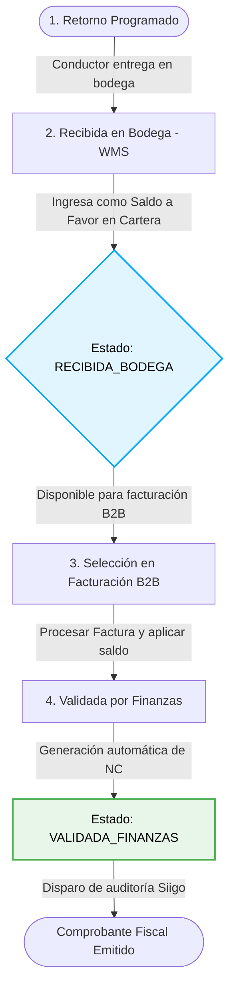
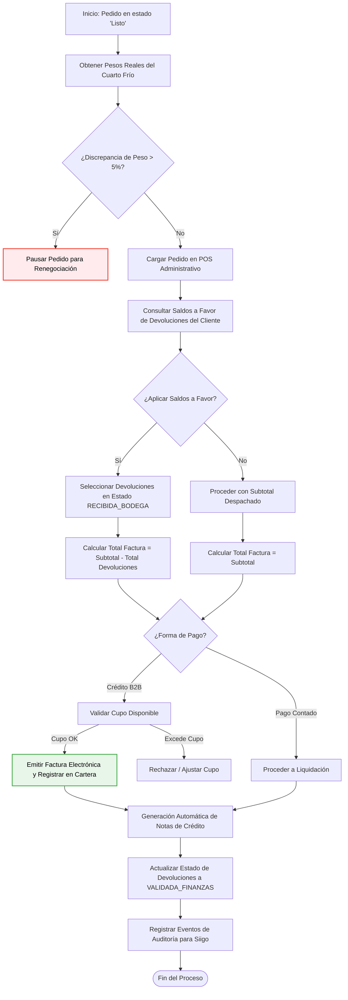

# Documentación de Devoluciones, Notas de Crédito y Facturación B2B

Este documento detalla las reglas de negocio, flujos y diagramas para el procesamiento y conciliación de devoluciones físicas, la generación automática de Notas de Crédito (NC), y su cruce con facturas electrónicas en **La Pezcadería S.A.S.**

---

## 1. Ciclo de Vida de una Devolución Física y Saldo a Favor

El proceso inicia cuando un cliente B2B solicita la devolución de producto (por avería, inconformidad de peso, etc.) y culmina cuando ese saldo es cruzado y validado en finanzas.

### Diagrama de Flujo: Ciclo de Vida de Devoluciones


### Reglas de Negocio del Ciclo de Devolución:
1. **Logística Independiente**: El producto físico se recibe en bodega mediante el panel de logística. Al marcarse como recibido, los ítems se catalogan según su destino final (reingreso a stock apto o merma/descarte).
2. **Generación de Saldo a Favor**: Una vez el Jefe de Bodega marca la devolución en estado `RECIBIDA_BODEGA`, el monto equivalente (calculado con la cantidad física real recibida y el precio unitario pactado originalmente) se expone de inmediato como un saldo a favor en la cuenta del cliente B2B en Cartera.
3. **Cruce Contable**: El saldo a favor permanece en estado `RECIBIDA_BODEGA` (Disponible) hasta que se cruza con una venta B2B, momento en el cual cambia al estado `VALIDADA_FINANZAS` (Aplicada).

---

## 2. Proceso de Consolidación y Facturación B2B

La facturación B2B se ejecuta basándose en los pesos reales registrados por el Cuarto Frío y permite compensar saldos a favor pendientes.

### Diagrama de Flujo: Facturación B2B y Aplicación de Saldos


### Reglas de Negocio del Proceso de Facturación B2B:
1. **Umbral de Tolerancia**: El peso real ingresado en Cuarto Frío se compara con el peso solicitado por el cliente. Si la discrepancia supera el **5%** (tolerancia automática), el pedido cambia automáticamente al estado `PAUSADO` para renegociación antes de permitir la facturación.
2. **Cálculo del Total Neto**: El valor total a facturar se calcula como:
   $$\text{Total Factura} = \sum (\text{Peso Real} \times \text{Precio Pactado}) - \sum (\text{Monto Devoluciones Seleccionadas})$$
3. **Control de Límite de Crédito**: Para ventas marcadas como *Crédito*, el sistema calcula de forma estricta:
   $$\text{Deuda Total Propuesta} = \text{Saldo Actual en Cartera} + \text{Total Factura}$$
   Si esta deuda propuesta excede el cupo de crédito parametrizado del cliente B2B, la transacción es bloqueada hasta que se registre un abono o se amplíe el cupo.
4. **Emisión de Notas de Crédito**: Al liquidar, por cada devolución cruzada se emite de manera síncrona un documento de Nota de Crédito individual en formato `NC-XXXXXX` y se propaga un evento de auditoría contable.

---

## 3. Integración de Auditoría Contable (Siigo Sync)

Dado que la integración física con Siigo se realiza de forma asíncrona mediante colas de mensajería, la aplicación utiliza el canal de eventos del ERP para dejar pistas de auditoría inmutables en la bitácora contable.

### Parámetros del Evento de Auditoría de Notas de Crédito:
Cuando se genera una Nota de Crédito, el ERP ejecuta la función `publishEvent` con la siguiente firma:
```typescript
publishEvent(
  'METADATA_CONFIGURED',
  actor, // Rol del usuario que realiza la operación (ej. 'ADMIN')
  `Nota de Crédito NC-XXXXXX emitida exitosamente en Siigo por valor de $XXXX por devolución en pedido #PED-XXXX (Cliente: Nombre Cliente).`,
  {
    devolucionId: 'dev-xxx',
    notaCreditoId: 'NC-xxxxxx',
    monto: 150000,
    clienteId: 'c-xxx',
    facturaDestino: 'quote-xxx'
  }
);
```

Este evento garantiza la rastreabilidad de los movimientos financieros y permite reconstruir la cuenta corriente de cartera en caso de inconsistencias en los canales de comunicación externos.
