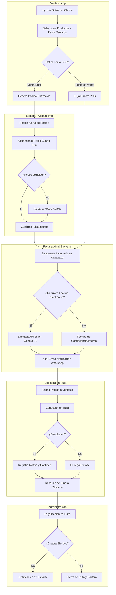
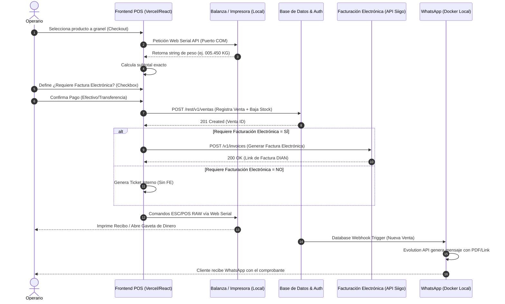

# Resumen Ejecutivo

El presente documento establece la especificación funcional y técnica detallada para el sistema unificado de gestión empresarial (ERP/WMS) de La Pezcadería SAS.

La solución centraliza la operativa abarcando el flujo completo desde la captura de la cotización inicial en terreno, el alistamiento de bodega con pesos exactos, hasta la facturación electrónica final y la logística de distribución en el área metropolitana de Bucaramanga.

Se define una arquitectura tecnológica web escalable (apoyada en el ecosistema de Supabase/PostgreSQL como base de datos y un framework frontend robusto basado en React.js con TypeScript y Vite), integrando módulos especializados para la producción con control de mermas, gestión de nómina, y un Punto de Venta (POS) con conectividad directa a hardware periférico local (balanzas e impresoras ESC/POS) sobre sistemas operativos Windows.

Se establecen las bases para la comunicación automatizada de estados de pedido vía WhatsApp mediante arquitecturas locales (n8n, Evolution API sobre Docker) y la sincronización contable con Siigo.

## 1. Antecedentes y Ajuste Estratégico

**Situación actual:** La gestión operativa, productiva, comercial y logística se ejecuta mediante procesos aislados. La naturaleza del producto (pescadería) exige un manejo preciso de pesos variables que actualmente genera fricción entre el pedido inicial y la facturación final.
**Problema identificado:** Ineficiencias en la trazabilidad del ciclo completo del producto, desde la transformación y fraccionamiento, hasta el despacho y recaudo de dineros en ruta. La falta de comunicación directa entre el hardware de POS web y los periféricos locales retrasa la atención en el punto de venta.
**Necesidad del cliente:** Un ERP/WMS centralizado, hecho a medida, que consolide: producción (recetas y mermas), flujos dinámicos de venta (cotización -> alistamiento -> factura), asignación manual de rutas con recaudo, control de empleados y manejo de periféricos POS desde un navegador estándar en equipos de escritorio.
**Beneficio esperado:** Precisión absoluta en la facturación y el control de inventario, reducción del margen de error en el recaudo de cartera por parte de los conductores, y agilización operativa del equipo base (9 empleados directos y fuerza de ventas externa).
**Impacto para el proceso:** Transparencia contable al generar la factura electrónica solo con los pesos reales confirmados por bodega, control estricto de los costos de producción mediante la medición de mermas, y un cierre de caja blindado en la logística de última milla.

## 2. Alcance

**Incluye:**
- **Módulo de Producción:** Transformación de materia prima, formulación de recetas fijas, control de mermas, fraccionamiento y empaque.
- **Módulo Comercial:** Creación de pedidos (estado Cotización) remotos y en sitio.
- **Módulo de Bodega:** Alistamiento de pedidos con confirmación y ajuste de pesos/cantidades reales.
- **Módulo de Facturación:** Generación de factura electrónica final (vía API de Siigo) basada en el alistamiento, control de devoluciones y descuentos.
- **Módulo de Logística:** Asignación manual de vehículos/conductores para el área metropolitana, y liquidación de rutas (recaudo de dineros).
- **Módulo POS:** Interfaz web de punto de venta con integración a hardware periférico (balanzas, gavetas, impresoras térmicas ESC/POS) mediante Web Serial API o un demonio local.
- **Módulos Administrativos:** Control de empleados, cartera de clientes y créditos a proveedores, traslados entre bodegas.

**No Incluye:**
- Asignación automática o ruteo algorítmico inteligente por GPS para los vehículos de reparto.
- Procesamiento de pagos en línea nativo (pasarelas de pago web).

## 3. Requisitos de Alto Nivel

| Id | Descripción | Prioridad |
|---|---|---|
| REQ-01 | El sistema debe manejar un flujo de pedido de dos fases: Cotización (peso estimado) y Factura (peso real confirmado en bodega). | Alta |
| REQ-02 | El módulo de producción debe permitir crear órdenes de trabajo descontando materia prima y registrando producto terminado y mermas. | Alta |
| REQ-03 | El módulo de logística debe gestionar la asignación de pedidos a conductores y el proceso de legalización de recaudo al final de la ruta. | Alta |
| REQ-04 | El sistema POS en entorno web debe interactuar directamente con balanzas y abrir gavetas mediante impresoras ESC/POS en sistemas Windows. | Alta |
| REQ-05 | Los traslados de inventario entre bodegas deben actualizar el stock en tiempo real y tener un estado de confirmación de recepción. | Media |

## 4. Reglas de Negocio

| Código | Regla de Negocio |
|---|---|
| RN-01 | No se puede generar una Factura de Venta sin que el pedido haya pasado previamente por el estado "Alistado" con la confirmación de pesos por el jefe de bodega. |
| RN-02 | En los procesos de producción, la suma del peso del producto terminado más la merma registrada no puede exceder el peso total de la materia prima extraída del inventario. |
| RN-03 | La liquidación de ruta de un conductor no se puede cerrar hasta que el dinero recaudado reportado coincida con las facturas marcadas como entregadas, o se justifique la diferencia. |
| RN-04 | Las devoluciones de mercancía en ruta deben generar automáticamente una nota de crédito y el reingreso al inventario (o a bodega de mermas/cuarentena) antes de ajustar el saldo del cliente. |
| RN-05 | La apertura de la gaveta de dinero en el POS solo se autorizará cuando se registre el pago total de una factura o mediante un permiso explícito de administrador. |

## 5. Diagrama Funcional

**Diagram Macro (Capable) - Flujo de Pedido, Alistamiento y Logística**
- **Swimlane 1: Ventas (Vendedor Externo / App):** Ingresa datos del cliente -> Selecciona productos (pesos teóricos) -> Genera Pedido (Cotización Inicial).
- **Swimlane 2: Bodega (Jefe de Bodega):** Recibe alerta de nuevo pedido -> Realiza alistamiento físico -> Ajusta pesos y cantidades exactas en el sistema -> Confirma Alistamiento.
- **Swimlane 3: Facturación y Backend:** Recibe pesos reales -> Descuenta inventario exacto -> Emite Factura Electrónica (API Siigo) -> Envía notificación al cliente (WhatsApp/n8n).
- **Swimlane 4: Logística (Asignación y Ruta):** Asigna Facturas a Vehículo/Conductor -> Conductor realiza entrega -> Registra devoluciones (si aplican) -> Registra Recaudo (efectivo/transferencia).
- **Swimlane 5: Administración (Cierre):** Conductor rinde cuentas -> Administrador valida recaudo contra facturas -> Cierra ruta -> Actualiza Cartera del Cliente.

## 6. Diagrama de Secuencia

**Flujo de Punto de Venta (POS) y Hardware**
**Actores:** Operario POS, Navegador Web (React.js), Web Serial API / Agente Local, Balanza, Impresora, Backend (Supabase/Node).

**Secuencia:**
1. Operario POS selecciona producto "A granel" en la interfaz web.
2. Navegador Web solicita lectura de peso a través de Web Serial API conectada al puerto COM de la balanza en el equipo Windows.
3. Balanza retorna cadena de datos (ej. `005.450 KG`).
4. Navegador Web procesa el string, extrae el peso y calcula el subtotal.
5. Operario define si ¿Requiere Factura Electrónica? (Checkbox).
6. Operario confirma el pago.
7. Navegador Web envía payload de venta al Backend para descontar inventario y facturar.
8. Backend retorna confirmación y URL del recibo.
9. Navegador Web envía comandos RAW (ESC/POS) a través de Web Serial API / Agente de Impresión a la impresora térmica para imprimir el recibo y abrir gaveta.

## 7. Casos Funcionales y Vista de Usuario

**CF_002_PRODUCCION_Y_MERMAS**
- **Prerrequisitos:** Recetas maestras (BOM) configuradas. Materia prima disponible en bodega de producción.
- **Resumen:** Permite a un operario registrar la transformación de pescado entero en filetes empacados, registrando el peso resultante y el desperición.
- **Excepciones:**
  - Stock insuficiente de materia prima: El sistema bloquea el inicio de la orden de producción.
  - Discrepancia de masa: Si la salida + merma difiere significativamente de la entrada (fuera del margen de tolerancia), el sistema requiere autorización del supervisor.
- **Postcondición:** Inventario de materia prima disminuido, inventario de producto terminado aumentado, costo promedio recalculado en base al rendimiento, merma registrada para análisis estadístico.
- **Consideraciones Técnicas:** Utilizar transacciones de base de datos para asegurar que las operaciones de resta y suma de inventario ocurran de manera atómica (Double-Entry Inventory).
- **Criterios de Aceptación:**
  - El formulario de producción debe permitir la entrada manual de pesos resultantes, independiente de la receta teórica.
  - El sistema debe calcular automáticamente el porcentaje de rendimiento y mostrarlo en pantalla al guardar.
- **Comentarios:** Considerar una interfaz optimizada para tablets o pantallas táctiles en el área de cuarto frío.

## 8. Escenarios de Prueba Mínimos

| Id Caso Prueba | Escenario | Datos de Prueba | Resultado Esperado |
|---|---|---|---|
| QA-001 | Venta POS con lectura de balanza exitosa. | Producto: Salmón. Lectura COM: 1.5kg. | Interfaz carga 1.5kg, calcula total correctamente. |
| QA-002 | Ajuste de peso en Alistamiento. | Pedido inicial: 10kg. Alistamiento: 9.8kg. | Factura final generada por 9.8kg, inventario resta 9.8kg. |
| QA-003 | Error de lectura en periférico POS. | Cable de balanza desconectado. | El sistema muestra alerta "Balanza no detectada" y permite entrada manual. |
| QA-004 | Liquidación de ruta con faltante de recaudo. | Total ruta: $1,000,000. Recaudo reportado: $950,000. | Sistema no permite cierre automático; exige justificación de faltante. |

## 9. Vista (Interfaz de Usuario)

- **Pantalla de Alistamiento (Warehouse View):** Pantalla en formato tabla o tarjetas. Muestra pedidos en estado "Cotización". Al seleccionar un pedido, se abre un modal con dos columnas: "Cantidad Solicitada" y un campo de entrada para "Cantidad Alistada". Botón principal: "Confirmar y Generar Factura".
- **Pantalla POS (Web):** Interfaz limpia, optimizada para resoluciones de monitores estándar. Panel izquierdo con categorías de productos, panel central con lista de items seleccionados, panel derecho con teclado numérico en pantalla, botón de lectura de balanza, y métodos de pago rápido.
- **Pantalla Logística (Despachos):** Vista tipo Kanban. Columnas: "Pedidos Listos", "Vehículo 1", "Vehículo 2". Permite arrastrar y soltar (drag & drop) los pedidos hacia los conductores para generar la hoja de ruta.

## 10. Campos (Diccionario de Datos Interfaz - Producción)

| Nombre | Tipo de dato | Long. Caracteres | Validaciones | Requerido | Descripción |
|---|---|---|---|---|---|
| ID_Orden_Prod | Varchar | 15 | Alfanumérico | Sí | Autogenerado, Único. Identificador de la orden de producción. |
| MP_Utilizada | Decimal | 10,2 | Numérico | Sí | Mayor a 0. Kilogramos de materia prima que salieron de bodega. |
| PT_Generado | Decimal | 10,2 | Numérico | Sí | Mayor a 0. Kilogramos de producto terminado empacado. |
| Merma_Kg | Decimal | 10,2 | Numérico | Sí | Mayor o igual a 0. Desperdicio generado en kilogramos. |
| Rendimiento | Decimal | 5,2 | Numérico | Sí | Calculado: (PT / MP) * 100. Porcentaje de rendimiento del lote. |

## 11. Requisitos No Funcionales

- **Seguridad:** Los roles deben aislar estrictamente las vistas: un operario de bodega no puede ver los módulos financieros o de nómina. Control de sesiones mediante tokens JWT.
- **Rendimiento:** Las integraciones con hardware POS (balanza/impresora) deben tener una latencia de respuesta inferior a 500 ms para no interrumpir la velocidad de atención en el mostrador.
- **Auditoría:** Registro (log) detallado de modificaciones en alistamiento. Se debe almacenar el "Peso Solicitado" vs el "Peso Alistado" junto con el ID del usuario que realizó la confirmación.
- **Usabilidad:** El Punto de Venta web debe soportar atajos de teclado para operaciones comunes (cobrar, buscar, leer balanza) con el fin de agilizar el uso en equipos con teclado físico Windows.
- **Integración de Hardware:** El sistema debe usar la API Web Serial compatible con navegadores modernos basados en Chromium (Chrome/Edge) para evitar la instalación de drivers pesados, o implementar un microservicio Dockerizado local en el servidor de la empresa que funcione como puente (WebSockets).

## 12. Esquema de Base de Datos (Estructural)

**Tablas Nuevas y Modificadas:**
- `RECETAS_MAESTRAS` (id_receta, nombre, id_producto_final, rendimiento_esperado)
- `RECETAS_DETALLE` (id_receta, id_materia_prima, proporcion)
- `PRODUCCION_LOTE` (id_lote, fecha, id_receta, kg_materia_prima, kg_producto_terminado, kg_merma, id_operario)
- `RUTAS_DESPACHO` (id_ruta, fecha, id_conductor, id_vehiculo, estado, total_recaudo_esperado, total_recaudo_real)
- `DEVOLUCIONES` (id_devolucion, id_factura, id_producto, cantidad, motivo, estado_mercancia)

**Modificaciones a Tablas Existentes:**
- `PEDIDOS_CABEZA`: Agregar campos estado_flujo (Cotización, Alistado, Facturado, En Ruta, Entregado), id_ruta.
- `PEDIDOS_DETALLE`: Agregar campos cantidad_solicitada, cantidad_alistada.

**Relaciones Clave:**
- `PRODUCCION_LOTE` descuenta de `INVENTARIO` (Materia prima) y suma a `INVENTARIO` (Producto terminado).
- `RUTAS_DESPACHO` agrupa múltiples `PEDIDOS_CABEZA` donde el estado es "Facturado".

## 13. Inventario Maestro de Flujos

A continuación se detalla el listado completo de los flujos operativos, comerciales, logísticos y financieros del ERP/WMS que regirán el desarrollo del sistema:

1. **Flujo de procesamiento y reempaque de productos:** Transformación de materia prima, fileteo y empaque.
2. **Flujo de devoluciones y reempaques:** Reingreso de mercancía rechazada, clasificación (cuarentena/buen estado) y reempaque.
3. **Flujo de compras:** Abastecimiento de inventario desde proveedores.
4. **Flujo de traslado de productos entre distintas bodegas:** Movimientos internos con confirmación de recepción.
5. **Flujo de logística para despachos:** Agrupación de pedidos, asignación de rutas y conductores.
6. **Flujo de recaudo de dineros en logística de entrega de pedidos:** Cobro en sitio por parte del conductor (efectivo/transferencia).
7. **Flujo de entrega de cuentas para rutas despachadas:** Legalización de la ruta, cuadre de caja y cierre por parte del administrador.
8. **Flujo de entregas a crédito:** Entregas donde no hay recaudo inmediato, afectando la cartera del cliente.
9. **Flujo de cartera de clientes, abonos y saldos:** Gestión de cuentas por cobrar y recepción de pagos/abonos.
10. **Flujo de créditos a proveedores:** Gestión de cuentas por pagar a proveedores y programación de pagos.
11. **Flujo de creación de productos:** Alta de items en el catálogo con unidades de medida, códigos de barras y parámetros técnicos.
12. **Flujo de creación de categorías (Precios de venta):** Estructuración financiera para definir listas de precios según línea/clase de producto.
13. **Flujo de creación de empleados, roles y funciones:** Gestión de personal, accesos al sistema y autorizaciones.
14. **Flujo de creación de cierres y flujos de caja:** Traslados de dinero, asignación de cajas a puntos de venta/bodegas y cierres diarios.
15. **Flujo de registros contables:** Asientos manuales y automáticos para alimentar la contabilidad/Siigo.
16. **Flujo de registros de gastos y egresos:** Clasificación financiera de gastos operativos y administrativos.

*(Nota: Los diagramas de secuencia y funcionales de estos flujos se documentan de manera independiente en la carpeta del proyecto a medida que se desarrolla cada módulo).*
