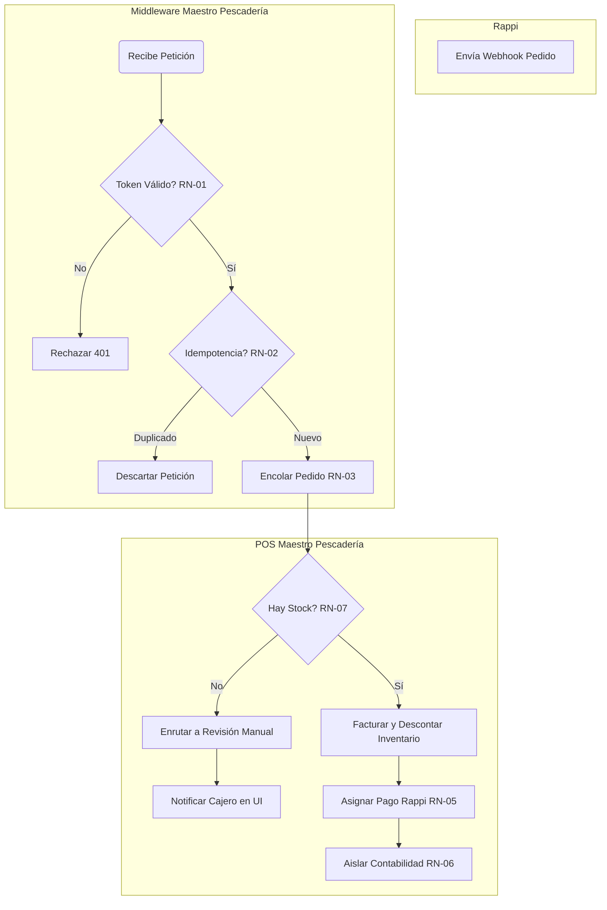
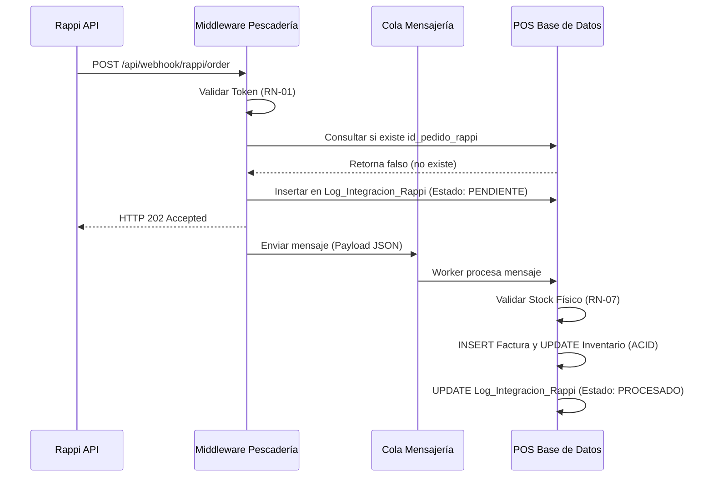

# Documento de Diseño Analítico y Técnico: Integración Rappi - POS Maestro Pescadería

## 1. Antecedentes y Ajuste Estratégico

*   **Situación actual:** Actualmente, los pedidos provenientes de Rappi ingresan a través de una tablet independiente en el mostrador. El personal de Maestro Pescadería (cajeros y despachadores) debe transcribir manualmente cada pedido al sistema POS (Maestro ERP) para poder registrar la venta, imprimir la comanda de preparación y descontar el inventario de pescados y mariscos.
*   **Problema identificado:** La doble digitación genera demoras críticas en la preparación de los productos frescos. Además, existe un alto riesgo de error humano (selección de un corte de pescado incorrecto o gramaje inexacto), lo que ocasiona descuadres de inventario, diferencias en la caja y mala experiencia para el cliente.
*   **Necesidad del cliente o usuario:** Se requiere automatizar la captura de los pedidos de Rappi, inyectándolos de forma directa y segura en el POS de Maestro Pescadería. El sistema debe validar la disponibilidad del producto en tiempo real, generar la factura automáticamente y asignar el pago al canal correspondiente.
*   **Beneficio esperado:** Reducción drástica del tiempo de procesamiento por pedido, eliminación de errores de digitación, inventario de productos perecederos actualizado al instante y conciliación financiera automatizada para ventas externas.
*   **Impacto para el proceso o producto:** Impacto directo en los módulos de **Ventas/POS** (creación de factura), **Inventario** (descuento automático de stock) y **Logística/Cocina** (impresión directa de comandas para alistamiento).

---

## 2. Alcance

*   **Incluye:**
    *   Desarrollo de un Middleware / API Rest en el ecosistema de Maestro Pescadería para recibir webhooks desde Rappi.
    *   Validación de tokens y firmas criptográficas en cada petición entrante.
    *   Integración del Middleware con la base de datos local/nube (LocalDB) del POS para la creación automática de facturas.
    *   Lógica restrictiva de validación de stock físico previo a la facturación.
    *   Proceso automatizado de reversión de inventario y generación de Nota de Crédito ante cancelaciones desde Rappi.
    *   Creación de tablas de auditoría y monitoreo.
*   **No Incluye:**
    *   Sincronización bidireccional del catálogo (los productos deben homologarse previamente).
    *   Gestión de motorizados/repartidores de Rappi dentro de la interfaz del POS de Maestro Pescadería.
    *   Integraciones con otras plataformas (ej. Uber Eats o Didi Food) en esta fase.

---

## 3. Requisitos de Alto Nivel

| Prioridad | Requisito | Descripción |
| :---: | :--- | :--- |
| **Alta** | **Recepción de Pedidos Segura** | Recibir los payloads de Rappi a través de un endpoint autenticado. |
| **Alta** | **Idempotencia** | Prevenir la duplicidad de pedidos (no facturar el mismo ID de Rappi dos veces). |
| **Alta** | **Facturación y Descuento** | Crear la factura en el POS y descontar el inventario de manera automática. |
| **Alta** | **Aislamiento Contable** | Asignar el ingreso a una cuenta/método de pago que no sume al efectivo físico de la caja. |
| **Media** | **Gestión de Cancelaciones** | Reversar el pedido y restaurar el stock si Rappi notifica cancelación posterior. |
| **Baja** | **Monitor de Integraciones** | Una vista en el ERP para auditar pedidos procesados o en revisión manual. |

---

## 4. Reglas de Negocio

| Código | Regla |
| :--- | :--- |
| **RN-01** | **Autenticación Obligatoria:** Toda petición entrante al middleware debe contener un token válido emitido por Rappi. Peticiones sin firma criptográfica válida se rechazan inmediatamente. |
| **RN-02** | **Unicidad de Transacción (Idempotencia):** El sistema debe registrar el ID único del pedido de Rappi. Si el ID ya existe en la base de datos, la petición se descarta para evitar facturación duplicada. |
| **RN-03** | **Procesamiento Asíncrono Estricto:** La inserción de datos en el POS no será en tiempo real directo. Los pedidos validados deben pasar por una cola de mensajería y procesar secuencialmente para evitar bloqueos (deadlocks) en las tablas de inventario. |
| **RN-04** | **Gestión Automática de Cancelaciones:** Si el middleware recibe un evento de "Pedido Cancelado" desde Rappi y el ID ya fue facturado, el sistema debe emitir obligatoriamente una Nota de Crédito y reversar el stock al inventario. |
| **RN-05** | **Asignación Dinámica de Pago (Cero Hardcoding):** El ID del método de pago ("Plataforma Externa - Rappi") debe obtenerse consultando una tabla de parámetros o variables de entorno. Queda estrictamente prohibido fijar este ID en el código fuente. |
| **RN-06** | **Aislamiento Contable de Caja:** Ningún valor facturado o reversado a través de esta integración sumará o restará al saldo de efectivo de la caja física del usuario en turno. |
| **RN-07** | **Validación de Stock Restrictiva:** La facturación automática requiere saldo físico positivo. Ante un quiebre de stock, el pedido no se factura, no se descuenta inventario en negativo, y se enruta a estado "Revisión Manual". |

---

## 5. Diagrama Funcional

> Representación macro del flujo aplicando swimlanes conceptuales.



---

## 6. Diagrama de Secuencia

**URL del diagrama:** Generado embebido a continuación.
**Sistemas involucrados:** Rappi, Middleware Pescadería, Cola de Mensajes, DB Local.



---

## 7. Casos Funcionales y Vista de Usuario

### Caso Funcional: CF_001_Procesar_Pedido_Rappi

*   **Prerrequisitos y Dependencias:** 
    *   Método de pago "Rappi" configurado en el maestro de formas de pago.
    *   SKUs de los productos de mar/congelados homologados entre Rappi y Maestro Pescadería.
    *   Middleware configurado con la clave secreta de Rappi.
*   **Resumen:** Procesar un payload de pedido entrante de Rappi, validar la disponibilidad de productos en el inventario local, crear la venta y descontar las cantidades correspondientes.
*   **Excepciones:** 
    *   Firma HMAC inválida -> Interrupción del flujo.
    *   Stock insuficiente -> El pedido se detiene y cambia a `REVISION_MANUAL`.
*   **Postcondición:** Una factura es registrada con éxito en la base de datos de Maestro Pescadería, el inventario se actualiza y el dinero ingresa bajo el concepto contable aislado de la caja fuerte física.
*   **Consideraciones Técnicas:** 
    *   El proceso de escritura en DB debe estar envuelto en una Transacción SQL (Propiedades ACID) para evitar descontar stock si la factura falla.
    *   El método de pago se lee de `env.RAPPI_PAYMENT_METHOD_ID`.
*   **Criterios de Aceptación:**
    1. El endpoint devuelve HTTP 202 en menos de 2 segundos.
    2. Al simular un pedido, la tirilla de caja no debe afectar el cuadre del cajero de turno.
    3. Una segunda petición con el mismo ID de Rappi es descartada silenciomente.
*   **Comentarios:** Es fundamental para la operación de la pescadería que las comandas de preparación se impriman automáticamente en el área de empaque una vez la factura es "PROCESADA".

---

## 8. Escenarios de Prueba Mínimos

| Id Caso Prueba | Escenario | Datos de Prueba | Resultado Esperado |
| :--- | :--- | :--- | :--- |
| **CP001** | **Escenario Exitoso:** Pedido con stock y firma válida. | Payload con 1 KG de Salmón (SKU: 101) con stock en sistema. | HTTP 202. Factura generada, 1 KG descontado, estado PROCESADO. |
| **CP002** | **Escenario de Validación:** Quiebre de stock. | Payload con 2 KG de Camarón, pero el inventario actual es 0.5 KG. | HTTP 202. El pedido queda en Log como REVISION_MANUAL. No se factura. |
| **CP003** | **Escenario de Validación:** Idempotencia. | Enviar exactamente el mismo payload del CP001. | Se descarta internamente por RN-02. No se genera factura duplicada. |
| **CP004** | **Escenario de Error:** Autenticación fallida. | Petición sin Header de Autorización o token manipulado. | Respuesta HTTP 401 Unauthorized. No se registra en la base de datos. |
| **CP005** | **Escenario de Regresión:** Cancelación de pedido. | Webhook notificando la cancelación del pedido procesado en CP001. | Generación automática de Nota de Crédito. El KG de Salmón regresa al inventario disponible. |

---

## 9. Vista

*   **Mockups / Pantallas:** Se agregará un panel lateral en el Kanban de Pedidos (`OrderKanbanView.tsx`) llamado **"Integraciones Delivery"**.
*   **Componentes nuevos:** 
    *   `DeliveryLogTable`: Tabla de solo lectura para auditar los últimos webhooks recibidos.
    *   `ManualReviewBadge`: Insignia de advertencia roja cuando hay pedidos caídos por falta de stock.
*   **Mensajes:** Notificación toast: _"⚠️ Un pedido de Rappi requiere revisión por falta de stock (Camarón Tigre)"_.

---

## 10. Campos

Se implementará una tabla de log para trazabilidad, cumpliendo la 3NF.

| Nombre | Tipo | Requerido | Descripción |
| :--- | :--- | :--- | :--- |
| `id_log` | Numérico (INT) | Sí | Primary Key. Autonumérico. |
| `id_pedido_rappi` | Texto (VARCHAR 50) | Sí | ID único generado por Rappi. Garantiza idempotencia. |
| `fecha_recepcion` | Fecha (DATETIME) | Sí | Timestamp de recepción del webhook. |
| `payload_recibido` | Texto (JSON) | Sí | JSON completo para auditoría. |
| `estado` | Texto (VARCHAR 20) | Sí | Estados permitidos: PENDIENTE, PROCESADO, ERROR, REVISION_MANUAL. |
| `id_factura_pos` | Numérico (INT) | No | Llave foránea a la tabla de facturas (si fue exitoso). |

---

## 11. Requisitos No Funcionales

*   **Seguridad:** Endpoint expuesto bajo HTTPS. Implementación de validación HMAC-SHA256 según el estándar de Rappi (Mitigación OWASP Top 10).
*   **Rendimiento:** Tiempos de respuesta (ACK) inferiores a 2 segundos para evitar *Timeouts* y penalizaciones algorítmicas en la app de Rappi.
*   **Auditoría:** Conservar todos los registros de la tabla `Log_Integracion_Rappi` por mínimo 90 días para resolución de disputas.
*   **Usabilidad:** La vista del monitor de integraciones debe integrarse de forma fluida y nativa con el diseño de Maestro Pescadería.

---

## 12. Esquema de Base de Datos

*   **Nuevas tablas:** `Log_Integracion_Rappi`
*   **Relaciones:** Relación `1:1` entre `Log_Integracion_Rappi.id_factura_pos` y `Facturas.id_factura`.
*   **Scripts SQL:**

```sql
CREATE TABLE Log_Integracion_Rappi (
    id_log INT IDENTITY(1,1) PRIMARY KEY,
    id_pedido_rappi VARCHAR(50) NOT NULL,
    fecha_recepcion DATETIME DEFAULT GETDATE() NOT NULL,
    payload_json NVARCHAR(MAX) NOT NULL,
    estado VARCHAR(20) NOT NULL,
    id_factura_pos INT NULL,
    mensaje_error VARCHAR(500) NULL,
    -- RN-02: Garantiza Idempotencia en capa BD
    CONSTRAINT UQ_Pedido_Rappi UNIQUE (id_pedido_rappi), 
    CONSTRAINT FK_Log_Factura FOREIGN KEY (id_factura_pos) REFERENCES Facturas(id_factura)
);
```

---

## 13. Anexos

| Tipo de Anexo | Referencia / Título | Descripción y Propósito |
| :--- | :--- | :--- |
| **Archivo del Cliente** | FormatoPruebaAnalistaTécnicoFuncional.docx | Documento original proporcionado para la prueba técnica, el cual define el requerimiento base de conciliación y facturación de pedidos de Rappi. |
| **Normativa de Seguridad** | OWASP API Security Top 10 [1] | Estándar global de seguridad para interfaces de programación. Se anexa para respaldar las Reglas de Negocio (RN-01), específicamente la validación de tokens y prevención de inyección de datos en nuestro Middleware. |
| **Estándar de Base de Datos** | Documentación Técnica de Microsoft SQL Server: Propiedades ACID | Guía oficial sobre transacciones (Atomicidad, Consistencia, Aislamiento, Durabilidad). Soporta el diseño de facturación y descuento de inventario (RN-07), garantizando que si el sistema falla a la mitad, no se descuente stock sin crear la factura. |
| **Referencia Externa (Arquitectura)** | Enterprise Integration Patterns (EIP) - Messaging Patterns | Catálogo de patrones de diseño de software. Respalda la decisión del Punto 1 y RN-06 de utilizar un Middleware como capa intermedia o "capa anticorrupción", evitando que Rappi escriba directamente en las tablas locales del POS. |
| **Referencia Externa (Modelado)** | Guía de normalización de bases de datos (1NF, 2NF, 3NF) | Fundamento teórico aplicado para la creación de la tabla `Log_Integracion_Rappi` y la inyección del `id_pedido_rappi` único, evitando redundancia de datos. |
