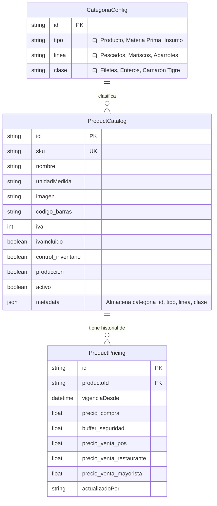
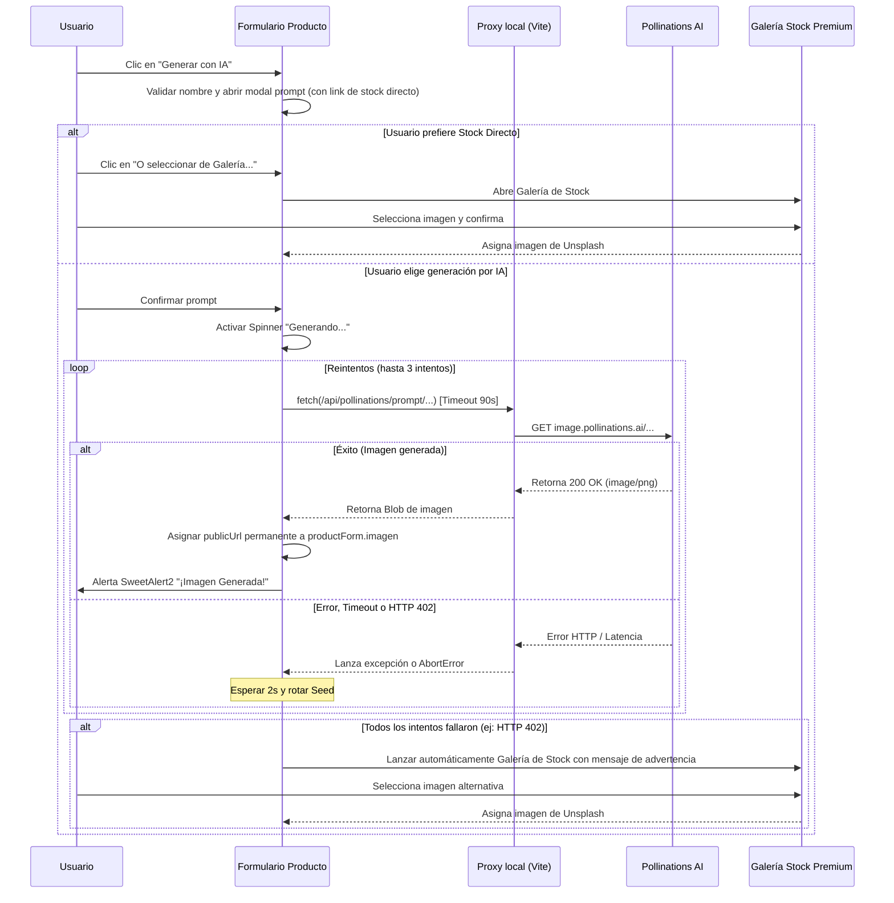

# Documentación de Productos, Precios y Categorías

Este documento detalla la arquitectura de datos, el flujo relacional de precios, la jerarquía de categorías y la implementación completa del módulo de inventario para el ERP de **La Pezcadería**.

---

## 1. Modelo de Datos Relacional (3NF)

Para evitar la redundancia de datos y permitir un registro de auditoría e histórico de precios sólido, la información de inventario se divide en tres estructuras independientes.



### Tabla: Catálogo de Productos (`ProductCatalog`)
Almacena la metadata inmutable o estructural del producto.

*   `id`: Identificador único (UUID auto-generado con prefijo `prd-`).
*   `sku`: Código único de referencia (ej: `FIL-ROB-004`).
*   `nombre`: Nombre descriptivo (ej: `FILETE DE RÓBALO LIMPIO`).
*   `unidadMedida`: `kg` (Kilos), `und` (Unidades), `lb` (Libras), o `gr` (Gramos).
*   `imagen`: URL del recurso gráfico del producto.
*   `codigo_barras`: Código EAN/UPC para lector de barras en POS.
*   `iva`: Porcentaje de impuesto (`0%` Exento, `5%` Excluido/Bajo, `19%` General).
*   `ivaIncluido`: Booleano que determina si los precios de venta ya contemplan la tarifa de IVA.
*   `control_inventario`: Booleano para activar el control WMS y seguimiento en Kardex.
*   `produccion`: Booleano que determina si el producto es apto como entrada o salida en procesos de planta de transformación.
*   `activo`: Booleano de eliminación lógica (Soft Delete).

### Tabla: Historial de Precios y Costos (`ProductPricing`)
Permite mantener la trazabilidad de los costos de compra y los precios de venta asociados a lo largo del tiempo.

*   `id`: Identificador único con prefijo `prc-`.
*   `productoId`: Relación `1:N` apuntando al `id` del catálogo.
*   `vigenciaDesde`: Fecha y hora a partir de la cual entra en vigencia esta tarifa.
*   `precio_compra`: Costo unitario base de compra en COP.
*   `buffer_seguridad`: Porcentaje de margen adicional sumado al costo base para prever mermas y fluctuaciones de precios de mercado antes de aplicar los márgenes de venta.
*   `precio_venta_pos`: Precio para consumidor final (+40% sobre el costo ajustado con buffer).
*   `precio_venta_restaurante`: Precio para canal institucional/restaurante (+30% sobre el costo ajustado con buffer).
*   `precio_venta_mayorista`: Precio para clientes mayoristas (+15% sobre el costo ajustado con buffer).
*   `actualizadoPor`: Rol del usuario que gatilló el cambio de precio (ej: `admin`, `administrativo`).

### Tabla: Configuración de Categorías (`CategoriaConfig`)
Modelo de clasificación jerárquica en 3 niveles (3NF) para organizar productos de forma flexible.

*   `id`: Identificador único con prefijo `cat-`.
*   `tipo`: Clasificación del recurso en la cadena de suministro (Nivel 1). Ej: `Producto`, `Materia Prima`, `Insumo`.
*   `linea`: Agrupación comercial o de origen del producto (Nivel 2). Ej: `Pescados`, `Mariscos`, `Abarrotes`.
*   `clase`: Detalle técnico, corte o especie del producto (Nivel 3). Ej: `Filetes`, `Enteros`, `Camarón Tigre`.

---

## 2. Estado Global y Persistencia

### Definición en `App.tsx`

El estado global de las categorías se define como un hook de React con persistencia mediante el servicio `localDb`:

```typescript
// Interfaz del modelo
export interface CategoriaConfig {
  id: string;
  tipo: string;
  linea: string;
  clase: string;
}

// Estado con carga inicial desde localStorage
const [categorias, setCategorias] = useState<CategoriaConfig[]>(() =>
  localDb.load('categorias', [
    { id: generateId('cat'), tipo: 'Producto', linea: 'Pescados', clase: 'Filetes' },
    { id: generateId('cat'), tipo: 'Producto', linea: 'Mariscos', clase: 'Camarones' },
    { id: generateId('cat'), tipo: 'Materia Prima', linea: 'Pescados Enteros', clase: 'Corvina' }
  ])
);

// Persistencia reactiva
useEffect(() => {
  localDb.save('categorias', categorias);
}, [categorias]);
```

### Registro en `localDb.ts`

La clave `categorias` está registrada en el diccionario `DB_KEYS` del servicio de persistencia:

```typescript
export const DB_KEYS = {
  // ... otras claves ...
  categorias: 'pezcaderia_categorias'
} as const;
```

### Props de InventoryView

Las categorías y su setter se pasan como props a `InventoryView`:

```typescript
<InventoryView
  // ... otras props ...
  categorias={categorias}
  setCategorias={setCategorias}
/>
```

La interfaz de props acepta ambos:

```typescript
interface InventoryViewProps {
  // ... otras props ...
  categorias: CategoriaConfig[];
  setCategorias: React.Dispatch<React.SetStateAction<CategoriaConfig[]>>;
}
```

---

## 3. Arquitectura de Pestañas del Módulo de Inventario

`InventoryView.tsx` está organizado en tres pestañas principales controladas por el estado `viewMode`:

| Pestaña | Valor `viewMode` | Descripción |
|---------|-------------------|-------------|
| **Operaciones de Inventario** | `operaciones` | Stock por bodegas, Entrada de Compra, Traslados, Producción, Trazabilidad Transaccional |
| **Catálogo de Productos** | `catalogo` | Tabla dinámica con stock por bodegas como columnas. Vista de ficha detallada al hacer clic. |
| **Gestión de Categorías** | `categorias` | CRUD de categorías jerárquicas (Tipo > Línea > Clase) con visualización de árbol. |

---

## 4. Pestaña: Catálogo de Productos

### 4.1 Tabla Dinámica con Bodegas como Columnas

La tabla del catálogo muestra dinámicamente **todas las bodegas** del sistema como columnas, calculando el stock para cada SKU:

```typescript
// Columnas generadas dinámicamente
{Object.keys(stock).map(bodegaName => (
  <th key={bodegaName}>{bodegaName}</th>
))}
<th>Stock Total</th>
```

**Helpers de cálculo de stock:**

```typescript
// Stock por bodega individual
const getStockInBodega = (sku: string, bodegaName: string) => {
  const items = stock[bodegaName] || [];
  return items.filter(item => item.sku === sku).reduce((acc, item) => acc + item.stock, 0);
};

// Stock total consolidado
const getTotalStock = (sku: string) => {
  return Object.keys(stock).reduce((acc, bodegaName) => {
    return acc + getStockInBodega(sku, bodegaName);
  }, 0);
};
```

**Características de la tabla:**
- **Filtro de búsqueda:** Por nombre, SKU o código de barras.
- **Filtro de estado:** Todos, Activos, Inactivos.
- **Fila clickeable:** Al hacer clic en una fila, se abre el formulario de edición detallado.
- **Imagen miniatura:** Muestra la imagen del producto o un icono placeholder.
- **Toggle de estado:** Cambio rápido de Activo/Inactivo sin entrar al formulario.

### 4.2 Formulario de Edición Detallado

Al hacer clic en una fila de la tabla (o al presionar "Registrar Producto"), se despliega un formulario de edición completo con layout split:

#### Panel Lateral Izquierdo (1.2fr)
- **Imagen del producto** con placeholder: Si existe URL, muestra la imagen; sino, muestra un icono `Package` con texto "Sin Imagen de Producto".
- **Generador de imágenes con IA:** Botón `✨ Generar con IA` que usa Pollinations AI para generar imágenes fotorrealistas basadas en el nombre del producto. Incluye overlay de carga con spinner animado.
- **Código SKU:** Badge con el código actual del producto.
- **Indicadores de Control:** Visualización de los estados `Control de Stock` y `Transformable en Planta`.
- **Resumen de Stock (solo edición):** Desglose de stock por cada bodega con el total consolidado.

#### Panel Derecho (2fr)
Formulario completo con las siguientes secciones:

**DATOS BÁSICOS Y CLASIFICACIÓN:**
- `SKU (Código Único) *` — Deshabilitado en modo edición.
- `Nombre del Producto *`
- Selectores dinámicos de categorías (ver sección 5)
- `Código de Barras`
- `Unidad de Medida *` — Opciones: kg, und, lb, gr.
- `Imagen (URL)` — Input manual para URL de imagen.

**POLÍTICA COMERCIAL, IMPUESTOS Y COSTOS:**
- `Costo Base ($ COP)` — Precio de compra.
- `Buffer de Seguridad (%)` — Margen de protección.
- `IVA (Tarifa)` — Selector con opciones: Exento (0%), Excluido/Bajo (5%), General (19%).
- `IVA Incluido` — Selector Sí/No.

**PARÁMETROS DEL SISTEMA:**
- `Controlar Inventario (WMS / Kardex)` — Checkbox (switch).
- `Es transformable en Planta (Producción)` — Checkbox (switch).

**SIMULACIÓN DE PRECIOS:**
Panel de solo lectura que calcula en tiempo real los precios sugeridos aplicando la fórmula:
- POS: Costo × (1 + Buffer%) × 1.40
- Restaurante: Costo × (1 + Buffer%) × 1.30
- Mayorista: Costo × (1 + Buffer%) × 1.15

### 4.3 Tabla de Historial de Inventario (Kardex)

Cuando se edita un producto existente, debajo del formulario se muestra un panel de **Historial de Movimientos de Inventario (Kardex)** que filtra todos los `MovimientoInventario` por el SKU del producto:

| Columna | Descripción |
|---------|-------------|
| Fecha | Timestamp del movimiento |
| Tipo de Movimiento | Badge con color: verde para entradas, rojo para salidas |
| Bodega Origen | Origen del movimiento (si aplica) |
| Bodega Destino | Destino del movimiento (si aplica) |
| Cantidad | Unidades movidas |
| Lote | Código de trazabilidad del lote |
| Referencia | Tipo y ID de referencia (ej: ORDEN_COMPRA: oc-abc123) |
| Operador | Rol del usuario que ejecutó la operación |
| Notas | Observaciones adicionales con tooltip |

---

## 5. Selectores Dinámicos de Categorías (Tipo > Línea > Clase)

Los selectores de categoría en el formulario de edición implementan un sistema de **cascada dependiente**:

```
Tipo (Nivel 1) → filtra → Línea (Nivel 2) → filtra → Clase (Nivel 3)
```

### Comportamiento:
1. **Tipo:** Muestra todos los tipos únicos existentes en `categorias[]`. Al cambiar, resetea Línea y Clase.
2. **Línea:** Muestra las líneas filtradas por el Tipo seleccionado. Al cambiar, resetea Clase.
3. **Clase:** Muestra las clases filtradas por el Tipo + Línea seleccionados.

### Creación en el acto:
Cada selector incluye una opción especial `[+ Crear nuevo...]` que al seleccionarse, despliega un input de texto adicional para escribir el nuevo valor:

```typescript
<option value="NEW_TIPO">[+ Crear nuevo Tipo]</option>
// Al seleccionar, aparece:
<input placeholder="Escriba el nuevo Tipo..." value={customTipo} ... />
```

### Auto-creación de categoría al guardar:
Si el usuario introduce una combinación Tipo-Línea-Clase que no existe en la tabla de categorías, el sistema la crea automáticamente al guardar el producto:

```typescript
const existsCat = categorias.find(c =>
  c.tipo.toUpperCase() === finalTipo.toUpperCase() &&
  c.linea.toUpperCase() === finalLinea.toUpperCase() &&
  c.clase.toUpperCase() === finalClase.toUpperCase()
);
if (!existsCat && finalTipo) {
  const newCatId = generateId('cat');
  setCategorias(prev => [...prev, { id: newCatId, tipo: finalTipo, linea: finalLinea, clase: finalClase }]);
}
```

---

## 6. Pestaña: Gestión de Categorías

### 6.1 Formulario CRUD (Panel Izquierdo)

Formulario para crear o editar ramas de la jerarquía Tipo > Línea > Clase:

- **Tipo (Grupo Principal):** Input con `datalist` que sugiere tipos existentes.
- **Línea:** Input libre.
- **Clase (Detalle / Especie):** Input libre.

Validaciones:
- Los tres campos son obligatorios.
- No se permiten duplicados (case-insensitive).
- Al editar, se pueden modificar los tres niveles.
- Al eliminar, se muestra confirmación SweetAlert2 indicando que los productos existentes conservan su clasificación.

### 6.2 Tabla de Registros (Panel Derecho - Superior)

Tabla con todas las combinaciones de categoría registradas, con las columnas:
- Tipo (Nivel 1) — Negrita
- Línea (Nivel 2) — Semi-negrita
- Clase (Nivel 3)
- Acciones (Editar / Eliminar)

Incluye buscador que filtra por tipo, línea o clase.

### 6.3 Árbol Jerárquico Visual (Panel Derecho - Inferior)

Representación visual tipo árbol que agrupa las categorías:

```
● PRODUCTO
  └─ Pescados
     [Filetes] [Enteros] [Porcionados]
  └─ Mariscos
     [Camarones] [Langostinos]

● MATERIA PRIMA
  └─ Pescados Enteros
     [Corvina] [Róbalo]
```

Los tipos se muestran como nodos principales con fondo sombreado. Las líneas se muestran con indentación y las clases como chips/badges dentro de cada línea.

---

## 7. Clasificación Jerárquica de Categorías

Las categorías se organizan bajo el modelo relacional **3NF (Tercera Forma Normal)** para estructurar de manera fluida y sin redundancias los tres niveles jerárquicos:

1.  **Tipo (Nivel 1):** Clasificación del recurso en la cadena de suministro.
    *   *Ejemplos:* `Producto` (Terminado/Comercializable), `Materia Prima` (Para procesamiento), `Insumo` (Empaques, condimentos).
2.  **Línea (Nivel 2):** Agrupación comercial o de origen del producto.
    *   *Ejemplos:* `Pescados`, `Mariscos`, `Abarrotes`, `Batidos`.
3.  **Clase (Nivel 3):** Detalle técnico, corte o especie del producto.
    *   *Ejemplos:* `Filetes`, `Enteros`, `Porcionados`, `Camarón Tigre`.

Durante el registro del producto, los selectores dinámicos se filtran en cascada según la selección previa. Si el usuario desea introducir un valor que no existe, puede seleccionar `[+ Crear nuevo...]`, lo cual inserta inmediatamente el nuevo nodo en la tabla relacional de categorías.

---

## 8. Flujo Comercial y Políticas de Precios

La fijación de precios en el sistema sigue una política comercial unificada que protege los márgenes brutos de la pescadería ante mermas del producto fresco.

### Simulación y Generación de Precios de Venta Sugeridos
El precio de venta para cada uno de los tres canales se calcula de forma automática basándose en la siguiente fórmula:

$$\text{Costo Ajustado} = \text{Costo Compra} \times \left(1 + \frac{\text{Buffer Seguridad \%}}{100}\right)$$

A partir del Costo Ajustado, se aplican los márgenes estándar por canal comercial:

*   **Canal POS (Venta Directa):** $+40\%$ sobre el costo ajustado.
    $$\text{Precio POS} = \text{Costo Ajustado} \times 1.40$$
*   **Canal Restaurante (Institucional):** $+30\%$ sobre el costo ajustado.
    $$\text{Precio Restaurante} = \text{Costo Ajustado} \times 1.30$$
*   **Canal Mayorista (Distribución):** $+15\%$ sobre el costo ajustado.
    $$\text{Precio Mayorista} = \text{Costo Ajustado} \times 1.15$$

> [!NOTE]
> Todos los precios de venta generados de forma automática se redondean al entero más cercano en pesos colombianos (COP). Cada actualización genera una nueva tupla en `ProductPricing` para mantener el historial.

---

## 9. Control de Inventarios e Integración WMS (Kardex)

Los productos que tengan la propiedad `control_inventario` habilitada registran automáticamente cada alteración física en la bitácora del Kardex (`MovimientoInventario`).

*   **Entrada por Compra (`ENTRADA_COMPRA`):** Registrado automáticamente al recibir y liquidar una Orden de Compra a un proveedor. Requiere ingreso de lote e incrementa el stock de la bodega destino seleccionada.
*   **Traslado entre Bodegas (`TRASLADO_SALIDA` y `TRASLADO_ENTRADA`):** Mueve unidades entre las bodegas configuradas en el sistema (ej: de Principal a Averías o Secundaria) sin alterar el stock consolidado del ERP.
*   **Consumo y Salida en Planta (`PRODUCCION_CONSUMO` y `PRODUCCION_SALIDA`):** En el procesamiento de pescadería (ej: filetear pescado entero), se descuenta stock de la materia prima (Pescado Entero) y se da de alta en el catálogo terminado (Filete Limpio) calculando la merma generada.
*   **Venta (`VENTA`):** Reduce stock de la bodega asociada al POS o canal de distribución al momento de confirmar la transacción.

---

## 10. Mapa de Archivos del Módulo

| Archivo | Responsabilidad |
|---------|-----------------|
| `src/App.tsx` | Definición de interfaces (`CategoriaConfig`, `ProductCatalog`, `ProductPricing`), estado global con persistencia, migración de datos legacy, derivación de `products` para retrocompatibilidad |
| `src/views/InventoryView.tsx` | UI completa del módulo: 3 pestañas (Operaciones, Catálogo, Categorías), formularios CRUD, tabla dinámica con bodegas, selectores cascada, Kardex por producto |
| `src/services/localDb.ts` | Servicio unificado de persistencia con `localStorage`. Diccionario `DB_KEYS` con todas las claves tipadas incluyendo `categorias` |
| `DOCUMENTACION_PRODUCTOS.md` | Este archivo de documentación técnica |

---

## 11. Datos Iniciales de Referencia

### Categorías Predefinidas
| Tipo | Línea | Clase |
|------|-------|-------|
| Producto | Pescados | Filetes |
| Producto | Mariscos | Camarones |
| Materia Prima | Pescados Enteros | Corvina |

### Productos de Ejemplo
| SKU | Nombre | Categoría |
|-----|--------|-----------|
| PES-ENT-001 | Pescado Entero (Materia Prima) | MATERIA PRIMA |
| FIL-LIM-002 | Filete Limpio (Terminado) | PESCADOS |
| CAM-TIG-003 | Camarón Tigre (Terminado) | MARISCOS |
| BAT-001..005 | Batidos (Varios) | BATIDOS |
| BEB-001..002 | Jugos Naturales | BEBIDAS |
| ENS-001..004 | Ensaladas | ENSALADAS |
| ENT-001..002 | Entradas | ENTRADAS |
| GEN-001 | Hamburguesa de Garbanzo | GENERAL |

---

## 12. Infraestructura de Generación de Imágenes con IA

La generación automática de imágenes del catálogo utiliza la API pública de **Pollinations AI** y un diseño resiliente para mitigar fallas en entornos locales y productivos:

### 12.1 Flujo Técnico y Resiliencia
1. **Evitación de CORS en Desarrollo:** Se implementó un proxy inverso en `vite.config.ts` que redirige las peticiones locales de `/api/pollinations/*` directamente a `https://image.pollinations.ai`. Esto evita bloqueos de CORS o políticas de sandbox locales durante pruebas y desarrollo.
2. **Detección y Manejo de Timeouts (AbortController):** Dado que la generación de imágenes complejas por IA puede tomar tiempo, se configuró un `AbortController` con un límite estricto de **90 segundos**. Esto evita que el spinner de carga de la interfaz quede activo permanentemente ante caídas del servidor remoto.
3. **Estrategia de Reintentos (Retry Loop):** Si el servidor de Pollinations retorna un error (HTTP >=400, o respuesta que no sea tipo `image/*`), el sistema realiza de forma automática hasta **2 reintentos adicionales** (3 intentos en total) con una espera de 2 segundos entre intentos y utilizando **semillas (seeds) diferentes** para diversificar la petición.
4. **Optimización de Dimensiones:** Para maximizar la velocidad de respuesta de la IA, las peticiones se configuran por defecto a una resolución óptima de **400x400** píxeles con el parámetro `nologo=true`.
5. **Fallback Interactivo de Galería Premium:** Si tras los reintentos la API falla (p. ej., con error `HTTP 402 Payment Required` por límites de cuota), el sistema captura la excepción y de manera fluida despliega un modal interactivo con una **Galería de Stock Premium**. Esta galería contiene imágenes fotorrealistas de alta calidad curadas para pescadería (filete, pescado entero, camarones, pulpo, mix de mariscos), permitiendo al usuario seleccionar y aplicar una alternativa profesional al instante. Asimismo, se incluye un atajo directo a esta galería desde la pantalla de entrada del prompt de la IA.

### 12.2 Diagrama de Secuencia del Flujo de Generación con Fallback


