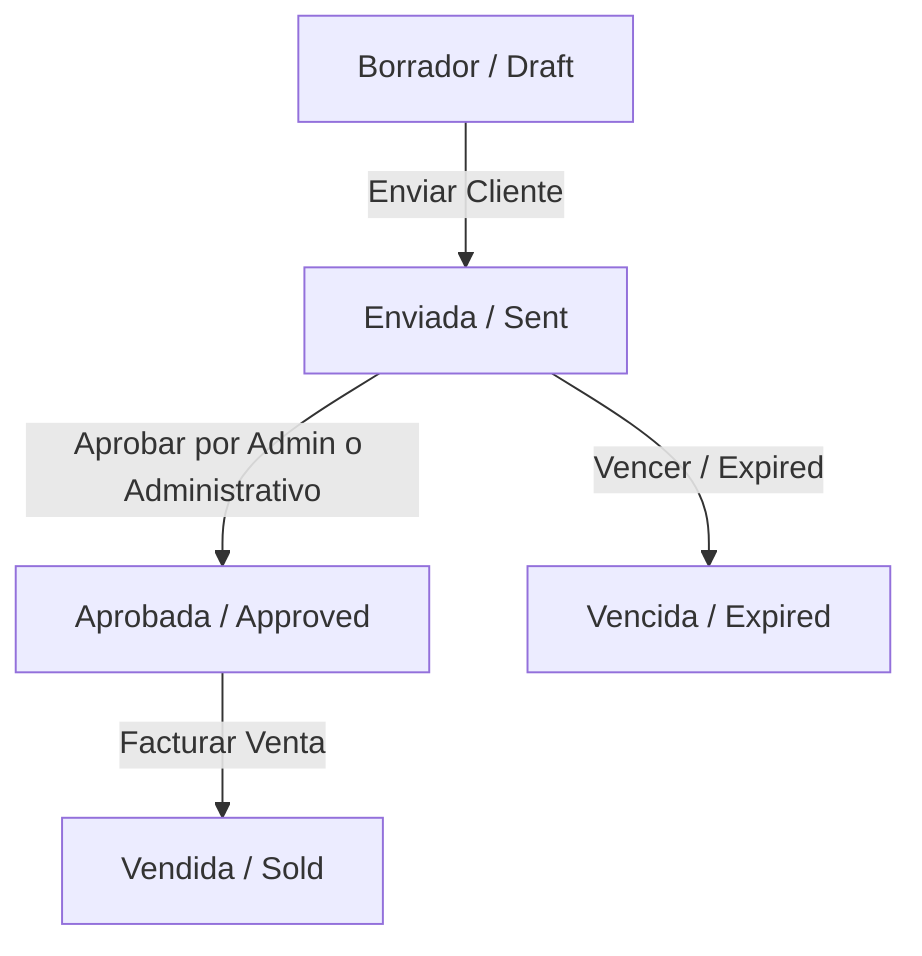

# 🐟 La Pezcadería ERP — Sistema Integrado de Control Operativo & Facturación

-00B171?style=for-the-badge)


Este es el repositorio central del **ERP de La Pezcadería S.A.S.**, una solución moderna, modular y resiliente diseñada para centralizar la gestión de inventarios multi-bodega, el proceso comercial de cotizaciones, la operación rápida en punto de venta (POS) con historial inteligente de precios por cliente, y el control de recursos humanos y finanzas.

---

## 🚀 Características Clave del Sistema

### 1. Punto de Venta (POS) Inteligente
* **Catálogo Adaptativo**: Grid de productos optimizado para pantallas táctiles y tablets con filtrado dinámico por categorías.
* **Control de Stock en Tiempo Real**: Visualización explícita del inventario desglosado en tres bodegas principales:
  * **P** (Bodega Principal)
  * **S** (Bodega Secundaria)
  * **A** (Bodega Averías)
* **Historial de Precios por Cliente**: Al vincular un cliente (NIT/Nombre), el sistema detecta de forma automática la última tarifa facturada de forma histórica. Si difiere del precio de lista actual, ofrece un **botón inteligente de un clic (`💡 Último precio`)** para aplicar el descuento correspondiente.
* **Deducción Atómica**: Las ventas POS descuentan inmediatamente las existencias físicas de la **Bodega Principal**.

### 2. Flujo de Workflow de Cotizaciones (`PricingView`)
Implementación de un ciclo documental formal inspirado en ERPs líderes a nivel mundial (como Odoo y ERPNext) con control de acceso basado en roles (RBAC):



* **Seguridad en Transiciones**: Solo usuarios autorizados (`admin` o `administrativo`) pueden transicionar cotizaciones de **Sent** a **Approved**. Si un rol `vendedor` intenta aprobarla, el sistema bloquea la acción.
* **Deducción de Stock al Facturar**: Al transicionar a **Vendida (Sold)**, se descuentan las existencias de la **Bodega Principal** y se actualiza el histórico de precios del cliente seleccionado.

### 3. Módulo de Recursos Humanos (RRHH)
* Gestión integral de fichas de empleados (salario, cargo, estado, fecha de ingreso).
* Almacenamiento y visualización de hojas de vida (PDF).
* **Bloqueo Automático de Credenciales**: Trigger en base de datos que desactiva de forma inmediata el acceso al ERP si el estado de un empleado cambia a `INACTIVO`.

### 4. Caja y Finanzas
* Tarjetas de rendimiento en el Dashboard principal (Ventas, Rutas activas, Porcentaje de Merma y Gastos de Ruta).
* Registro detallado del libro diario y arqueo de caja diario.

---

## 🗄️ Arquitectura de Base de Datos (PostgreSQL/Supabase)

El esquema relacional se encuentra en la carpeta `/database/` y está segmentado de forma modular:

1. **`01_schema_inicial.sql`**: Definición de tipos personalizados, tablas de terceros, clientes, proveedores, productos, bodegas y configuraciones generales del sistema.
2. **`02_sistema_inventario_y_produccion.sql`**: Gestión de lotes, stocks e insumos. Incluye trigger para validación de merma: si supera el 35%, exige un **PIN de autorización de jefe de bodega**.
3. **`03_ventas_y_facturacion.sql`**: Pedidos, detalles y cálculo de secuencias/consecutivos autogenerados.
4. **`04_caja_y_finanzas.sql`**: Registro diario de movimientos y gastos operativos de rutas de distribución.
5. **`05_politicas_rls_y_seguridad.sql`**: Habilitación de políticas Row-Level Security (RLS) y roles de base de datos para restringir acceso no autorizado.
6. **`06_recursos_humanos.sql`**: Estructura de la nómina y trigger de bloqueo de credenciales automáticas.

---

## 📊 Script de Migración (`scripts/migrate_sheets_data.ts`)

Herramienta escrita en TypeScript para automatizar la extracción de datos históricos desde Google Sheets hacia PostgreSQL en Supabase.
* Lee y desduplica la información de productos y clientes.
* Genera mapeo relacional de datos y realiza inserciones masivas controladas.

---

## 💻 Stack Tecnológico

* **Frontend**: React 18, TypeScript, Vite, Vanilla CSS.
* **Iconografía**: `lucide-react`.
* **Modales & Notificaciones**: `sweetalert2`.
* **Base de Datos**: PostgreSQL / Supabase Client.
* **Persistencia**: LocalStorage de respaldo para estados críticos (`pezcaderia_stock` y `pezcaderia_last_client_prices`).

---

## ⚙️ Instalación y Configuración Local

### Prerrequisitos
* Node.js (v18 o superior)
* Administrador de paquetes `pnpm` o `npm`

### Pasos
1. **Clonar el proyecto e instalar dependencias:**
   ```bash
   git clone https://github.com/PezcaderiaSAS/maestro_ERP_Pezcaderia.git
   cd maestro_ERP_Pezcaderia
   pnpm install
   ```

2. **Configurar base de datos (Supabase):**
   * Copia el contenido de los archivos SQL ubicados en `/database/` en el editor SQL de tu proyecto de Supabase (ejecutar en orden numérico del `01` al `06`).

3. **Ejecutar el Servidor de Desarrollo:**
   ```bash
   pnpm dev
   ```
   Abre [http://localhost:3000](http://localhost:3000) en tu navegador para interactuar con la aplicación.

4. **Compilar para Producción:**
   ```bash
   pnpm build
   ```

---

## 🤝 Flujo de Trabajo en Git

Para subir mejoras al repositorio remoto:
```bash
# 1. Traer últimos cambios de la nube
git pull origin main

# 2. Agregar tus archivos y confirmar cambios
git add .
git commit -m "feat: [tu descripción detallada]"

# 3. Empujar a la rama principal
git push origin main
```
