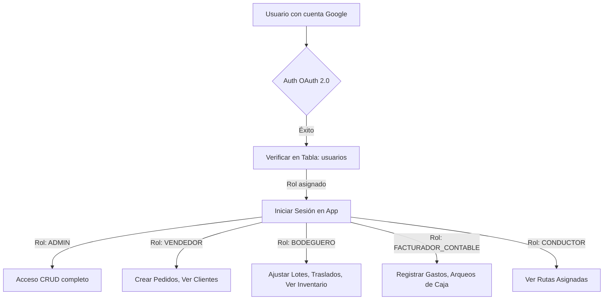
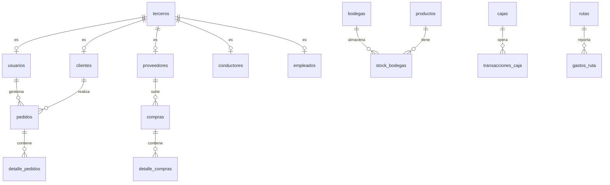

# Plan de Arquitectura Unificada e Implementación: La Pezcadería ERP (v3.2)

Este documento presenta el diseño técnico definitivo para la unificación del ecosistema de software de **La Pezcadería S.A.S.** Se incorporan los módulos de base de datos relacionales, compras, inventario, ventas POS, integración de facturación electrónica Siigo y el módulo de Gestión de Recursos Humanos (Empleados).

---

## 1. Autenticación Avanzada (Google Auth) y Roles (RBAC)

Para solucionar la eliminación involuntaria de información, se implementará un flujo de autenticación centralizado ligado a políticas de base de datos (Row Level Security) y un sistema de **Soft Deletes**.



### 1.1 Políticas RLS y Eliminación Lógica (Soft Deletes)
* **Soft Deletes**: Todas las tablas transaccionales y maestras contarán con los campos `activo` (BOOLEAN, default true) y `deleted_at` (TIMESTAMP WITH TIME ZONE).
* **Restricción de Operaciones Destructivas**: Las sentencias SQL `DELETE` físicas están bloqueadas en la base de datos para usuarios sin rol `ADMIN`. Los deletes accidentales se previenen mediante llaves foráneas con restricción `ON DELETE RESTRICT`.

---

## 2. Idempotencia Avanzada (Prevención de Transacciones Duplicadas)

Para evitar duplicidad en facturación, egresos de caja y salidas de inventario, el frontend generará un UUID único (`idempotency_key`) para cada transacción crítica y lo enviará en la cabecera `X-Idempotency-Key`. El servidor registrará este token en una tabla temporal para bloquear peticiones concurrentes duplicadas.

---

## 3. Optimización de Base de Datos de Grado Empresarial (PostgreSQL)

Se implementará una arquitectura relacional normalizada en la tercera forma normal (3NF), orientada a optimizar el rendimiento y garantizar la integridad de los datos.



### 3.1 El Modelo de Terceros (Unified Party Pattern)
Para evitar la redundancia de datos (nombres, identificaciones, teléfonos, correos y direcciones distribuidos en múltiples tablas) y unificar los registros de cuentas por cobrar y pagar, se implementa la tabla padre **`terceros`**. Las entidades `clientes`, `proveedores`, `usuarios`, `conductores` y `empleados` heredan de esta mediante llaves primarias compartidas.

---

### 3.2 Estructura de Tablas de Grado Empresarial (SQL)

#### Tabla: `terceros` (Entidad Base)
* `id` (UUID, PRIMARY KEY) - Generado por `gen_random_uuid()`.
* `tipo_persona` (VARCHAR(15)) - `NATURAL`, `JURIDICA`.
* `tipo_identificacion` (VARCHAR(10)) - `NIT`, `CC`, `CE`.
* `identificacion` (VARCHAR(20), UNIQUE, NOT NULL) - Indexado.
* `nombre_razon_social` (VARCHAR(255), NOT NULL) - Indexado.
* `direccion` (VARCHAR(255), NOT NULL)
* `celular` (VARCHAR(20))
* `email` (VARCHAR(100), UNIQUE)
* `ciudad` (VARCHAR(100), NOT NULL)
* `activo` (BOOLEAN, DEFAULT TRUE)
* `creado_en` (TIMESTAMP WITH TIME ZONE, DEFAULT NOW())
* `deleted_at` (TIMESTAMP WITH TIME ZONE)

#### Tabla: `clientes` (Subtipo de Terceros)
* `id` (UUID, PRIMARY KEY, FOREIGN KEY REFERENCES `terceros(id)` ON DELETE RESTRICT)
* `vendedor_id` (UUID, FOREIGN KEY REFERENCES `usuarios(id)` ON DELETE RESTRICT)
* `tipo_precio` (VARCHAR(20), DEFAULT 'POS') - `POS`, `RESTAURANTE`, `MAYORISTA`.
* `encargado_compras` (VARCHAR(100))

#### Tabla: `proveedores` (Subtipo de Terceros)
* `id` (UUID, PRIMARY KEY, FOREIGN KEY REFERENCES `terceros(id)` ON DELETE RESTRICT)
* `contacto_compras` (VARCHAR(100))
* `plazo_pago_dias` (INTEGER, DEFAULT 0)

#### Tabla: `usuarios` (Subtipo de Terceros con acceso al software)
* `id` (UUID, PRIMARY KEY, FOREIGN KEY REFERENCES `terceros(id)` ON DELETE RESTRICT)
* `rol` (VARCHAR(30)) - `ADMIN`, `VENDEDOR`, `FACTURADOR`, `BODEGUERO`, `CONDUCTOR`.
* `pin_acceso` (VARCHAR(60)) - PIN encriptado con bcrypt (usado para login y autorizaciones críticas).
* `google_uid` (VARCHAR(255), UNIQUE) - UID de autenticación OAuth 2.0.

#### Tabla: `conductores` (Subtipo de Terceros)
* `id` (UUID, PRIMARY KEY, FOREIGN KEY REFERENCES `terceros(id)` ON DELETE RESTRICT)
* `licencia_conduccion` (VARCHAR(50), NOT NULL)
* `celular_corporativo` (VARCHAR(20))

#### Tabla: `empleados` (Subtipo de Terceros para Recursos Humanos)
* `id` (UUID, PRIMARY KEY, FOREIGN KEY REFERENCES `terceros(id)` ON DELETE RESTRICT)
* `fecha_ingreso` DATE NOT NULL,
* `fecha_egreso` DATE,
* `url_hoja_vida` VARCHAR(500), -- Link al PDF guardado en Supabase Storage
* `cargo` VARCHAR(100) NOT NULL, -- Ej. 'Jefe de Bodega', 'Operario planta', etc.
* `salario_base` NUMERIC(12,2) NOT NULL DEFAULT 0.00,
* `estado` VARCHAR(20) NOT NULL DEFAULT 'ACTIVO' CHECK (estado IN ('ACTIVO', 'INACTIVO', 'VACACIONES', 'LICENCIA')),
* `observaciones` TEXT

---

#### Tabla: `productos`
* `id` (UUID, PRIMARY KEY)
* `sku` (VARCHAR(50), UNIQUE, NOT NULL) - Indexado.
* `nombre` (VARCHAR(150), NOT NULL)
* `categoria` (VARCHAR(50), NOT NULL)
* `precio_compra` (NUMERIC(12,2), NOT NULL)
* `precio_venta_pos` (NUMERIC(12,2), NOT NULL)
* `precio_venta_restaurante` (NUMERIC(12,2), NOT NULL)
* `precio_venta_mayorista` (NUMERIC(12,2), NOT NULL)
* `buffer_seguridad` (NUMERIC(5,2), DEFAULT 0)
* `activo` (BOOLEAN, DEFAULT TRUE)

#### Tabla: `bodegas`
* `id` (UUID, PRIMARY KEY)
* `nombre` (VARCHAR(100), UNIQUE, NOT NULL)
* `ubicacion` (VARCHAR(255))
* `activa` (BOOLEAN, DEFAULT TRUE)

#### Tabla: `stock_bodegas` (Relación N:M para control físico)
* `bodega_id` (UUID, FOREIGN KEY REFERENCES `bodegas(id)`, PRIMARY KEY (bodega_id, producto_id))
* `producto_id` (UUID, FOREIGN KEY REFERENCES `productos(id)`, PRIMARY KEY (bodega_id, producto_id))
* `cantidad` (NUMERIC(12,2), DEFAULT 0.0)

#### Tabla: `lotes_inventario`
* `id` (UUID, PRIMARY KEY)
* `producto_id` (UUID, FOREIGN KEY REFERENCES `productos(id)` ON DELETE RESTRICT) - Indexado.
* `bodega_id` (UUID, FOREIGN KEY REFERENCES `bodegas(id)` ON DELETE RESTRICT) - Indexado.
* `numero_lote` (VARCHAR(50), NOT NULL)
* `fecha_vencimiento` (DATE, NOT NULL)
* `cantidad_inicial` (NUMERIC(12,2), NOT NULL)
* `cantidad_actual` (NUMERIC(12,2), NOT NULL)
* `temperatura_camara` (NUMERIC(4,1))
* `creado_en` (TIMESTAMP WITH TIME ZONE, DEFAULT NOW())

---

#### Tabla: `pedidos` (Cabecera y Venta de Caja)
* `id` (UUID, PRIMARY KEY)
* `numero_orden` (VARCHAR(30), UNIQUE, NOT NULL) - Indexado. Generado por secuencia.
* `fecha` (TIMESTAMP WITH TIME ZONE, DEFAULT NOW())
* `origen` (VARCHAR(20)) - `VISITA`, `LLAMADA`, `WHATSAPP`, `POS`.
* `cliente_id` (UUID, FOREIGN KEY REFERENCES `clientes(id)` ON DELETE RESTRICT) - Indexado.
* `bodega_id` (UUID, FOREIGN KEY REFERENCES `bodegas(id)` ON DELETE RESTRICT) - Bodega desde donde se despacha.
* `vendedor_id` (UUID, FOREIGN KEY REFERENCES `usuarios(id)` ON DELETE RESTRICT)
* `forma_pago` (VARCHAR(20)) - `CREDITO`, `CONTADO`.
* `tipo_entrega` (VARCHAR(20)) - `EN_RUTA`, `INMEDIATA`, `RECOGEN`.
* `fecha_entrega` (DATE NOT NULL)
* `jornada` (VARCHAR(15)) - `MANANA`, `TARDE`.
* `estado` (VARCHAR(20)) - `CREADO`, `LISTO`, `FACTURADO`, `ANULADO`.
* `subtotal` (NUMERIC(12,2), DEFAULT 0.0)
* `descuento_global_porcentaje` (NUMERIC(5,2), DEFAULT 0.0)
* `descuento_global_valor` (NUMERIC(12,2), DEFAULT 0.0)
* `total` (NUMERIC(12,2), DEFAULT 0.0)
* `idempotency_key` (UUID, UNIQUE)
* `activo` (BOOLEAN, DEFAULT TRUE)
* -- Campos para la Integración de Facturación Electrónica con Siigo:
* `siigo_factura_guid` (UUID, UNIQUE, NULLABLE) - ID de factura retornado por Siigo API.
* `siigo_status` (VARCHAR(30), DEFAULT 'PENDIENTE') - `PENDIENTE`, `ENVIADO`, `FALLIDO`, `NO_REQUERIDO`.
* `siigo_error_message` (TEXT)

#### Tabla: `detalle_pedidos` (Líneas con descuentos aplicados)
* `id` (UUID, PRIMARY KEY)
* `pedido_id` (UUID, FOREIGN KEY REFERENCES `pedidos(id)` ON DELETE CASCADE) - Indexado.
* `producto_id` (UUID, FOREIGN KEY REFERENCES `productos(id)` ON DELETE RESTRICT)
* `lote_inventario_id` (UUID, FOREIGN KEY REFERENCES `lotes_inventario(id)` ON DELETE RESTRICT, NULLABLE)
* `cantidad` (NUMERIC(12,2), NOT NULL)
* `precio_lista` (NUMERIC(12,2), NOT NULL) - Precio base del producto según cliente.
* `descuento_porcentaje` (NUMERIC(5,2), DEFAULT 0.0) - Descuento específico por ítem.
* `precio_final` (NUMERIC(12,2)) - Calculado como `precio_lista * (1 - descuento_porcentaje / 100)`.
* `total_linea` (NUMERIC(12,2)) - Calculado como `cantidad * precio_final`.

---

#### Tabla: `ordenes_produccion` (Registro de Transformación)
* `id` (UUID, PRIMARY KEY)
* `producto_origen_id` (UUID, FOREIGN KEY REFERENCES `productos(id)` ON DELETE RESTRICT): Materia prima.
* `lote_origen` (VARCHAR(50), NOT NULL): Lote de inventario de origen.
* `cantidad_origen` (NUMERIC(12,2), NOT NULL): Kilogramos de entrada.
* `producto_destino_id` (UUID, FOREIGN KEY REFERENCES `productos(id)` ON DELETE RESTRICT): Producto procesado resultante.
* `lote_destino` (VARCHAR(50), NOT NULL): Lote nuevo/heredado de salida.
* `cantidad_destino` (NUMERIC(12,2), NOT NULL): Kilogramos de salida.
* `merma` (NUMERIC(12,2) GENERATED ALWAYS AS (cantidad_origen - cantidad_destino) STORED)
* `merma_justificacion` (TEXT): Justificación obligatoria si la merma supera el estándar tolerable.
* `autorizado_por` (UUID, FOREIGN KEY REFERENCES `usuarios(id)` ON DELETE RESTRICT) - ID del Jefe de Bodega que ingresó su PIN numérico.
* `fecha` (TIMESTAMP WITH TIME ZONE, DEFAULT NOW())

---

#### Tabla: `compras` (Módulo de Abastecimiento de Bodega)
* `id` (UUID, PRIMARY KEY)
* `numero_factura_proveedor` (VARCHAR(50), NOT NULL)
* `proveedor_id` (UUID, FOREIGN KEY REFERENCES `proveedores(id)` ON DELETE RESTRICT) - Indexado.
* `bodega_id` (UUID, FOREIGN KEY REFERENCES `bodegas(id)` ON DELETE RESTRICT) - Bodega receptora del stock.
* `fecha_compra` (TIMESTAMP WITH TIME ZONE, NOT NULL)
* `subtotal` (NUMERIC(12,2), NOT NULL)
* `impuesto` (NUMERIC(12,2), DEFAULT 0.0)
* `total` (NUMERIC(12,2), NOT NULL)
* `forma_pago` (VARCHAR(20)) - `CREDITO`, `CONTADO`.
* `estado` (VARCHAR(20)) - `SOLICITADO`, `RECIBIDO`, `ANULADO`.
* `idempotency_key` (UUID, UNIQUE)
* `creado_por` (UUID, FOREIGN KEY REFERENCES `usuarios(id)` ON DELETE RESTRICT)
* `creado_en` (TIMESTAMP WITH TIME ZONE, DEFAULT NOW())

#### Tabla: `detalle_compras`
* `id` (UUID, PRIMARY KEY)
* `compra_id` (UUID, FOREIGN KEY REFERENCES `compras(id)` ON DELETE CASCADE) - Indexado.
* `producto_id` (UUID, FOREIGN KEY REFERENCES `productos(id)` ON DELETE RESTRICT)
* `lote_proveedor` (VARCHAR(50), NOT NULL)
* `fecha_vencimiento` (DATE, NOT NULL)
* `cantidad` (NUMERIC(12,2), NOT NULL)
* `precio_compra` (NUMERIC(12,2), NOT NULL)
* `total_linea` (NUMERIC(12,2)) - `cantidad * precio_compra`.

---

### 3.3 Índices PostgreSQL Recomendados para Alta Concurrencia
```sql
CREATE INDEX idx_terceros_identificacion ON terceros(identificacion);
CREATE INDEX idx_terceros_nombre ON terceros(nombre_razon_social);
CREATE INDEX idx_productos_sku ON productos(sku);
CREATE INDEX idx_pedidos_numero_orden ON pedidos(numero_orden);
CREATE INDEX idx_pedidos_cliente_id ON pedidos(cliente_id);
CREATE INDEX idx_detalle_pedidos_pedido ON detalle_pedidos(pedido_id);
CREATE INDEX idx_lotes_inventario_producto ON lotes_inventario(producto_id);
CREATE INDEX idx_transacciones_caja_caja ON transacciones_caja(caja_id);
```

### 3.4 Control de Concurrencia y Números de Documentos Secuenciales
Para evitar colisiones en la numeración secuencial de facturas, pedidos y compras bajo cargas de trabajo pesadas, no se consultará `SELECT MAX()`. En su lugar, se definirán objetos `SEQUENCE` en PostgreSQL:

```sql
-- Crear la secuencia para pedidos
CREATE SEQUENCE seq_numero_pedido START WITH 1;

-- Función de trigger para asignar número de pedido de manera atómica
CREATE OR REPLACE FUNCTION set_numero_pedido()
RETURNS TRIGGER AS $$
BEGIN
  NEW.numero_orden := 'PED-' || LPAD(nextval('seq_numero_pedido')::text, 6, '0');
  RETURN NEW;
END;
$$ LANGUAGE plpgsql;

CREATE TRIGGER trg_set_numero_pedido
BEFORE INSERT ON pedidos
FOR EACH ROW
EXECUTE FUNCTION set_numero_pedido();
```

---

## 4. Estructuración Matemática de Descuentos

Para proporcionar la flexibilidad de aplicar descuentos comerciales diferenciados por línea o globales:

### 4.1 Fórmulas Financieras Aplicadas

1. **Precio Final de Línea ($i$):**
   $$\text{Precio Final}_i = \text{Precio Lista}_i \times \left(1 - \frac{\text{Descuento Porcentaje}_i}{100}\right)$$
2. **Total de Línea ($i$):**
   $$\text{Total Línea}_i = \text{Cantidad}_i \times \text{Precio Final}_i$$
3. **Subtotal del Pedido:**
   $$\text{Subtotal} = \sum_{i=1}^{N} \text{Total Línea}_i$$
4. **Descuento Global Aplicado:**
   * Si se aplica por porcentaje ($P$):
     $$\text{Descuento Global Valor} = \text{Subtotal} \times \left(\frac{P}{100}\right)$$
   * Si se digita un valor fijo directo ($V$), se toma el valor directo.
5. **Total Neto de Facturación:**
   $$\text{Total Final} = \text{Subtotal} - \text{Descuento Global Valor}$$

---

## 5. Plan de Implementación para Despliegue a Costo $0

* **Base de Datos, API y Autenticación**: **Supabase (Costo: $0 USD/mes)**
  * Proporciona PostgreSQL con RLS, storage para PDFs y fotos de Hojas de Vida (hasta 1GB gratis).
* **Alojamiento Frontend (SPA React/Vite)**: **Vercel o Netlify (Costo: $0 USD/mes)**
  * Despliegue automático con CDN global rápida y certificados SSL.
* **Integración API Siigo y Edge Functions**: **Supabase Edge Functions (Costo: $0 USD/mes)**
  * Funciones Deno en la nube para procesar de forma asíncrona y enviar las facturas autorizadas hacia la API de Siigo.
