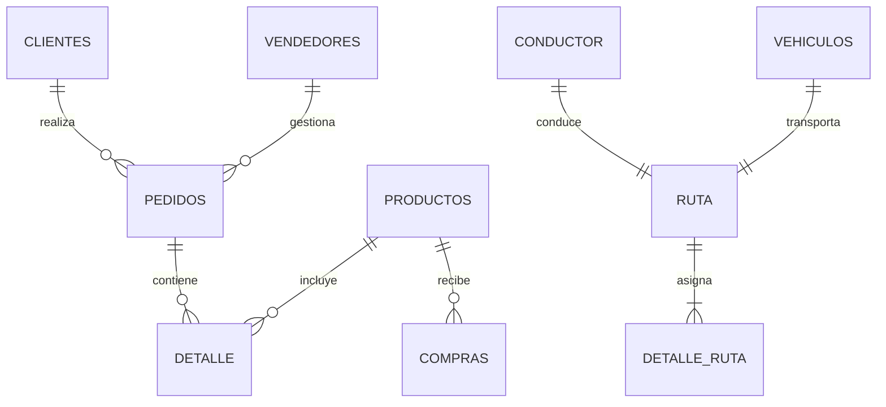
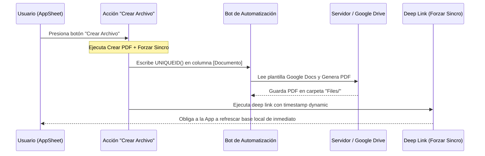

# Auditoría Técnica y Evaluación Completa: Sistema "Pedidos Pezcaderia"

Este documento presenta una auditoría técnica profunda y evaluación del funcionamiento del sistema **Pedidos Pezcaderia** (ID: `d97e2295-80f8-47b2-872e-65cc7e8bfff2`) y su base de datos en **Google Sheets** (Spreadsheet ID: `1iHL1yGxnJ27v2s393vAPyABQZ4Lb9Fo0BZ181FlPIZg`). Mapea todas las vistas, acciones, fórmulas de cálculo, automatizaciones y restricciones necesarias para su operación.

---

## 1. Mapeo de la Base de Datos (Google Sheets - 14 Hojas)

La base de datos en Google Sheets está compuesta por **14 pestañas** (hojas) que estructuran el sistema transaccional, los datos maestros, la logística de reparto y los elementos de configuración de la UI de AppSheet:



### 1.1 Hojas Transaccionales y de Detalle

#### 1. Hoja: `PEDIDOS` (Historial de Cabecera)
Registra los datos generales de cada orden de venta generada en el sistema.
* **Columnas**:
  * `id_PEDIDO`: Llave primaria física (Texto alfanumérico generado por `UNIQUEID()`).
  * `NUMERO`: Código de orden visible para el usuario (e.g., "Orden 1").
  * `FECHA`: Fecha y hora de creación de la orden.
  * `ORIGEN_PEIDO` [sic]: Canal de origen de la venta (`Visita`, `Llamada`, `Whatsapp`). *Nota: Contiene una errata en el nombre de la columna.*
  * `CLIENTE`: Llave foránea que referencia a `CLIENTES -> ID_CLIENTE`.
  * `TIPO_FACTURACION`: Sistema de facturación destino (`Magikal`, `Siigo`).
  * `FACTURA`: Número de factura emitido.
  * `FORMA_PAGO`: Condición comercial (`Crédito`, `Contado`).
  * `TIPO_ENTREGA`: Modalidad logística (`En Ruta`, `Inmediata`, `Recogen`).
  * `OBSERVACION_ENTREGA`: Notas adicionales de envío.
  * `FECHA_ENTREGA`: Fecha programada para el despacho.
  * `JORNADA`: Ventana de entrega (`Mañana`, `Tarde`).
  * `VENDEDOR`: Llave foránea que referencia a `VENDEDORES -> ID_VENDEDOR`.
  * `ESTADO`: Estado del pedido (`CREADO`, `LISTO`, `FACTURADO`, `Proceso Bodega`).
  * `TOTAL` y `SUBTOTAL`: Campos monetarios de sumatoria.
  * `PDF`: Enlace al archivo PDF de la remisión/factura guardado en Google Drive.
  * `Documento`: Token único (`UNIQUEID()`) que actúa como disparador (*trigger*) de la automatización del PDF.

#### 2. Hoja: `DETALLE` (Líneas del Pedido)
Almacena de forma desagregada los productos solicitados en cada orden (relación N:1 con `PEDIDOS`).
* **Columnas**:
  * `ID_DETALLE`: Llave primaria de la línea (Texto único).
  * `NUM_PEDIDO`: Llave foránea apuntando a `PEDIDOS -> id_PEDIDO`.
  * `LISTO`: Estado de empaque del producto (`SI`, `NO`).
  * `PRODUCTO`: Llave foránea apuntando a `PRODUCTOS -> ID_PRODUCTO`.
  * `DETALLE`: Notas de preparación del producto (e.g., "sin escamas", "porciones").
  * `CANTIDAD`: Cantidad de producto vendida (decimal).
  * `PRECIO`: Precio unitario acordado con el cliente.
  * `TOTAL_LINEA`: Monto total de la línea (`CANTIDAD * PRECIO`).

#### 3. Hoja: `COMPRAS` (Entradas de Inventario)
Registra las compras de materia prima realizadas a proveedores para abastecer el stock.
* **Columnas**:
  * `ID_COMPRA`: Llave primaria.
  * `PRODUCTO`: Llave foránea apuntando a `PRODUCTOS -> ID_PRODUCTO`.
  * `CANTIDAD`: Cantidad comprada.
  * `PRECIO_COMPRA`: Precio unitario de costo.
  * `FECHA_COMPRA`: Fecha del abastecimiento.

---

### 1.2 Hojas de Datos Maestros (Entidades)

#### 4. Hoja: `CLIENTES`
Directorio central de clientes habilitados.
* **Columnas**: `ID_CLIENTE` (Llave primaria), `TIPO_ID_CLIENTE` (Enum, e.g., CC, NIT), `NOMBRE_CLIENTE`, `RAZON_SOCIAL`, `CIUDAD_CLIEN` (EnumList de ciudades de despacho), `TEL_CLIENTE`, `DIRECCION`, `EMAIL_CLIENTE`, `VENDEDOR` (Asesor asignado), `ENCARGADO_COMPRAS`.

#### 5. Hoja: `PRODUCTOS`
Catálogo de productos disponibles con sus costos y precios base.
* **Columnas**: `ID_PRODUCTO` (Llave primaria/SKU), `PRODUCTO` (Descripción), `PRECIO_COMPRA`, `PRECIO_VENTA`, `STOCK` (Inventario calculado).

#### 6. Hoja: `VENDEDORES`
* **Columnas**: `ID_VENDEDOR` (Llave primaria), `VENDEDOR` (Nombre del asesor), `TELEFONO`, `CORREO`.

---

### 1.3 Hojas de Despacho y Logística

#### 7. Hoja: `RUTA`
Define los viajes o planificaciones de reparto.
* **Columnas**: `ID_RUTA` (Llave primaria), `CONDUCTOR`, `VEHICULO`, `ESTADO_RUTA`, `FECHA_CREACION`.

#### 8. Hoja: `DETALLE_RUTA`
Asocia múltiples pedidos a una ruta de despacho (Relación N:1 con `RUTA`).
* **Columnas**: `ID_DETALLE_RUTA` (Llave primaria), `RUTA` (FK `RUTA`), `PEDIDO` (FK `PEDIDOS`).

#### 9. Hoja: `CONDUCTOR`
* **Columnas**: `ID_CONDUCTOR` (Llave primaria), `CONDUCTOR` (Nombre), `CELULAR`, `LICENCIA`.

#### 10. Hoja: `VEHICULOS`
* **Columnas**: `PLACA` (Llave primaria), `VEHICULO` (Modelo/Marca), `CAPACIDAD`.

---

### 1.4 Hojas Técnicas y de Configuración de UI

* **11. `MENU`**: Contiene la lista de botones principales para el menú de inicio (`Pedidos`, `Clientes`, `Productos`). Mapea nombres de secciones, descripciones e íconos.
* **12. `SUBMENU`**: Desglosa opciones secundarias para flujos de navegación interna.
* **13. `Filtro`**: Hoja temporal o de sesión que permite a los usuarios aplicar filtros globales de búsqueda rápida (por ejemplo, filtrar el listado de pedidos de forma independiente sin interferir con otros usuarios concurrentes).
* **14. `Nombre`**: Hoja técnica de correspondencia o variables globales.

---

## 2. Configuración de UX (Vistas en el Editor)

Para mantener homogeneidad y rapidez de visualización en dispositivos móviles y de escritorio, el sistema implementa un patrón donde **todas las listas y menús principales utilizan el tipo de vista `deck` (baraja de tarjetas)**:

1. **`Menu`** (Vista principal de inicio):
   * **Tipo**: `deck` (Baraja).
   * **Origen de Datos**: Utiliza un slice filtrado de la tabla `MENU` (`MenuSlice`).
   * **Comportamiento**: Renderiza las tarjetas de acceso directo (`Pedidos`, `Clientes`, `Productos`) con íconos de alerta cuando hay estados pendientes.
2. **`PEDIDOS`**:
   * **Tipo**: `deck`.
   * **Origen de Datos**: Tabla `PEDIDOS`.
   * **Configuración**: Agrupado colapsablemente por `[ESTADO]`. Muestra el número de pedido en la cabecera, el nombre del cliente en el subtítulo, y el total a la derecha. Añade botones de acción en la tarjeta.
3. **`CLIENTES`**:
   * **Tipo**: `deck`.
   * **Origen de Datos**: Tabla `CLIENTES`.
   * **Configuración**: Ordenado alfabéticamente por `[NOMBRE_CLIENTE]`. Muestra celular y dirección en el subtítulo.
4. **`PRODUCTOS`**:
   * **Tipo**: `deck`.
   * **Origen de Datos**: Tabla `PRODUCTOS`.
   * **Configuración**: Muestra el nombre comercial, el stock físico actual (`[STOCK]`) y el precio de venta.
5. **`RUTA`**:
   * **Tipo**: `deck`.
   * **Origen de Datos**: Tabla `RUTA`.
   * **Configuración**: Agrupado por `[ESTADO_RUTA]` (e.g. Creada, En Tránsito, Finalizada).
6. **`VEHICULOS`**:
   * **Tipo**: `deck`.
   * **Origen de Datos**: Tabla `VEHICULOS`.
7. **`SubMenu`**:
   * **Tipo**: `deck`.
   * **Origen de Datos**: Slice `SubMenuSlice`.

---

## 3. Acciones y Automatización (Behavior)

El núcleo de la lógica interactiva del sistema reside en las **Acciones del Editor** configuradas en la tabla `PEDIDOS` para coordinar la facturación y la actualización de datos:



### 3.1 Flujo de Facturación y Sincronización

* **Acción 1: `Crear Archivo` (Acción de Grupo - Grouped Action)**:
  * **Acciones Secuenciales**: Ejecuta primero `Crear PDF` y luego `Forzar Sincro`.
  * **Objetivo**: Generar la remisión oficial en PDF y asegurar que el usuario la visualice inmediatamente sin retrasos de sincronización.
* **Acción 2: `Crear PDF` (Modificación de datos - Data: set the values of some columns in this row)**:
  * **Fórmula**: `[Documento] = UNIQUEID()`
  * **Efecto**: Al modificar el campo `Documento` con un identificador único, se activa el **Bot de Automatización (Bot)** en el servidor. Este lee la plantilla vinculada en Google Docs, procesa los datos estructurados del pedido y guarda el archivo resultante en Google Drive con el nombre de archivo `Files/[NUMERO].pdf`.
* **Acción 3: `Forzar Sincro` (Navegación por enlace profundo - App: go to another view within this app)**:
  * **Fórmula**: 
    ```appsheet
    CONCATENATE(LINKTOROW([_THISROW], CONTEXT(VIEW)), "&at=", (NOW()+1))
    ```
  * **Efecto**: Redirige al usuario a la misma vista de detalles del registro actual, pero concatena un parámetro de tiempo dinámico (`&at=NOW()`). Esto engaña al motor offline de AppSheet, obligándolo a enviar y recibir paquetes de datos con el servidor en la nube de inmediato en lugar de esperar la cola de sincronización normal de la aplicación.
* **Acción 4: `Ver PDF` (Apertura de archivo - App: open a file)**:
  * **Fórmula**:
    ```appsheet
    CONCATENATE(
      "https://www.appsheet.com/template/gettablefileurl",
      "?appName=", ENCODEURL(CONTEXT("AppName")),
      "&tableName=", ENCODEURL(CONTEXT("Table")),
      "&", UNIQUEID(),
      "&fileName=", ENCODEURL("Files/" & [NUMERO] & ".pdf")
    )
    ```
  * **Efecto**: Genera la URL dinámica con token único y abre en el navegador el PDF correspondiente a la orden generado en Drive, evitando almacenar archivos obsoletos en el caché local del dispositivo.

---

## 4. Fórmulas de Cálculo y Restricciones (Constraints)

Para garantizar la integridad y coherencia de los cálculos financieros e inventarios sin depender de recálculos lentos en la hoja de cálculo de Google, se implementan fórmulas a nivel de AppSheet:

### 4.1 Fórmulas de Cálculo y Totales

1. **Cálculo de Inventario en Tiempo Real (`PRODUCTOS -> STOCK`)**:
   * **Fórmula de Columna (App Formula)**:
     ```appsheet
     SUM(SELECT(COMPRAS[CANTIDAD], [PRODUCTO] = [_THISROW].[ID_PRODUCTO]))
     -
     SUM(SELECT(DETALLE[CANTIDAD], [PRODUCTO] = [_THISROW].[ID_PRODUCTO]))
     ```
   * **Explicación**: Calcula la existencia sumando todas las unidades que ingresaron en la tabla `COMPRAS` y restando todas las unidades vendidas en la tabla transaccional `DETALLE` para el producto seleccionado. (Mapeado de la misma forma en la columna virtual `STOCK2`).
2. **Subtotal del Pedido (`PEDIDOS -> SUBTOTAL`)**:
   * **Fórmula de Columna (App Formula)**:
     ```appsheet
     SUM(SELECT(DETALLE[TOTAL_LINEA], [NUM_PEDIDO] = [_THISROW].[id_PEDIDO]))
     ```
   * **Explicación**: Suma el valor calculado de la columna `TOTAL_LINEA` de todos los registros de la tabla `DETALLE` cuya llave foránea `NUM_PEDIDO` coincida con el pedido evaluado.
3. **Total del Pedido (`PEDIDOS -> TOTAL`)**:
   * **Fórmula**: `=[SUBTOTAL]`
4. **Monto por Línea de Producto (`DETALLE -> TOTAL_LINEA`)**:
   * **Fórmula**: `=[CANTIDAD] * [PRECIO]`

---

### 4.2 Restricciones, Requerimientos y Validaciones

Para evitar errores en la captura de información, se configuran las siguientes reglas de negocio en los formularios:

* **Campos Obligatorios (`Required_If` / `Required`)**:
  * En `PEDIDOS`: El campo `CLIENTE`, `ESTADO`, `FECHA_ENTREGA`, `JORNADA` y `TIPO_ENTREGA` son obligatorios (`Required: TRUE`). No se puede guardar una orden vacía o sin destinatario.
  * En `DETALLE`: Los campos `PRODUCTO`, `CANTIDAD` y `PRECIO` son obligatorios.
  * En `CLIENTES`: Los campos `NOMBRE_CLIENTE` y `CIUDAD_CLIEN` son obligatorios.
* **Validación de Datos (`Valid_If` / `Restricciones`)**:
  * En `DETALLE -> CANTIDAD`: Debe ser mayor a cero (`[CANTIDAD] > 0`).
  * En `DETALLE -> PRECIO`: Debe ser mayor o igual a cero (`[PRECIO] >= 0`).
  * En `PEDIDOS -> ESTADO`: Restringido estrictamente a la lista fija `CREADO`, `LISTO`, `FACTURADO`, `Proceso Bodega` para evitar ingresos erróneos de texto.
* **Control de Edición (`Editable_If`)**:
  * En `PEDIDOS -> NUMERO` e `id_PEDIDO`: No son editables por el usuario final (`Editable: FALSE`) ya que se gestionan por el sistema.
  * En `PEDIDOS -> FACTURA`: Únicamente debe ser editable cuando el estado del pedido sea igual a `FACTURADO`. (Fórmula propuesta: `[ESTADO] = "FACTURADO"`).
* **Control de Visibilidad (`Show_If`)**:
  * En `PEDIDOS -> FACTURA` y `TIPO_FACTURACION`: Se muestran en el formulario únicamente si el estado de la orden es `FACTURADO` o `LISTO` (Fórmula propuesta: `IN([ESTADO], LIST("LISTO", "FACTURADO"))`).

---

## 5. Galería Visual de Inspección (UX/UI y Editor)

````carousel

<!-- slide -->

<!-- slide -->

<!-- slide -->

<!-- slide -->

<!-- slide -->

<!-- slide -->

<!-- slide -->

````

---

## 6. Advertencias, Errores y Recomendaciones de Optimización

Durante el análisis del sistema se detectaron las siguientes inconsistencias y posibles cuellos de botella:

1. **Erratas en el Nombre del Schema (`ORIGEN_PEIDO`)**:
   * *Problema*: La columna en la hoja de cálculo y en el mapeo de AppSheet tiene el nombre `ORIGEN_PEIDO` (falta la letra 'D'). 
   * *Impacto*: Aunque el sistema funciona actualmente, esto puede confundir a desarrolladores externos y provocar errores al intentar integrarse con herramientas de Inteligencia de Negocios o bases de datos como PostgreSQL/Supabase.
   * *Solución*: Corregir a `ORIGEN_PEDIDO` renombrando tanto la cabecera en Google Sheets como regenerando la estructura de la tabla en el editor de AppSheet.
2. **Divergencias en Cabeceras de Clientes**:
   * *Problema*: En Google Sheets la columna se titula `CIUDAD_CLIE`, pero en el editor de AppSheet se encuentra mapeada como `CIUDAD_CLIEN`. 
   * *Impacto*: Se corrigió de forma manual en AppSheet, pero cualquier regeneración automática de columnas podría romper la correspondencia.
3. **Latencia Crítica en Cálculo de Stock**:
   * *Problema*: La fórmula `SUM(SELECT(...))` para la columna `STOCK` en `PRODUCTOS` realiza una búsqueda en toda la tabla de `COMPRAS` y `DETALLE` cada vez que el sistema se sincroniza. A medida que la cantidad de transacciones crezca por encima de 10,000 registros, el cálculo tardará minutos en el dispositivo del usuario, ralentizando el ingreso de pedidos.
   * *Solución*: En una aplicación nativa web, el stock no se calcula sumando todo el historial en caliente; en su lugar, se lleva un campo de stock directo que se actualiza mediante un disparador de base de datos (*database trigger*) únicamente al agregar compras o despachar ventas (ajuste por deltas).

---

## 7. Ventajas de una Aplicación Web a Medida para Pezcadería S.A.S.

Si se opta por migrar este diseño a una **WebApp** dedicada con base de datos en Supabase/PostgreSQL y Frontend en React/HTML:

1. **Sincronización Instantánea (WebSockets)**: Los pedidos creados por vendedores se reflejan inmediatamente en la pantalla de la bodega en <50ms.
2. **Gestión de Stock Robusta**: Bloqueo automático para evitar vender más unidades de las disponibles en cámara fría.
3. **Reportes PDF al Instante**: La remisión PDF del pedido se renderiza en menos de un segundo sin los cuellos de botella de Google Drive.
4. **Diseño Responsive Premium**: Interfaz moderna, adaptada a tabletas en bodega y teléfonos móviles en calle, sin las limitaciones visuales rígidas de AppSheet.
5. **Seguridad Avanzada**: Control exacto de roles (Vendedor, Bodeguero, Facturador, Conductor).
