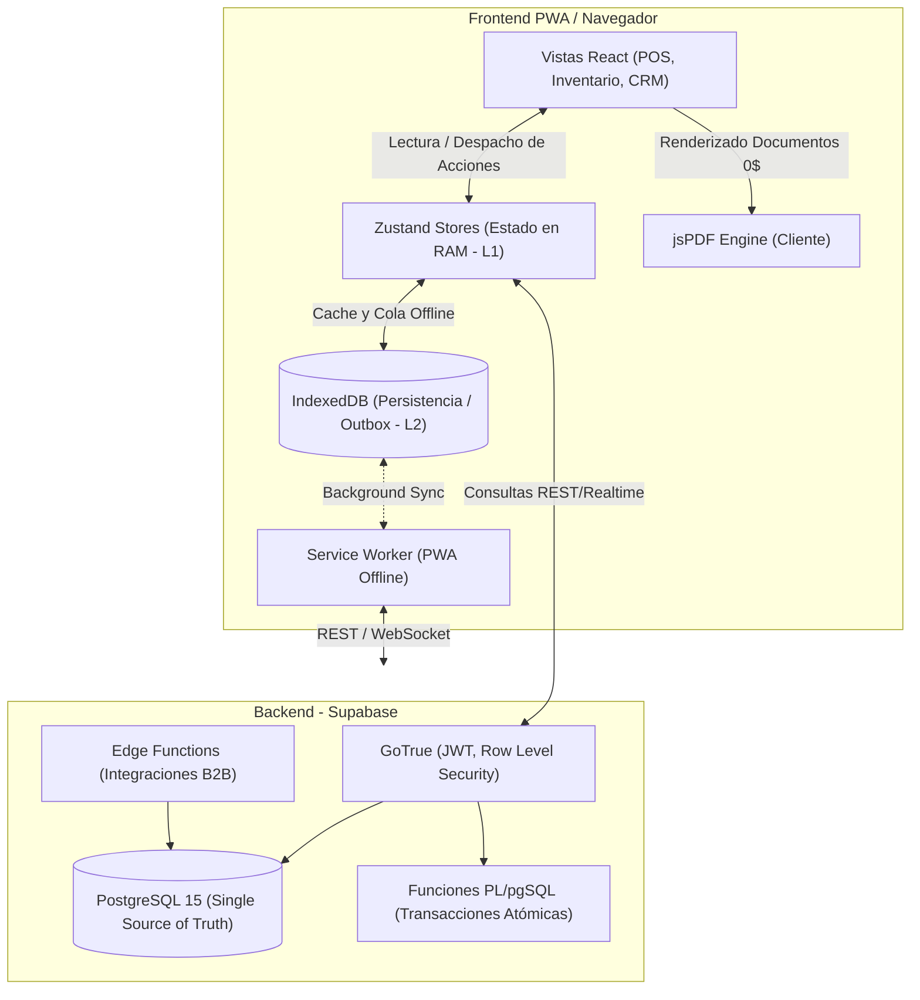

# Arquitectura C4: La Pezcadería ERP

**Fecha de Análisis:** 2026-10-02
**Tipo:** Análisis Estructural Inverso (Archify)
**Dominio:** ERP Data-Driven, SPA Offline-First con React 18 y Supabase.

A continuación se presenta el modelado C4 (Contexto, Contenedores y Componentes) basado en el estado actual del repositorio `src/`.

---

## Nivel 1: Contexto del Sistema (C1)
Vista de alto nivel de los actores y dependencias externas.

```mermaid
graph TD
    %% Actores
    Admin(["👑 Administrador / Gerente"])
    Bodega(["📦 Jefe de Bodega"])
    Cajero(["💰 Cajero / Vendedor"])

    %% Sistema Central
    ERP["🏢 La Pezcadería ERP (SPA)"]

    %% Sistemas Externos
    Supabase[("☁️ Supabase Cloud (BaaS)")]
    Twenty["🤝 Twenty CRM Engine"]
    DIAN["🧾 Facturación Electrónica (DIAN)"]
    Hardware["🖨️ Hardware Local (Ticketeras 80mm)"]

    %% Relaciones
    Admin -->|Audita, Configura, Analiza| ERP
    Bodega -->|Traslados, Recepción, FEFO| ERP
    Cajero -->|Ventas POS, Arqueos| ERP

    ERP <-->|Auth, RLS, DB Sync, RPC| Supabase
    ERP <-->|Sincronización de Clientes/Ventas| Twenty
    ERP -->|Transmisión de Facturas (Edge)| DIAN
    ERP -->|Generación Client-Side (jsPDF)| Hardware
```

---

## Nivel 2: Diagrama de Contenedores (C2)
Arquitectura multinivel del ERP (Caché Multinivel L1/L2/L3).



---

## Nivel 3: Diagrama de Componentes (C3) - Core Engines
Mapeo de los servicios clave descubiertos en `src/services/` y `src/store/`.

```mermaid
graph TD
    %% UI Views
    subgraph Views [Vistas Principales (React)]
        POS[POSView]
        WMS[InventoryView / Kanban]
        HR[Payroll / HRView]
    end

    %% Zustand Stores (L1)
    subgraph Stores [Zustand Store Ecosystem (19 Stores)]
        S_Cash[useCashStore]
        S_Inv[useInventoryStore]
        S_App[useAppStore]
        S_Users[useEmployeeStore]
    end

    %% Domain Services (L2)
    subgraph Services [Servicios de Dominio Empresarial]
        POS_Eng[posCashEngineService]
        WMS_Eng[inventoryService / warehouseService]
        Sync_Eng[offlineSyncService]
        Alg_Eng[scientificAnalytics / Pareto ABC]
    end

    %% Data Access (L3)
    subgraph Data [Data Layer]
        SupaData[SupabaseDataService]
        Local[LocalDataService / localDb]
    end

    %% Conexiones
    POS --> S_Cash
    WMS --> S_Inv
    HR --> S_Users

    S_Cash --> POS_Eng
    S_Inv --> WMS_Eng
    S_Inv --> Alg_Eng

    POS_Eng --> Sync_Eng
    WMS_Eng --> Sync_Eng

    Sync_Eng --> SupaData
    Sync_Eng --> Local
```

---

## Análisis y Hallazgos Arquitectónicos

1. **Escalabilidad de Estado (Zustand):**
   Existen actualmente **19 stores atómicos** en `src/store/`. Esta es una excelente práctica para evitar re-renders masivos en React. Cada dominio de negocio (Caja, Inventario, Clientes, Facturación) posee su propio ciclo de vida.
2. **Offline-First y Outbox Pattern:**
   La existencia de `localDb.ts` y `offlineSyncService.ts` confirma que el ERP fue diseñado para soportar contingencias sin internet. El POS puede encolar transacciones en IndexedDB (Patrón Outbox) y subirlas cuando vuelve la red.
3. **Cálculos Intensivos Client-Side:**
   Servicios como `coldStoragePdfService.ts` y `scientificAnalytics.ts` indican que la generación de PDFs y algoritmos matemáticos (como ABC Pareto 80/20) se delegan al navegador del usuario, **ahorrando un 100% en costos de cómputo en la nube**.
4. **Módulos Especializados Descubiertos:**
   - *Cold Storage Rental (WMS 3PL):* Alquiler de cuartos fríos.
   - *Fish Yield Production:* Cálculo de mermas de despiece de pescado.
   - *Twenty CRM:* Integración directa en el core.
