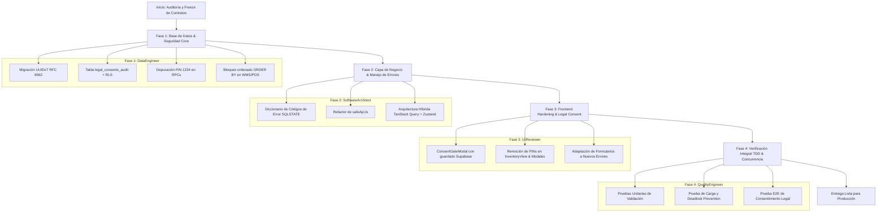

# Plan de Implementación: Enterprise Hardening & Performance Architecture

**ID del Plan:** `PLAN-004-ENTERPRISE-HARDENING`  
**Referencia de Spec:** [`spec.md`](./spec.md)  
**Orquestación:** Agency Swarm Framework (`DataEngineer`, `SoftwareArchitect`, `UIReviewer`, `QualityEngineer`)  

---

## 1. Estrategia de Ejecución por Etapas

---

## 2. Detalle de Fases de Trabajo

### Fase 1: Base de Datos & Seguridad Core (Liderado por `DataEngineer`)
- **Migración 32:** Creación de la función `uuid_generate_v7()` compatible con RFC 9562.
- **Migración 33:** Creación de la tabla `legal_consents_audit` con políticas RLS inmutables.
- **Migración 34:** Refactorización de `database/26_operational_flows_guards.sql`:
  - Eliminación de `pin_acceso = '1234'`.
  - Validación de rol supervisor vía `auth.uid()` / claim JWT.
  - Refactorización de la RPC de ventas para ordenar los IDs de los productos (`ORDER BY producto_id`) antes de ejecutar `FOR UPDATE`.

### Fase 2: Capa de Negocio & Manejo de Errores (Liderado por `SoftwareArchitect`)
- Actualización de `src/lib/safeApi.ts`:
  - Sustitución de `raw.includes(...)` por un switch/map basado en `error.code` (ej. `'23503'`, `'23505'`, `'23514'`, `'42501'`, `'P0001'`).
  - Extracción de códigos de error de negocio tipados (`AppErrorCode`).
- Definición de los contratos de hidratación y caché para TanStack Query (aislando datos volátiles en Zustand y datos de entidad en Query).

### Fase 3: Frontend Hardening & Legal Consent (Liderado por `UIReviewer`)
- Actualización de `ConsentGateModal.tsx`:
  - Invoca `supabase.from('legal_consents_audit').insert(...)` al hacer clic en Aceptar.
  - Preserva la copia en `localStorage` como caché local.
- Limpieza en `InventoryView.tsx` y `ArqueoCajaModal.tsx`:
  - Remoción de prompts que sugieren el PIN `'1234'` o comparaciones con cadenas estáticas.
  - El modal de autorización verifica el rol del usuario conectado mediante `useAuthStore`.

### Fase 4: Verificación Integral TDD & Concurrencia (Liderado por `QualityEngineer`)
- Pruebas unitarias con Vitest para `safeApi.ts` asegurando que todos los códigos SQLSTATE devuelvan el mensaje en español correcto sin depender del texto raw.
- Pruebas de integración para la persistencia del consentimiento legal.
- Verificación de la suite de tests existente (`npm run test:run`) asegurando 0 regresiones.

---

## 3. Matriz de Riesgos y Mitigaciones

| Riesgo Identificado | Severidad | Mitigación Arquitectónica |
| :--- | :---: | :--- |
| **Bloqueo a usuarios existentes por falta de consentimiento** | Media | La consulta inicial valida si ya existe consentimiento; si hay falla de red en modo offline, se permite operar de forma provisional guardando el evento en la cola Outbox. |
| **Incompatibilidad de UUIDv7 con clientes antiguos** | Baja | UUIDv7 es 100% compatible con el tipo de datos nativo `UUID` de 128 bits de PostgreSQL. No altera esquemas ni clientes. |
| **Falsos rechazos por falta de rol supervisor** | Alta | Se provee un mensaje explícito indicando qué rol se requiere y se ofrece flujo de cambio de usuario/re-login sin perder el carrito actual. |
| **Ruptura de tests unitarios existentes** | Media | Actualizar mocks en `operationalFlows.test.ts` que utilizaban `'1234'` para simular el rol de supervisor. |
