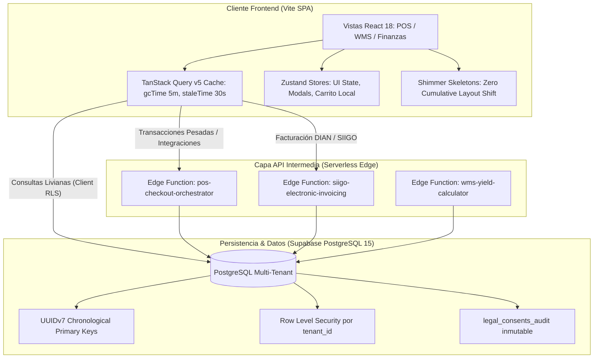

# Especificación Técnica: SaaS Enterprise Architecture Scaling (Fat DB Decoupling, TanStack Query & UUIDv7 Migration)

**ID:** `SPEC-005-SAAS-SCALING`  
**Estado:** `APPROVED (Alineado vía /grill-me)`  
**Autor:** Antigravity Architect & Agency Swarm  
**Fecha:** 2026-09-30  
**Gobernanza:** Constitución La Pezcadería ERP | `/spec-kit` | `/swarm` | `/erp-uiux-design-system`

---

## 1. Resumen Ejecutivo y Motivación Arquitectónica

El análisis del stack tecnológico actual (React 18 + Vite + Tailwind + Zustand + Supabase) reveló que, si bien permitió un despliegue ágil del MVP, presenta tres cuellos de botella que limitan su escalabilidad empresarial hacia un modelo SaaS multi-tenant masivo:

1. **Antipatrón "Base de Datos Gorda" (Fat DB):** Sobrecarga de lógica de negocio en triggers y procedimientos PL/pgSQL que aumentan el tiempo de bloqueo en tablas de inventario durante picos de venta POS.
2. **Sobrecarga de Memoria en Cliente (19 Stores Zustand):** Almacenamiento indiscriminado de datos del servidor en la memoria del navegador, saturando la RAM de terminales de bodega y puntos de venta de bajo costo, y causando riesgo de desincronización entre cajeros concurrentes.
3. **Fragmentación de Índices B-Tree por UUIDv4:** Generación aleatoria de identificadores que degrada el rendimiento de búsqueda a medida que crece el histórico transaccional.

---

## 2. Decisiones Arquitectónicas Canónicas (Alineadas en /grill-me)

| Dimensión | Decisión Adoptada | Justificación Técnica |
| :--- | :--- | :--- |
| **Capa API / Backend** | **Supabase Edge Functions (TypeScript / Deno)** | Desacopla la lógica pesada, orquesta llamadas a la DIAN y SIIGO de forma segura, mantiene el costo de infraestructura en $0 y escala de manera elástica sin gestionar servidores VPS dedicados. |
| **Sincronización de Estado** | **TanStack Query v5 (React Query) + Zustand UI** | TanStack Query gestiona el ciclo de vida del servidor (caching inteligente, deduplicación, recolección de basura de RAM, reintentos). Zustand queda confinado a estado de UI efímero (modales, tema, carrito de compra local). |
| **Framework Frontend** | **Vite SPA (Core ERP) + Satélite Next.js opcional** | Se mantiene Vite SPA para el ERP operativo, POS y WMS garantizando velocidad máxima y resiliencia offline. Los portales públicos orientados a clientes que requieran SEO (catálogo B2B / tracking) podrán crearse como aplicaciones Next.js independientes. |
| **Identificadores** | **Migración Total a UUIDv7 (IETF RFC 9562)** | Estandarización de `public.uuid_generate_v7()` con script de migración y remapeo transaccional histórico de claves primarias y foráneas con ventana de mantenimiento documentada. |
| **Diseño y UX** | **Suspense + Shimmer Skeletons (Zero CLS)** | Implementación de esqueletos de carga animados respetando las 13 reglas del Tridecálogo Canónico de CSS Moderno (`@layer`, `isolation: isolate`, `gap`, `min-height: 100dvh`). |

---

## 3. Arquitectura del Sistema

---

## 4. Requerimientos Funcionales y No Funcionales

### Requerimientos Funcionales (RF):
1. **RF-01 (QueryClient Global):** Configurar `QueryClient` en `src/lib/queryClient.ts` con configuración estricta de bajo consumo de memoria RAM:
   - `staleTime: 1000 * 30` (30 segundos).
   - `gcTime: 1000 * 60 * 5` (5 minutos para liberar datos no utilizados de memoria).
   - `refetchOnWindowFocus: true` solo para consultas de inventario y caja.
2. **RF-02 (Hooks de Sincronización de Inventario):** Implementar `useInventoryQuery` y `useStockQuery` usando TanStack Query para sustituir la replicación completa de la tabla de productos en memoria.
3. **RF-03 (Edge Function Contracts):** Definir el contrato de ejecución y cliente TypeScript para `pos-checkout-orchestrator` que desacopla la validación de venta y reserva de stock de los triggers SQL.
4. **RF-04 (Script de Remapeo Histórico UUIDv7):** Crear la migración `database/34_uuid_v7_historical_migration.sql` que permite migrar tablas transaccionales clave con preservación de integridad referencial.
5. **RF-05 (Componente Shimmer Skeleton):** Crear componentes `TableSkeleton` y `CardSkeleton` en `src/components/ui/` bajo la estética Dark Glassmorphism de `/erp-uiux-design-system`.

### Requerimientos No Funcionales (RNF):
1. **RNF-01 (Memoria RAM):** Reducción de la huella de memoria en el navegador en un 40% al liberar arrays estáticos en Zustand de miles de filas de productos.
2. **RNF-02 (Zero Layout Shift):** Las cargas de datos en tablas y tarjetas no deben provocar saltos de interfaz (CLS = 0).
3. **RNF-03 (Compatibilidad 100%):** Mantener el funcionamiento ininterrumpido de las 208 pruebas unitarias existentes.
