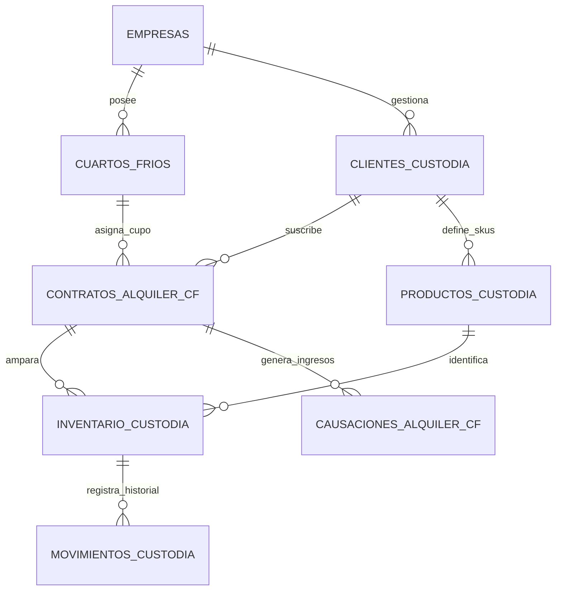

# Plan de Arquitectura y Diseño Técnico: Alquiler de Cuarto Frío WMS 3PL

**Módulo:** `wms-cold-storage-rental`  
**Arquitectura:** Data-Driven, Supabase PostgreSQL RLS, React 18, Tailwind CSS, TypeScript Estricto  
**Estado:** Aprobado

---

## 🏛️ 1. Modelo Entidad-Relación y Tablas en Supabase



### 1.1 Estructura DDL en PostgreSQL

```sql
-- 1. Cuartos Fríos (Infraestructura física)
CREATE TABLE cuartos_frios (
    id UUID PRIMARY KEY DEFAULT gen_random_uuid(),
    empresa_id UUID NOT NULL REFERENCES empresas(id) ON DELETE CASCADE,
    codigo VARCHAR(30) NOT NULL, -- ej. 'CF-CONG-01'
    nombre VARCHAR(100) NOT NULL,
    temperatura_setpoint NUMERIC(4, 1) NOT NULL DEFAULT -18.0,
    capacidad_total_posiciones INT NOT NULL CHECK (capacidad_total_posiciones > 0),
    capacidad_total_kg NUMERIC(12, 2) GENERATED ALWAYS AS (capacidad_total_posiciones * 800.0) STORED,
    activo BOOLEAN NOT NULL DEFAULT TRUE,
    creado_en TIMESTAMP WITH TIME ZONE DEFAULT timezone('UTC', NOW()),
    actualizado_en TIMESTAMP WITH TIME ZONE DEFAULT timezone('UTC', NOW()),
    UNIQUE(empresa_id, codigo)
);

-- 2. Clientes de Almacenamiento en Custodia (Terceros 3PL)
CREATE TABLE clientes_custodia (
    id UUID PRIMARY KEY DEFAULT gen_random_uuid(),
    empresa_id UUID NOT NULL REFERENCES empresas(id) ON DELETE CASCADE,
    tercero_id UUID REFERENCES clientes(id) ON DELETE RESTRICT,
    razon_social VARCHAR(150) NOT NULL,
    numero_identificacion VARCHAR(30) NOT NULL,
    tipo_identificacion VARCHAR(10) NOT NULL DEFAULT 'NIT',
    responsable_contacto VARCHAR(100),
    telefono VARCHAR(30),
    email VARCHAR(100),
    autorizados_retiro JSONB DEFAULT '[]'::jsonb, -- Lista de personas con DNI autorizadas a retirar
    estado VARCHAR(20) NOT NULL DEFAULT 'ACTIVO' CHECK (estado IN ('ACTIVO', 'INACTIVO', 'BLOQUEADO_MORA')),
    creado_en TIMESTAMP WITH TIME ZONE DEFAULT timezone('UTC', NOW()),
    actualizado_en TIMESTAMP WITH TIME ZONE DEFAULT timezone('UTC', NOW())
);

-- 3. Catálogo Versátil de Productos de Clientes (SKUs de Custodia)
CREATE TABLE productos_custodia (
    id UUID PRIMARY KEY DEFAULT gen_random_uuid(),
    empresa_id UUID NOT NULL REFERENCES empresas(id) ON DELETE CASCADE,
    cliente_id UUID NOT NULL REFERENCES clientes_custodia(id) ON DELETE CASCADE,
    codigo_cliente VARCHAR(50),
    nombre VARCHAR(150) NOT NULL,
    tipo_empaque VARCHAR(30) NOT NULL, -- 'CAJA_CARTON', 'CANASTILLA', 'SACO', 'BLOQUE_DESNUDO'
    modalidad_medicion VARCHAR(20) NOT NULL CHECK (modalidad_medicion IN ('SOLO_PESO', 'PESO_ESTABLE', 'MIXTO_BULTOS_PESO')),
    peso_unitario_nominal NUMERIC(10, 3) CHECK (peso_unitario_nominal > 0), -- ej. 20.000 kg por caja
    temperatura_optima VARCHAR(20) DEFAULT '-18C a -22C',
    activo BOOLEAN NOT NULL DEFAULT TRUE,
    creado_en TIMESTAMP WITH TIME ZONE DEFAULT timezone('UTC', NOW())
);

-- 4. Contratos de Alquiler de Cuarto Frío
CREATE TABLE contratos_alquiler_cf (
    id UUID PRIMARY KEY DEFAULT gen_random_uuid(),
    empresa_id UUID NOT NULL REFERENCES empresas(id) ON DELETE CASCADE,
    consecutivo VARCHAR(30) NOT NULL, -- ej. 'CTR-CF-2026-001'
    cliente_id UUID NOT NULL REFERENCES clientes_custodia(id) ON DELETE RESTRICT,
    cuarto_frio_id UUID NOT NULL REFERENCES cuartos_frios(id) ON DELETE RESTRICT,
    modalidad_tiempo VARCHAR(10) NOT NULL CHECK (modalidad_tiempo IN ('DIAS', 'MESES')),
    posiciones_contratadas INT NOT NULL CHECK (posiciones_contratadas > 0),
    capacidad_contratada_kg NUMERIC(12, 2) GENERATED ALWAYS AS (posiciones_contratadas * 800.0) STORED,
    tarifa_unitaria NUMERIC(12, 2) NOT NULL CHECK (tarifa_unitaria >= 0), -- Precio por posición por día o mes
    tarifa_recargo_sobrepeso_kg NUMERIC(10, 2) DEFAULT 0.00, -- Tarifa extra por kg que exceda los 800kg
    modalidad_facturacion VARCHAR(15) NOT NULL DEFAULT 'ANTICIPADA' CHECK (modalidad_facturacion IN ('ANTICIPADA', 'VENCIDA')),
    requiere_cuentas_orden BOOLEAN NOT NULL DEFAULT FALSE,
    fecha_inicio DATE NOT NULL,
    fecha_fin DATE NOT NULL,
    estado VARCHAR(20) NOT NULL DEFAULT 'VIGENTE' CHECK (estado IN ('BORRADOR', 'VIGENTE', 'FINALIZADO', 'CANCELADO')),
    observaciones TEXT,
    creado_por UUID REFERENCES auth.users(id),
    creado_en TIMESTAMP WITH TIME ZONE DEFAULT timezone('UTC', NOW()),
    actualizado_en TIMESTAMP WITH TIME ZONE DEFAULT timezone('UTC', NOW()),
    UNIQUE(empresa_id, consecutivo)
);

-- 5. Inventario en Custodia (Aislado de inventario propio 1435)
CREATE TABLE inventario_custodia (
    id UUID PRIMARY KEY DEFAULT gen_random_uuid(),
    empresa_id UUID NOT NULL REFERENCES empresas(id) ON DELETE CASCADE,
    contrato_id UUID NOT NULL REFERENCES contratos_alquiler_cf(id) ON DELETE RESTRICT,
    cliente_id UUID NOT NULL REFERENCES clientes_custodia(id) ON DELETE RESTRICT,
    producto_custodia_id UUID NOT NULL REFERENCES productos_custodia(id) ON DELETE RESTRICT,
    lote_cliente VARCHAR(50) NOT NULL,
    fecha_ingreso TIMESTAMP WITH TIME ZONE NOT NULL DEFAULT timezone('UTC', NOW()),
    fecha_vencimiento DATE,
    bultos_iniciales INT NOT NULL DEFAULT 0,
    bultos_actuales INT NOT NULL DEFAULT 0 CHECK (bultos_actuales >= 0),
    peso_neto_inicial_kg NUMERIC(12, 2) NOT NULL CHECK (peso_neto_inicial_kg >= 0),
    peso_neto_actual_kg NUMERIC(12, 2) NOT NULL CHECK (peso_neto_actual_kg >= 0),
    activo BOOLEAN NOT NULL DEFAULT TRUE,
    creado_en TIMESTAMP WITH TIME ZONE DEFAULT timezone('UTC', NOW()),
    actualizado_en TIMESTAMP WITH TIME ZONE DEFAULT timezone('UTC', NOW())
);

-- 6. Movimientos de Entrada y Salida (Actas)
CREATE TABLE movimientos_custodia (
    id UUID PRIMARY KEY DEFAULT gen_random_uuid(),
    empresa_id UUID NOT NULL REFERENCES empresas(id) ON DELETE CASCADE,
    inventario_custodia_id UUID NOT NULL REFERENCES inventario_custodia(id) ON DELETE RESTRICT,
    tipo_movimiento VARCHAR(10) NOT NULL CHECK (tipo_movimiento IN ('ENTRADA', 'SALIDA')),
    consecutivo_acta VARCHAR(30) NOT NULL, -- ej. 'ACT-ENT-001', 'ACT-SAL-001'
    fecha_movimiento TIMESTAMP WITH TIME ZONE NOT NULL DEFAULT timezone('UTC', NOW()),
    bultos INT NOT NULL CHECK (bultos >= 0),
    peso_bruto_kg NUMERIC(12, 2) NOT NULL CHECK (peso_bruto_kg >= 0),
    peso_tara_kg NUMERIC(12, 2) NOT NULL DEFAULT 0.00 CHECK (peso_tara_kg >= 0),
    peso_neto_kg NUMERIC(12, 2) GENERATED ALWAYS AS (peso_bruto_kg - peso_tara_kg) STORED,
    temperatura_medida NUMERIC(4, 1),
    merma_kg NUMERIC(10, 2) DEFAULT 0.00, -- Merma de frío calculada en salidas
    transportador_nombre VARCHAR(100),
    transportador_cedula VARCHAR(30),
    placa_vehiculo VARCHAR(15),
    documento_soporte_pdf_url TEXT,
    firmado_por_cliente TEXT, -- Data URI de firma digital o nombre del autorizado
    operador_almacen_id UUID REFERENCES auth.users(id),
    autorizado_gerencia_id UUID REFERENCES auth.users(id), -- Solo si hubo mora y se requirió excepción
    observaciones TEXT,
    creado_en TIMESTAMP WITH TIME ZONE DEFAULT timezone('UTC', NOW())
);

-- 7. Causación Contable de Ingresos por Alquiler
CREATE TABLE causaciones_alquiler_cf (
    id UUID PRIMARY KEY DEFAULT gen_random_uuid(),
    empresa_id UUID NOT NULL REFERENCES empresas(id) ON DELETE CASCADE,
    contrato_id UUID NOT NULL REFERENCES contratos_alquiler_cf(id) ON DELETE RESTRICT,
    cliente_id UUID NOT NULL REFERENCES clientes_custodia(id) ON DELETE RESTRICT,
    periodo_inicio DATE NOT NULL,
    periodo_fin DATE NOT NULL,
    posiciones_facturadas INT NOT NULL,
    unidades_tiempo INT NOT NULL, -- Días o Meses calculados
    subtotal NUMERIC(12, 2) NOT NULL CHECK (subtotal >= 0),
    recargo_sobrecupo NUMERIC(12, 2) NOT NULL DEFAULT 0.00 CHECK (recargo_sobrecupo >= 0),
    base_gravable NUMERIC(12, 2) GENERATED ALWAYS AS (subtotal + recargo_sobrecupo) STORED,
    iva_19 NUMERIC(12, 2) GENERATED ALWAYS AS (ROUND((subtotal + recargo_sobrecupo) * 0.19, 2)) STORED,
    retefuente NUMERIC(12, 2) NOT NULL DEFAULT 0.00,
    total_a_cobrar NUMERIC(12, 2) GENERATED ALWAYS AS ((subtotal + recargo_sobrecupo) + ROUND((subtotal + recargo_sobrecupo) * 0.19, 2) - retefuente) STORED,
    estado VARCHAR(20) NOT NULL DEFAULT 'PENDIENTE' CHECK (estado IN ('PENDIENTE', 'CAUSADO', 'FACTURADO', 'PAGADO', 'ANULADO')),
    asiento_contable_id UUID,
    factura_venta_id UUID,
    creado_en TIMESTAMP WITH TIME ZONE DEFAULT timezone('UTC', NOW())
);
```

---

## 🧮 2. Algoritmos Matemáticos Deterministas (`scientific-agent-analytics`)

### 2.1 Cálculo de Capacidad y Sobrecupo
$$\text{Capacidad Máxima Contratada (kg)} = N_{\text{posiciones}} \times 800$$
$$\Delta W_{\text{sobrecupo}} = \max(0, W_{\text{recibido\_neto}} - \text{Capacidad Máxima})$$

Si $\Delta W_{\text{sobrecupo}} > 0$:
$$\text{Recargo por Sobrecupo} = \Delta W_{\text{sobrecupo}} \times \text{Tarifa}_{\text{kg\_sobrepeso}}$$

### 2.2 Tarificación por Modalidad Temporal
- **Modalidad Días:**
  $$\text{Subtotal} = N_{\text{posiciones}} \times \text{Días Efectivos} \times \text{Tarifa Diaria}$$
- **Modalidad Meses con Fracción:**
  $$\text{Subtotal} = (N_{\text{posiciones}} \times M_{\text{enteros}} \times \text{Tarifa Mensual}) + \left(N_{\text{posiciones}} \times D_{\text{fracción}} \times \frac{\text{Tarifa Mensual}}{30}\right)$$

### 2.3 Cálculo de Merma Natural de Frío en Salidas
$$\text{Merma (kg)} = \max(0, W_{\text{teórico\_esperado}} - W_{\text{báscula\_salida}})$$
$$\% \text{ Merma} = \left(\frac{\text{Merma (kg)}}{W_{\text{teórico\_esperado}}}\right) \times 100$$

---

## 🛡️ 3. Esquemas de Validación con Zod (`packages/validation-schemas`)

```typescript
import { z } from 'zod';

// Esquema de Creación de Contrato
export const ContratoAlquilerCfSchema = z.object({
  clienteId: z.string().uuid("Cliente inválido"),
  cuartoFrioId: z.string().uuid("Cuarto frío inválido"),
  modalidadTiempo: z.enum(['DIAS', 'MESES']),
  posicionesContratadas: z.number().int().min(1, "Debe contratar al menos 1 posición"),
  tarifaUnitaria: z.number().positive("La tarifa debe ser mayor a cero"),
  tarifaRecargoSobrepesoKg: z.number().nonnegative().default(0),
  modalidadFacturacion: z.enum(['ANTICIPADA', 'VENCIDA']),
  requiereCuentasOrden: z.boolean().default(false),
  fechaInicio: z.string().regex(/^\d{4}-\d{2}-\d{2}$/, "Formato de fecha YYYY-MM-DD"),
  fechaFin: z.string().regex(/^\d{4}-\d{2}-\d{2}$/, "Formato de fecha YYYY-MM-DD"),
  observaciones: z.string().optional()
}).refine(data => new Date(data.fechaFin) >= new Date(data.fechaInicio), {
  message: "La fecha final debe ser posterior o igual a la inicial",
  path: ["fechaFin"]
});

// Esquema de Movimiento de Entrada (Acta de Recepción)
export const ActaRecepcionEntradaSchema = z.object({
  contratoId: z.string().uuid(),
  productoCustodiaId: z.string().uuid(),
  loteCliente: z.string().min(1, "El lote es obligatorio"),
  bultos: z.number().int().min(1, "Al menos 1 bulto"),
  pesoBrutoKg: z.number().positive("El peso bruto debe ser positivo"),
  pesoTaraKg: z.number().nonnegative("La tara no puede ser negativa"),
  temperaturaMedida: z.number().max(5, "Temperatura inadecuada para conservación en frío"),
  transportadorNombre: z.string().min(3, "Nombre de transportador obligatorio"),
  transportadorCedula: z.string().min(5, "Cédula del transportador obligatoria"),
  placaVehiculo: z.string().min(5, "Placa obligatoria"),
  observaciones: z.string().optional()
});
```
