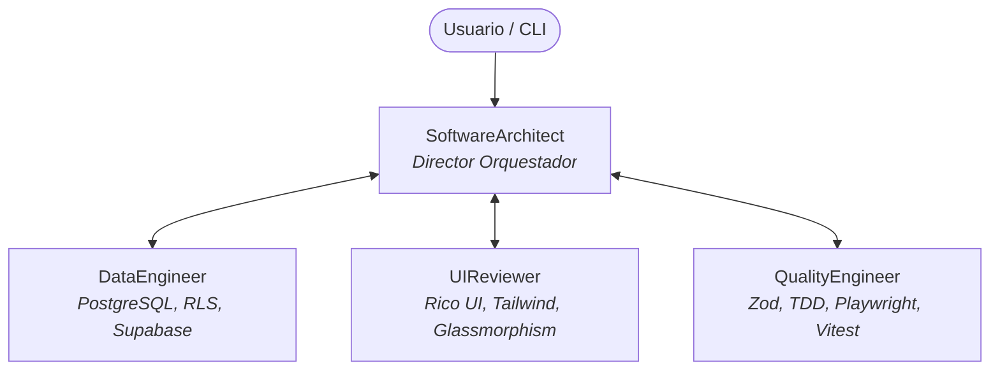

# 🤖 La Pezcaderia ERP — Agency Swarm con Google AI Studio (Nivel Gratuito)

Este módulo implementa un enjambre multi-agente autónomo utilizando **Agency Swarm** y alimentado por **Google AI Studio** a costo $0 con modelos **Gemini 2.5 Flash / Gemini Flash Latest**.

---

## 🏛️ 1. Topología del Enjambre (Swarm)



- **Punto de Entrada (`SoftwareArchitect`):** Interpreta los requerimientos del usuario, consulta las directrices de gobernanza de [`ARCHITECT_GOVERNANCE.md`](../../ARCHITECT_GOVERNANCE.md) y delega tareas a los agentes especialistas.
- **Especialistas en Comunicación Bidireccional:**
  - `DataEngineer`: Diseña esquemas, RLS jerárquicos Multi-Tenant y RPCs atómicas con bloqueo pesimista.
  - `UIReviewer`: Audita interfaces, componentes React 18 y estética Dark Glassmorphism.
  - `QualityEngineer`: Valida esquemas Zod, pruebas unitarias e integración de flujos críticos de facturación e inventario.

---

## 🔑 2. Configuración de API Key Gratuita de Google AI Studio

1. Obtén tu clave API sin costo en: [Google AI Studio](https://aistudio.google.com/app/apikey).
2. Crea o edita el archivo `tools/agency-swarm/.env` (o agrégala al `.env` raíz):

```bash
# tools/agency-swarm/.env
GEMINI_API_KEY=AIzaSy...TuClaveAqui...
GEMINI_MODEL=gemini-2.5-flash
```

> **Nota:** La librería se conecta automáticamente al endpoint OpenAI-compatible oficial de Google:
> `https://generativelanguage.googleapis.com/v1beta/openai/`

---

## 🚀 3. Ejecución y Uso

El entorno virtual aislado ya se encuentra configurado en `tools/agency-swarm/.venv`.

### A. Verificar Instalación y Modelos
```bash
tools\agency-swarm\.venv\Scripts\python.exe tools/agency-swarm/test_agency.py
```

### B. Ejecutar una Consulta por Línea de Comandos (CLI)
```bash
# Con modelo por defecto (gemini-2.5-flash):
tools\agency-swarm\.venv\Scripts\python.exe tools/agency-swarm/run_cli.py -p "¿Como debemos auditar el flujo de anulación parcial de una factura electrónica?"

# Con modelo Flash Lite (Mayor cuota de solicitudes por minuto en capa gratuita):
tools\agency-swarm\.venv\Scripts\python.exe tools/agency-swarm/run_cli.py -m gemini-2.5-flash-lite -p "¿Como debemos auditar el flujo de ventas en punto de venta?"
```

### C. Modo Terminal Interactivo (Chat en Vivo)
```bash
tools\agency-swarm\.venv\Scripts\python.exe tools/agency-swarm/run_cli.py --demo
```

---

## 📁 4. Estructura de Archivos

```
tools/agency-swarm/
├── .env.example          # Plantilla de variables de entorno
├── config.py             # Adaptador de Google AI Studio con AsyncOpenAI
├── agency.py             # Definición del Swarm y flujos de comunicación
├── test_agency.py        # Test de inicialización
├── run_cli.py            # CLI y modo demo interactivo
├── pezca_agents/         # Agentes especializados
│   ├── software_architect.py
│   ├── data_engineer.py
│   ├── ui_reviewer.py
│   └── quality_engineer.py
└── .venv/                # Entorno virtual Python 3.13 con agency-swarm y google-genai
```
